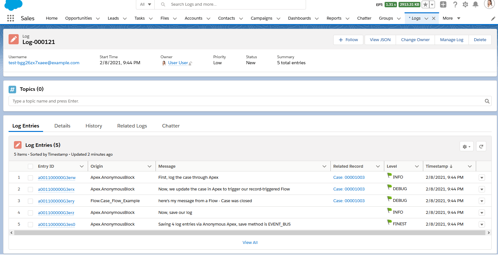

# Nebula Logger for Salesforce

[](https://github.com/jongpie/NebulaLogger/actions/workflows/build.yml)
[](https://codecov.io/gh/jongpie/NebulaLogger)

Designed for Salesforce admins, developers & architects. A robust logger for Apex, Lightning Components, Flow, Process Builder & Integrations.

## Unlocked Package - v4.8.0

[](https://test.salesforce.com/packaging/installPackage.apexp?p0=04t5Y0000015lmOQAQ)
[](https://login.salesforce.com/packaging/installPackage.apexp?p0=04t5Y0000015lmOQAQ)
[](https://jongpie.github.io/NebulaLogger/)

## Managed Package - v4.8.0

[](https://test.salesforce.com/packaging/installPackage.apexp?mgd=true&p0=04t5Y0000015lXNQAY)
[](https://login.salesforce.com/packaging/installPackage.apexp?mgd=true&p0=04t5Y0000015lXNQAY)
[](https://github.com/jongpie/NebulaLogger/milestone/8)

---

## Getting Started

After deploying Nebula Logger to your org, there are a few additional configuration changes needed...

-   Assign permission set(s) to users
    -   `LoggerLogCreator` provides the minimum access needed for users to generate logs via Apex, Lightning Components, Flow or Process Builder
    -   `LoggerEndUser` provides access to generate logs, as well as read-only access to any log records shared with the user.
    -   `LoggerLogViewer` provides view-all access (read-only) to all log records. This does **not** provide access to generate logs.
    -   `LoggerAdmin` provides view-all and modify-all access to all log records.
-   Customize the default settings in `LoggerSettings__c`
    -   You can customize settings at the org, profile and user levels

### All Together: Apex, Lightning Components & Flow in One Log

After incorporating Logger into your Flows & Apex code (including controllers, trigger framework, etc.), you'll have a unified transaction log of all your declarative & custom code automations.

```java
Case currentCase = [SELECT Id, CaseNumber, Type, Status, IsClosed FROM Case LIMIT 1];

Logger.info('First, log the case through Apex', currentCase);

Logger.debug('Now, we update the case in Apex to cause our record-triggered Flow to run');
update currentCase;

Logger.info('Last, save our log');
Logger.saveLog();
```

This generates 1 consolidated `Log__c`, containing `LogEntry__c` records from both Apex and Flow



## Log Management

### View Related Log Entries on a Record Page

### Deleting Old Logs

Admins can easily delete old logs using 2 methods: list views or Apex batch jobs

#### Mass Deleting with List Views

#### Batch Deleting with Apex Jobs

## Beta Feature: Custom Plugin Framework for Log\_\_c and LogEntry\_\_c objects

If you want to add your own automation to the `Log__c` or `LogEntry__c` objects, you can leverage Apex or Flow to define "plugins" - the logger system will then automatically run the plugins after each trigger event (BEFORE_INSERT, BEFORE_UPDATE, AFTER_INSERT, AFTER_UPDATE, and so on). This framework makes it easy to build your own plugins, or deploy/install others' prebuilt packages, without having to modify the logging system directly.

-   Flow plugins
-   Apex plugins

TODO: table that lists all plugins, link to their READMEs, and then their READMEs link to their wiki pages for more info (wiki pages will then have to also link back to their READMEs)

<table>
    <thead>
        <tr>
            <th>Plugin Name</th>
            <th>Description</th>
            <th>Wiki Page</th>
        </tr>
    </thead>
    <tbody>
        <tr>
            <td>
                <a href="./nebula-logger/plugins/async-failure-additions">Async Failures Additions plugin</a>
            </td>
            <td>TODO</td>
            <td>TODO</td>
        </tr>
        <tr>
            <td>
                <a href="./nebula-logger/plugins/big-object-archiving">Big Object Archiving plugin</a>
            </td>
            <td>TODO</td>
            <td>TODO</td>
        </tr>
        <tr>
            <td>
                <a href="./nebula-logger/plugins/log-retention-rules">Log Retention Rules plugin</a>
            </td>
            <td>TODO</td>
            <td>TODO</td>
        </tr>
        <tr>
            <td>
                <a href="./nebula-logger/plugins/logger-admin-dashboard">Logger Admin Dashboard plugin</a>
            </td>
            <td>TODO</td>
            <td>TODO</td>
        </tr>
        <tr>
            <td>
                <a href="./nebula-logger/plugins/slack">Slack plugin</a>
            </td>
            <td>TODO</td>
            <td>TODO</td>
        </tr>
    </tbody>
</table>

### Beta Plugin: Slack Integration

The optional [Slack plugin](./nebula-logger-plugins/Slack/) leverages the Nebula Logger plugin framework to automatically send Slack notifications for logs that meet a certain (configurable) logging level. The plugin also serves as a functioning example of how to build your own plugin for Nebula Logger, such as how to:

-   Use Apex to apply custom logic to `Log__c` and `LogEntry__c` records
-   Add custom fields and list views to Logger's objects
-   Extend permission sets to include field-level security for your custom fields
-   Leverage the new `LoggerParameter__mdt` CMDT object to store configuration for your plugin

Check out the [Slack plugin](./nebula-logger-plugins/slack/) for more details on how to install & customize the plugin


---

## Uninstalling/Removing Logger

If you want to remove the unlocked or managed packages, you can do so by simply uninstalling them in your org under Setup --> Installed Packages.


