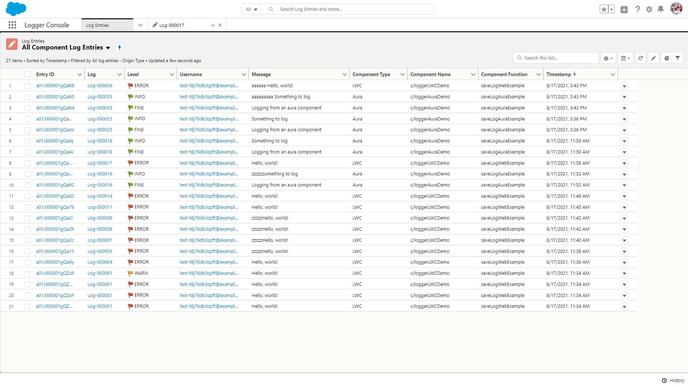
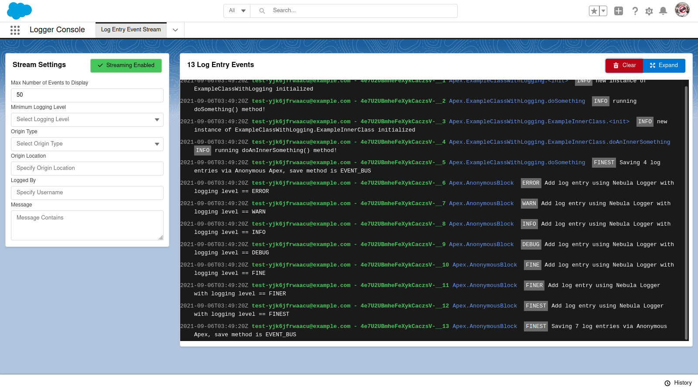

# Nebula Logger for Salesforce

[](https://github.com/jongpie/NebulaLogger/actions/workflows/build.yml)
[](https://codecov.io/gh/jongpie/NebulaLogger)

The most robust logger for Salesforce. Works with Apex, Lightning Components, Flow, Process Builder & Integrations. Designed for Salesforce admins, developers & architects.

## Unlocked Package - v4.14.0

[](https://test.salesforce.com/packaging/installPackage.apexp?p0=04t5Y0000015oPvQAI)
[](https://login.salesforce.com/packaging/installPackage.apexp?p0=04t5Y0000015oPvQAI)
[](https://jongpie.github.io/NebulaLogger/)

`sf package install --wait 20 --security-type AdminsOnly --package 04t5Y0000015oPvQAI`

`sfdx force:package:install --wait 20 --securitytype AdminsOnly --package 04t5Y0000015oPvQAI`

---

## Managed Package - v4.14.0

[](https://test.salesforce.com/packaging/installPackage.apexp?mgd=true&p0=04t5Y000001Mk8YQAS)
[](https://login.salesforce.com/packaging/installPackage.apexp?mgd=true&p0=04t5Y000001Mk8YQAS)
[](https://github.com/jongpie/NebulaLogger/milestone/12?closed=1)

`sf package install --wait 30 --security-type AdminsOnly --package 04t5Y000001Mk8YQAS`

`sfdx force:package:install --wait 30 --securitytype AdminsOnly --package 04t5Y000001Mk8YQAS`

---

## Features

1. Easily add log entries via Apex, Lightning Components (lightning web components (LWCs) & aura components), Flow & Process Builder to generate 1 consolidated, unified log
2. Manage & report on logging data using the `Log__c` and `LogEntry__c` objects
3. Leverage `LogEntryEvent__e` platform events for real-time monitoring & integrations
4. Enable logging and set the logging level for different users & profiles using `LoggerSettings__c` custom hierarchy setting
    - In addition to the required fields on this Custom Setting record, `LoggerSettings__c` ships with `SystemLogMessageFormat__c`, which uses Handlebars-esque syntax to refer to fields on the `LogEntryEvent__e` Platform Event. You can use curly braces to denote merge field logic, eg: `{OriginLocation__c}\n{Message__c}` - this will output the contents of `LogEntryEvent__e.OriginLocation__c`, a line break, and then the contents of `LogEntryEvent__e.Message__c`
5. Automatically mask sensitive data by configuring `LogEntryDataMaskRule__mdt` custom metadata rules
6. View related log entries on any Lightning SObject flexipage by adding the 'Related Log Entries' component in App Builder
7. Dynamically assign tags to `Log__c` and `LogEntry__c` records for tagging/labeling your logs
8. Plugin framework: easily build or install plugins that enhance the `Log__c` and `LogEntry__c` objects, using Apex or Flow (not currently available in the managed package)
9. Event-Driven Integrations with [Platform Events](https://developer.salesforce.com/docs/atlas.en-us.platform_events.meta/platform_events/platform_events_intro.htm), an event-driven messaging architecture. External integrations can subscribe to log events using the `LogEntryEvent__e` object - see more details at [the Platform Events Developer Guide site](https://developer.salesforce.com/docs/atlas.en-us.platform_events.meta/platform_events/platform_events_subscribe_cometd.htm)

Learn more about the design and history of the project on [Joys Of Apex blog post](https://www.joysofapex.com/advanced-logging-using-nebula-logger/)

## Architecture Overview

Nebula Logger is built natively on Salesforce, using Apex, lightning components and various types of objects. There are no required external dependencies. To learn more about the architecture, check out the
[architecture overview in the wiki](https://raw.githubusercontent.com/wiki/jongpie/NebulaLogger/images/nebula-logger-architecture-overview.png).

<a href="https://github.com/jongpie/NebulaLogger/wiki/Architecture" target="_blank">
    
</a>

## Installing

Nebula Logger is available as both an unlocked package and a managed package. The metadata is the same in both packages, but there are some differences in the available functionality & features. All examples in `README` are for the unlocked package (no namespace) - simply add the `Nebula` namespace to the examples if you are using the managed package.

<table>
    <thead>
        <tr>
            <th></th>
            <th>Unlocked Package (Recommended)</th>
            <th>Managed Package</th>
        </tr>
    </thead>
    <tbody>
        <tr>
            <td>Namespace</td>
            <td>none</td>
            <td><code>Nebula</code></td>
        </tr>
        <tr>
            <td>Future Releases</td>
            <td>Faster release cycle: new patch versions are released (e.g., <code>v4.4.x</code>) for new enhancements & bugfixes that are merged to the <code>main</code> branch in GitHub</td>
            <td>Slower release cycle: new minor versions are only released (e.g., <code>v4.x</code>) once new enhancements & bugfixes have been tested and code is stabilized</td>
        </tr>
        <tr>
            <td>Public & Protected Apex Methods</td>
            <td>Any <code>public</code> and <code>protected</code> Apex methods are subject to change in the future - they can be used, but you may encounter deployment issues if future changes to <code>public</code> and <code>protected</code> methods are not backwards-compatible</td>
            <td>Only <code>global</code> methods are available in managed packages - any <code>global</code> Apex methods available in the managed package will be supported for the foreseeable future</td>
        </tr>
        <tr>
            <td>Apex Debug Statements</td>
            <td><code>System.debug()</code> is automatically called - the output can be configured with <code>LoggerSettings__c.SystemLogMessageFormat__c</code> to use any field on <code>LogEntryEvent__e</code></td>
            <td>Requires adding your own calls for <code>System.debug()</code> due to Salesforce limitations with managed packages</td>
        </tr>
        <tr>
            <td>Logger Plugin Framework</td>
            <td>Leverage Apex or Flow to build your own "plugins" for Logger - easily add your own automation to the any of the included objects: <code>LogEntryEvent__e</code>, <code>Log__c</code>, <code>LogEntry__c</code>, <code>LogEntryTag__c</code> and <code>LoggerTag__c</code>. The logger system will then automatically run your plugins for each trigger event (BEFORE_INSERT, BEFORE_UPDATE, AFTER_INSERT, AFTER_UPDATE, and so on).</td>
            <td>This functionality is not currently available in the managed package</td>
        </tr>
    </tbody>
</table>

---

## Getting Started

After installing Nebula Logger in your org, there are a few additional configuration changes needed...

-   Assign permission set(s) to users
    -   See the wiki page [Assigning Permission Sets](https://github.com/jongpie/NebulaLogger/wiki/Assigning-Permission-Sets) for more details on each of the included permission sets
-   Customize the default settings in `LoggerSettings__c`
    -   You can customize settings at the org, profile and user levels

---

### Logger for Apex: Quick Start

For Apex developers, the `Logger` class has several methods that can be used to add entries with different logging levels. Each logging level's method has several overloads to support multiple parameters.

```java
// This will generate a debug statement within developer console
System.debug('Debug statement using native Apex');

// This will create a new `Log__c` record with multiple related `LogEntry__c` records
Logger.error('Add log entry using Nebula Logger with logging level == ERROR');
Logger.warn('Add log entry using Nebula Logger with logging level == WARN');
Logger.info('Add log entry using Nebula Logger with logging level == INFO');
Logger.debug('Add log entry using Nebula Logger with logging level == DEBUG');
Logger.fine('Add log entry using Nebula Logger with logging level == FINE');
Logger.finer('Add log entry using Nebula Logger with logging level == FINER');
Logger.finest('Add log entry using Nebula Logger with logging level == FINEST');
Logger.saveLog();
```

This results in 1 `Log__c` record with several related `LogEntry__c` records.


---

### Logger for Lightning Components: Quick Start

For lightning component developers, the `logger` LWC provides very similar functionality that is offered in Apex. Simply incorporate the `logger` LWC into your component, and call the desired logging methods within your code.

```javascript
// For LWC, import logger's createLogger() function into your component
import { createLogger } from 'c/logger';

export default class LoggerLWCImportDemo extends LightningElement {
    logger;

    async connectedCallback() {
        this.logger = await createLogger();
        this.logger.info('Hello, world');
        this.logger.saveLog();
    }
}
```

```javascript
// For aura, retrieve logger from your component's markup
const logger = component.find('logger');

logger.error('Hello, world!').addTag('some important tag');
logger.warn('Hello, world!');
logger.info('Hello, world!');
logger.debug('Hello, world!');
logger.fine('Hello, world!');
logger.finer('Hello, world!');
logger.finest('Hello, world!');
logger.saveLog();
```

---

### Logger for Flow & Process Builder: Quick Start

Within Flow & Process Builder, you can select 1 of the several Logging actions


In this simple example, a Flow is configured after-insert and after-update to log a Case record (using the action 'Add Log Entry for an SObject Record')


This results in a `Log__c` record with related `LogEntry__c` records.


---

### All Together: Apex, Lightning Components & Flow in One Log

After incorporating Logger into your Flows & Apex code (including controllers, trigger framework, etc.), you'll have a unified transaction log of all your declarative & custom code automations.

```java
Case currentCase = [SELECT Id, CaseNumber, Type, Status, IsClosed FROM Case LIMIT 1];

Logger.info('First, log the case through Apex', currentCase);

Logger.debug('Now, we update the case in Apex to cause our record-triggered Flow to run');
update currentCase;

Logger.info('Last, save our log');
Logger.saveLog();
```

This generates 1 consolidated `Log__c`, containing `LogEntry__c` records from both Apex and Flow


---

## Features for Apex Developers

Within Apex, there are several different methods that you can use that provide greater control over the logging system.

### Transaction Controls

Apex developers can use additional `Logger` methods to dynamically control how logs are saved during the current transaction.

-   `Logger.suspendSaving()` – causes `Logger` to ignore any calls to `saveLog()` in the current transaction until `resumeSaving()` is called. Useful for reducing DML statements used by `Logger`
-   `Logger.resumeSaving()` – re-enables saving after `suspendSaving()` is used
-   `Logger.flushBuffer()` – discards any unsaved log entries
-   `Logger.setSaveMethod(SaveMethod saveMethod)` - sets the default save method used when calling `saveLog()`. Any subsequent calls to `saveLog()` in the current transaction will use the specified save method
-   `Logger.saveLog(SaveMethod saveMethod)` - saves any entries in Logger's buffer, using the specified save method for only this call. All subsequent calls to `saveLog()` will use the default save method.
-   Enum `Logger.SaveMethod` - this enum can be used for both `Logger.setSaveMethod(saveMethod)` and `Logger.saveLog(saveMethod)`
    -   `Logger.SaveMethod.EVENT_BUS` - The default save method, this uses the `EventBus` class to publish `LogEntryEvent__e` records. The default save method can also be controlled declaratively by updating the field `LoggerSettings__c.DefaultSaveMethod__c`
    -   `Logger.SaveMethod.QUEUEABLE` - This save method will trigger `Logger` to save any pending records asynchronously using a queueable job. This is useful when you need to defer some CPU usage and other limits consumed by Logger.
    -   `Logger.SaveMethod.REST` - This save method will use the current user’s session ID to make a synchronous callout to the org’s REST API. This is useful when you have other callouts being made and you need to avoid mixed DML operations.
    -   `Logger.SaveMethod.SYNCHRONOUS_DML` - This save method will skip publishing the `LogEntryEvent__e` platform events, and instead immediately creates `Log__c` and `LogEntry__c` records. This is useful when you are logging from within the context of another platform event and/or you do not anticipate any exceptions to occur in the current transaction. **Note**: when using this save method, any exceptions will prevent your log entries from being saved - Salesforce will rollback any DML statements, including your log entries! Use this save method cautiously.

### Track Related Logs in Batchable and Queuable Jobs

In Salesforce, asynchronous jobs like batchable and queuable run in separate transactions - each with their own unique transaction ID. To relate these jobs back to the original log, Apex developers can use the method Logger.setParentLogTransactionId(String). `Logger` uses this value to relate child `Log__c` records, using the field `Log__c.ParentLog__c`.

This example batchable class shows how you can leverage this feature to relate all of your batch job’s logs together.

> :information_source: If you deploy this example class to your org,you can run it using `Database.executeBatch(new BatchableLoggerExample());`

```java
public with sharing class BatchableLoggerExample implements Database.Batchable<SObject>, Database.Stateful {
    private String originalTransactionId;

    public Database.QueryLocator start(Database.BatchableContext batchableContext) {
        // Each batchable method runs in a separate transaction,
        // so store the first transaction ID to later relate the other transactions
        this.originalTransactionId = Logger.getTransactionId();

        Logger.info('Starting BatchableLoggerExample');
        Logger.saveLog();

        // Just as an example, query all accounts
        return Database.getQueryLocator([SELECT Id, Name, RecordTypeId FROM Account]);
    }

    public void execute(Database.BatchableContext batchableContext, List<Account> scope) {
        // One-time call (per transaction) to set the parent log
        Logger.setParentLogTransactionId(this.originalTransactionId);

        for (Account account : scope) {
            // Add your batch job's logic here

            // Then log the result
            Logger.info('Processed an account record', account);
        }

        Logger.saveLog();
    }

    public void finish(Database.BatchableContext batchableContext) {
        // The finish method runs in yet-another transaction, so set the parent log again
        Logger.setParentLogTransactionId(this.originalTransactionId);

        Logger.info('Finishing running BatchableLoggerExample');
        Logger.saveLog();
    }
}
```

Queueable jobs can also leverage the parent transaction ID to relate logs together. This example queueable job will run several chained instances. Each instance uses the parentLogTransactionId to relate its log back to the original instance's log.

> :information_source: If you deploy this example class to your org,you can run it using `System.enqueueJob(new QueueableLoggerExample(3));`

```java
public with sharing class QueueableLoggerExample implements Queueable {
    private Integer numberOfJobsToChain;
    private String parentLogTransactionId;

    private List<LogEntryEvent__e> logEntryEvents = new List<LogEntryEvent__e>();

    // Main constructor - for demo purposes, it accepts an integer that controls how many times the job runs
    public QueueableLoggerExample(Integer numberOfJobsToChain) {
        this(numberOfJobsToChain, null);
    }

    // Second constructor, used to pass the original transaction's ID to each chained instance of the job
    // You don't have to use a constructor - a public method or property would work too.
    // There just needs to be a way to pass the value of parentLogTransactionId between instances
    public QueueableLoggerExample(Integer numberOfJobsToChain, String parentLogTransactionId) {
        this.numberOfJobsToChain = numberOfJobsToChain;
        this.parentLogTransactionId = parentLogTransactionId;
    }

    // Creates some log entries and starts a new instance of the job when applicable (based on numberOfJobsToChain)
    public void execute(System.QueueableContext queueableContext) {
        Logger.setParentLogTransactionId(this.parentLogTransactionId);

        Logger.fine('queueableContext==' + queueableContext);
        Logger.info('this.numberOfJobsToChain==' + this.numberOfJobsToChain);
        Logger.info('this.parentLogTransactionId==' + this.parentLogTransactionId);

        // Add your queueable job's logic here

        Logger.saveLog();

        --this.numberOfJobsToChain;
        if (this.numberOfJobsToChain > 0) {
            String parentLogTransactionId = this.parentLogTransactionId != null ? this.parentLogTransactionId : Logger.getTransactionId();
            System.enqueueJob(new QueueableLoggerExample(this.numberOfJobsToChain, parentLogTransactionId));
        }
    }
}
```

### Overloads for Logging Methods

Each of the logging methods in `Logger` (such as `Logger.error()`, `Logger.debug()`, and so on) has several static overloads for various parameters. These are intended to provide simple method calls for common parameters, such as:

-   Log a message and a record - `Logger.error(String message, SObject record)`
-   Log a message and a record ID - `Logger.error(String message, Id recordId)`
-   Log a message and a save result - `Logger.error(String message, Database.SaveResult saveResult)`
-   ...

To see the full list of overloads, check out the `Logger` class [documentation](https://jongpie.github.io/NebulaLogger/apex/Logger-Engine/Logger).

### Using the Fluent Interface

Each of the logging methods in `Logger` returns an instance of the class `LogEntryEventBuilder`. This class provides several additional methods together to further customize each log entry - each of the builder methods can be chained together. In this example Apex, 3 log entries are created using different approaches for calling `Logger` - all 3 approaches result in identical log entries.

```java
// Get the current user so we can log it (just as an example of logging an SObject)
User currentUser = [SELECT Id, Name, Username, Email FROM User WHERE Id = :UserInfo.getUserId()];

// Using static Logger method overloads
Logger.debug('my string', currentUser);

// Using the instance of LogEntryEventBuilder
LogEntryEventBuilder builder = Logger.debug('my string');
builder.setRecord(currentUser);

// Chaining builder methods together
Logger.debug('my string').setRecord(currentUser);

// Save all of the log entries
Logger.saveLog();
```

### Using LogMessage for Dynamically-Generated Strings

The class `LogMessage` provides the ability to generate string messages on demand, using `String.format()`. This provides 2 benefits:

1. Improved CPU usage by skipping unnecessary calls to `String.format()`

    ```java
    // Without using LogMessage, String.format() is always called, even if the FINE logging level is not enabled for a user
    String formattedString = String.format('my example with input: {0}', List<Object>{'myString'});
    Logger.fine(formattedString);

    // With LogMessage, when the specified logging level (FINE) is disabled for the current user, `String.format()` is not called
    LogMessage logMessage = new LogMessage('my example with input: {0}', 'myString');
    Logger.fine(logMessage);
    ```

2. Easily build complex strings
    ```java
     // There are several constructors for LogMessage to support different numbers of parameters for the formatted string
     String unformattedMessage = 'my string with 3 inputs: {0} and then {1} and finally {2}';
     String formattedMessage = new LogMessage(unformattedMessage, 'something', 'something else', 'one more').getMessage();
     String expectedMessage = 'my string with 3 inputs: something and then something else and finally one more';
     System.assertEquals(expectedMessage, formattedMessage);
    ```

For more details, check out the `LogMessage` class [documentation](https://jongpie.github.io/NebulaLogger/apex/Logger-Engine/LogMessage).

---

## Features for Lightning Component Developers

For lightning component developers, the included `logger` LWC can be used in other LWCs & aura components for frontend logging. Similar to `Logger` and `LogEntryBuilder` Apex classes, the LWC has both `logger` and `logEntryBuilder` classes. This provides a fluent API for JavaScript developers so they can chain the method calls.

Once you've incorporated `logger` into your lightning components, you can see your `LogEntry__c` records using the included list view "All Component Log Entries'.



Each `LogEntry__c` record automatically stores the component's type ('Aura' or 'LWC'), the component name, and the component function that called `logger`. This information is shown in the section "Lightning Component Information"


#### Example LWC Usage

For lightning component developers, the `logger` LWC provides very similar functionality that is offered in Apex. Simply import the `logger` LWC in your component, and call the desired logging methods within your code.

```javascript
// For LWC, import logger's createLogger() function into your component
import { createLogger } from 'c/logger';

export default class LoggerLWCImportDemo extends LightningElement {
    logger;

    async connectedCallback() {
        // Call createLogger() once per component
        this.logger = await createLogger();

        this.logger.setScenario('some scenario');
        this.logger.finer('initialized demo LWC');
    }

    logSomeStuff() {
        this.logger.error('Add log entry using Nebula Logger with logging level == ERROR').addTag('some important tag');
        this.logger.warn('Add log entry using Nebula Logger with logging level == WARN');
        this.logger.info('Add log entry using Nebula Logger with logging level == INFO');
        this.logger.debug('Add log entry using Nebula Logger with logging level == DEBUG');
        this.logger.fine('Add log entry using Nebula Logger with logging level == FINE');
        this.logger.finer('Add log entry using Nebula Logger with logging level == FINER');
        this.logger.finest('Add log entry using Nebula Logger with logging level == FINEST');

        this.logger.saveLog();
    }

    doSomething(event) {
        this.logger.finest('Starting doSomething() with event: ' + JSON.stringify(event));
        try {
            this.logger.debug('TODO - finishing implementation of doSomething()').addTag('another tag');
            // TODO add the function's implementation below
        } catch (thrownError) {
            this.logger
                .error('An unexpected error log entry using Nebula Logger with logging level == ERROR')
                .setError(thrownError)
                .addTag('some important tag');
        } finally {
            this.logger.saveLog();
        }
    }
}
```

#### Example Aura Usage

To use the logger component, it has to be added to your aura component's markup:

```html
<aura:component implements="force:appHostable">
    <c:logger aura:id="logger" />

    <div>My component</div>
</aura:component>
```

Once you've added logger to your markup, you can call it in your aura component's controller:

```javascript
({
    logSomeStuff: function (component, event, helper) {
        const logger = component.find('logger');

        logger.error('Hello, world!').addTag('some important tag');
        logger.warn('Hello, world!');
        logger.info('Hello, world!');
        logger.debug('Hello, world!');
        logger.fine('Hello, world!');
        logger.finer('Hello, world!');
        logger.finest('Hello, world!');

        logger.saveLog();
    }
});
```

---

## Features for Flow Builders

Within Flow (and Process Builder), there are 4 invocable actions that you can use to leverage Nebula Logger

1. 'Add Log Entry' - uses the class `FlowLogEntry` to add a log entry with a specified message
2. 'Add Log Entry for an SObject Record' - uses the class `FlowRecordLogEntry` to add a log entry with a specified message for a particular SObject record
3. 'Add Log Entry for an SObject Record Collection' - uses the class `FlowCollectionLogEntry` to add a log entry with a specified message for an SObject record collection
4. 'Save Log' - uses the class `Logger` to save any pending logs


---

## Tagging Your Log Entries

Nebula Logger supports dynamically tagging/labeling your `LogEntry__c` records via Apex, Flow, and custom metadata records in `LogEntryTagRule__mdt`. Tags can then be stored using one of the two supported modes (discussed below).

### Adding Tags in Apex

Apex developers can use 2 new methods in `LogEntryBuilder` to add tags - `LogEntryEventBuilder.addTag(String)` and `LogEntryEventBuilder.addTags(List<String>)`.

```java
// Use addTag(String tagName) for adding 1 tag at a time
Logger.debug('my log message').addTag('some tag').addTag('another tag');

// Use addTags(List<String> tagNames) for adding a list of tags in 1 method call
List<String> myTags = new List<String>{'some tag', 'another tag'};
Logger.debug('my log message').addTags(myTags);
```

### Adding Tags in Flow

Flow builders can use the `Tags` property to specify a comma-separated list of tags to apply to the log entry. This feature is available for all 3 Flow classes: `FlowLogEntry`, `FlowRecordLogEntry` and `FlowCollectionLogEntry`.


### Adding Tags with Custom Metadata Records

Admins can configure tagging rules to append additional tags using the custom metadata type `LogEntryTagRule__mdt`.

-   Rule-based tags are only added when `LogEntry__c` records are created (not on update).
-   Rule-based tags are added in addition to any tags that have been added via Apex and/or Flow.
-   Each rule is configured to apply tags based on the value of a single field on `LogEntry__c` (e.g., `LogEntry__c.Message__c`).
-   Each rule can only evaluate 1 field, but multiple rules can evaluate the same field.
-   A single rule can apply multiple tags. When specifying multiple tags, put each tag on a separate line within the Tags field (`LogEntryTagRule__mdt.Tags__c`).

Rules can be set up by configuring a custom metadata record with these fields configured:

1. Logger SObject: currently, only the "Log Entry" object (`LogEntry__c`) is supported.
2. Field: the SObject's field that should be evaluated - for example, `LogEntry__c.Message__c`. Only 1 field can be selected per rule, but multiple rules can use the same field.
3. Comparison Type: the type of operation you want to use to compare the field's value. Currently supported options are: `CONTAINS`, `EQUALS`, `MATCHES_REGEX`, and `STARTS_WITH`.
4. Comparison Value: the comparison value that should be used for the selected field operation.
5. Tags: a list of tag names that should be dynamically applied to any matching `LogEntry__c` records.
6. Is Enabled: only enabled rules are used by Logger - this is a handy way to easily enable/disable a particular rule without having to entirely delete it.

Below is an example of what a rule looks like once configured. Based on this rule, any `LogEntry__c` records that contain "My Important Text" in the `Message__c` field will automatically have 2 tags added - "Really important tag" and "A tag with an emoji, whynot?! 🔥"


### Choosing a Tagging Mode

Once you've implementing log entry tagging within Apex or Flow, you can choose how the tags are stored within your org. Each mode has its own pros and cons - you can also build your own plugin if you want to leverage your own tagging system (note: plugins are not currently available in the managed package).

<table>
    <thead>
        <tr>
            <th><strong>Tagging Mode</strong></th>
            <th>Logger's Custom Tagging Objects (Default)</th>
            <th>Salesforce <code>Topic</code> and <code>TopicAssignment</code> Objects</th>
        </tr>
    </thead>
    <tbody>
        <tr>
            <td>Summary</td>
            <td>Stores your tags in custom objects <code>LoggerTag__c</code> and <code>LogEntryTag__c</code></td>
            <td>Leverages Salesforce's <a href="https://www.salesforce.com/products/chatter/features/online-collaboration-tools">Chatter Topics functionality</a> to store your tags. This mode is not available in the managed package.</td>
        </tr>
        <tr>
            <td>Data Model</td>
            <td>
                <ul>
                    <li><code>LoggerTag__c</code>: this represents the actual tag you want to apply to your log entry record. Tags are unique, based on the field <code>LoggerTag__c.Name</code>. The logging system will automatically create <code>LoggerTag__c</code> records if a matching record does not already exist in your org.</li>
                    <li><code>LogEntryTag__c</code>: a junction object between <code>LoggerTag__c</code> and <code>LogEntry__c</code></li>
                </ul>
            </td>
            <td>
                <ul>
                    <li><code>Topic</code>: a standard object, used to tag any Salesforce record (with Topics enabled). This object is used similar to how <code>LoggerTag__c</code> is used. See <a href="https://developer.salesforce.com/docs/atlas.en-us.object_reference.meta/object_reference/sforce_api_objects_topic.htm">object reference docs for more details</a></li>
                    <li><code>TopicAssignment</code>: a junction object between a <code>Topic</code> record and any (supported) SObject, using a polymorphic <code>EntityId</code> field. See <a href="https://developer.salesforce.com/docs/atlas.en-us.object_reference.meta/object_reference/sforce_api_objects_topicassignment.htm">object reference docs for more details</a></li>
                </ul>
            </td>
        </tr>
        <tr>
            <td>Data Visibility</td>
            <td>
                <ul>
                    <li>Access to the <code>LoggerTag__c</code> object can be granted/restricted using standard Salesforce object and record-sharing functionality (OWD, sharing rules, profiles, permission sets, etc). By default, <code>LoggerTag__c</code> OWD is set to 'public read-only' for internal users and 'private' for external users</li>
                    <li>Since <code>LogEntryTag__c</code> is a junction object, access to these records is controlled by a user's access to the related <code>LogEntry__c</code> and <code>LoggerTag__c</code> records</li>
                </ul>
            </td>
            <td>
                <ul>
                    <li>In Chatter, all <code>Topic</code> records are visible - including any <code>Topic</code> records created via Logger. For some orgs that are ok with this visibility within Chatter, this is considered a great feature. But for some orgs, this visibility may not be ideal.</li>
                    <li>Although <code>Topic</code> records are visible to all Chatter users, <code>TopicAssignment</code> records are only visible to users that have access to the related <code>EntityId</code> (in this case, the <code>LogEntry__c</code> record)</li>
                </ul>
            </td>
        </tr>
        <tr>
            <td>Leveraging Data</td>
            <td>Since the data is stored in custom objects, you can leverage any platform functionality you want, such as building custom list views, reports & dashboards, enabling Chatter feeds, creating activities/tasks, and so on.</a>
            <td>Topics can be used to <a href="http://releasenotes.docs.salesforce.com/en-us/winter20/release-notes/rn_lex_lists_topic_filters.htm">filter list views</a>, which is a really useful feature. However, using Topics <a href="https://trailblazer.salesforce.com/ideaView?id=08730000000l12wAAA">in reports and dashboards is only partially implemented</a> at this time.
            </td>
        </tr>
    </tbody>
</table>

---

## Adding Custom Fields to Nebula Logger's Data Model

As of `v4.13.14`, Nebula Logger supports defining, setting, and mapping custom fields within Nebula Logger's data model. This is helpful in orgs that want to extend Nebula Logger's included data model by creating their own org/project-specific fields.

This feature requires that you populate your custom fields yourself, and is only available in Apex currently. The plan is to add in a future release the ability to also set custom fields via JavaScript & Flow.

### Adding Custom Fields to the Platform Event `LogEntryEvent__e`

The first step is to add a field to the platform event `LogEntryEvent__e`

-   Create a custom field on `LogEntryEvent__e`. Any data type supported by platform events can be used.

    -   In this example, a custom text field called `SomeCustomField__c` has been added:

        

-   Populate your field(s) in Apex by calling the instance method overloads `LogEntryEventBuilder.setField(Schema.SObjectField field, Object fieldValue)` or `LogEntryEventBuilder.setField(Map<Schema.SObjectField, Object> fieldToValue)`

    ```apex
    Logger.info('hello, world')
        // Set a single field
        .setField(LogEntryEvent__e.SomeCustomTextField__c, 'some text value')
        // Set multiple fields
        .setFields(new Map<Schema.SObjectField, Object>{
            LogEntryEvent__e.AnotherCustomTextField__c => 'another text value',
            LogEntryEvent__e.SomeCustomDatetimeField__c => System.now()
        });
    ```

### Adding Custom Fields to the Custom Objects `Log__c`, `LogEntry__c`, and `LoggerScenario__c`

If you want to store the data in one of Nebula Logger's custom objects, you can follow the above steps, and also...

-   Create an equivalent custom field on one of Nebula Logger's custom objects - right now, only `Log__c`, `LogEntry__c`, and `LoggerScenario__c` are supported.

    -   In this example, a custom text field _also_ called `SomeCustomField__c` has been added to `Log__c` object - this will be used to store the value of the field `LogEntryEvent__e.SomeCustomField__c`:

        

-   Create a record in the new CMDT `LoggerFieldMapping__mdt` to map the `LogEntryEvent__e` custom field to the custom object's custom field, shown below. Nebula Logger will automatically populate the custom object's target field with the value of the source `LogEntryEvent__e` field.

    -   In this example, a custom text field called `SomeCustomField__c` has been added to both `LogEntryEvent__e` and `Log__c`.

        

---

## Log Management

### Logger Console App

The Logger Console app provides access to the tabs for Logger's objects: `Log__c`, `LogEntry__c`, `LogEntryTag__c` and `LoggerTag__c` (for any users with the correct access).


### Log's 'Manage' Quick Action

To help development and support teams better manage logs (and any underlying code or config issues), some fields on `Log__c` are provided to track the owner, priority and status of a log. These fields are optional, but are helpful in critical environments (production, QA sandboxes, UAT sandboxes, etc.) for monitoring ongoing user activities.

-   All editable fields on `Log__c` can be updated via the 'Manage Log' quick action (shown below)

    

-   Additional fields are automatically set based on changes to `Log__c.Status__c`
    -   `Log__c.ClosedBy__c` - The user who closed the log
    -   `Log__c.ClosedDate__c` - The datetime that the log was closed
    -   `Log__c.IsClosed__c` - Indicates if the log is closed, based on the selected status (and associated config in the 'Log Status' custom metadata type)
    -   `Log__c.IsResolved__c` - Indicates if the log is resolved (meaning that it required analaysis/work, which has been completed). Only closed statuses can be considered resolved. This is also driven based on the selected status (and associated config in the 'Log Status' custom metadata type)
-   To customize the statuses provided, simply update the picklist values for `Log__c.Status__c` and create/update corresponding records in the custom metadata type `LogStatus__mdt`. This custom metadata type controls which statuses are considered closed and resolved.

---

### Log's 'View JSON' Quick Action

Everyone loves JSON - so to make it easy to see a JSON version of a `Log__c` record, you can use the 'View JSON' quick action button. It displays the current `Log__c` + all related `LogEntry__c` records in JSON format, as well as a handy button to copy the JSON to your clipboard. All fields that the current user can view (based on field-level security) are dynamically returned, including any custom fields added directly in your org or by plugins.


---

### Real-Time Monitoring with Log Entry Event Stream

Within Logger Console app, the Log Entry Event Stream tab provides real-time monitoring of `LogEntryEvent__e` platform events. Simply open the tab to start monitoring, and use the filters to further refine with `LogEntryEvent__e` records display in the stream.



---

### View Related Log Entries on a Record Page

Within App Builder, admins can add the 'Related Log Entries' lightning web component (lwc) to any record page. Admins can also control which columns are displayed be creating & selecting a field set on `LogEntry__c` with the desired fields.

-   The component automatically shows any related log entries, based on `LogEntry__c.RecordId__c == :recordId`
-   Users can search the list of log entries for a particular record using the component's built-insearch box. The component dynamically searches all related log entries using SOSL.
-   Component automatically enforces Salesforce's security model
    -   Object-Level Security - Users without read access to `LogEntry__c` will not see the component
    -   Record-Level Security - Users will only see records that have been shared with them
    -   Field-Level Security - Users will only see the fields within the field set that they have access to


---

### Deleting Old Logs

Admins can easily delete old logs using 2 methods: list views or Apex batch jobs

#### Mass Deleting with List Views

Salesforce (still) does not support mass deleting records out-of-the-box. There's been [an Idea for 11+ years](https://trailblazer.salesforce.com/ideaView?id=08730000000BqczAAC) about it, but it's still not standard functionality. A custom button is available on `Log__c` list views to provide mass deletion functionality.

1. Admins can select 1 or more `Log__c` records from the list view to choose which logs will be deleted


2. The button shows a Visualforce page `LogMassDelete` to confirm that the user wants to delete the records


#### Batch Deleting with Apex Jobs

Two Apex classes are provided out-of-the-box to handle automatically deleting old logs

1. `LogBatchPurger` - this batch Apex class will delete any `Log__c` records with `Log__c.LogRetentionDate__c <= System.today()`.
    - By default, this field is populated with "TODAY + 14 DAYS" - the number of days to retain a log can be customized in `LoggerSettings__c`.
    - Admins can also manually edit this field to change the retention date - or set it to null to prevent the log from being automatically deleted
2. `LogBatchPurgeScheduler` - this schedulable Apex class can be schedule to run `LogBatchPurger` on a daily or weekly basis

---

## Beta Feature: Custom Plugin Framework for Log\_\_c and LogEntry\_\_c objects

If you want to add your own automation to the `Log__c` or `LogEntry__c` objects, you can leverage Apex or Flow to define "plugins" - the logger system will then automatically run the plugins after each trigger event (BEFORE_INSERT, BEFORE_UPDATE, AFTER_INSERT, AFTER_UPDATE, and so on). This framework makes it easy to build your own plugins, or deploy/install others' prebuilt packages, without having to modify the logging system directly.

-   Flow plugins: your Flow should be built as auto-launched Flows with these parameters:

    1. `Input` parameter `triggerOperationType` - The name of the current trigger operation (such as BEFORE_INSERT, BEFORE_UPDATE, etc.)
    2. `Input` parameter `triggerNew` - The list of logger records being processed (`Log__c` or `LogEntry__c` records)
    3. `Output` parameter `updatedTriggerNew` - If your Flow makes any updates to the collection of records, you should return a record collection containing the updated records
    4. `Input` parameter `triggerOld` - The list of logger records as they exist in the datatabase

-   Apex plugins: your Apex class should extend the abstract class `LoggerSObjectHandlerPlugin`. For example:

    ```java
    public class ExamplePlugin extends LoggerSObjectHandlerPlugin {
        public override void execute(
            TriggerOperation triggerOperationType,
            List<SObject> triggerNew,
            Map<Id, SObject> triggerNewMap,
            List<SObject> triggerOld,
            Map<Id, SObject> triggerOldMap
        ) {
            switch on triggerOperationType {
                when BEFORE_INSERT {
                    for (Log__c log : (List<Log__c>) triggerNew) {
                        log.Status__c = 'On Hold';
                    }
                }
            }
        }
    }

    ```

Once you've created your Apex or Flow plugin(s), you will also need to configure the plugin:

-   'Logger Plugin' - use the custom metadata type `LoggerPlugin__mdt` to define your plugin, including the plugin type (Apex or Flow) and the API name of your plugin's Apex class or Flow
-   'Logger Parameter' - use the custom metadata type `LoggerParameter__mdt` to define any configurable parameters needed for your plugin, such as environment-specific URLs and other similar configurations

Note: the logger plugin framework is not available in the managed package due to some platform limitations & considerations with some of the underlying code. The unlocked package is recommended (instead of the managed package) when possible, including if you want to be able to leverage the plugin framework in your org.

### Beta Plugin: Slack Integration

The optional [Slack plugin](./nebula-logger/plugins/slack) leverages the Nebula Logger plugin framework to automatically send Slack notifications for logs that meet a certain (configurable) logging level. The plugin also serves as a functioning example of how to build your own plugin for Nebula Logger, such as how to:

-   Use Apex to apply custom logic to `Log__c` and `LogEntry__c` records
-   Add custom fields and list views to Logger's objects
-   Extend permission sets to include field-level security for your custom fields
-   Leverage the new `LoggerParameter__mdt` CMDT object to store configuration for your plugin

Check out the [Slack plugin](./nebula-logger/plugins/slack) for more details on how to install & customize the plugin


---

## Uninstalling/Removing Logger

If you want to remove the unlocked or managed packages, you can do so by simply uninstalling them in your org under Setup --> Installed Packages.


