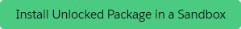
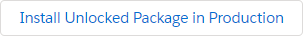
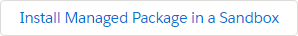
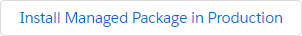

# Nebula Logger for Salesforce

[](https://github.com/jongpie/NebulaLogger/actions/workflows/build.yml)
[](https://codecov.io/gh/jongpie/NebulaLogger)
[](https://opensource.org/licenses/MIT)

**The most robust observability solution for Salesforce.** Built 100% natively on the Salesforce platform, designed to work seamlessly with Apex, Lightning Components, Flow, OmniStudio, and integrations.

## 🚀 Quick Start

### Installation

**Unlocked Package (Recommended)** - v4.18.0

```bash
sf package install --wait 20 --security-type AdminsOnly --package 04tg70000001jUXAAY
```

[](https://test.salesforce.com/packaging/installPackage.apexp?p0=04tg70000001jUXAAY)
[](https://login.salesforce.com/packaging/installPackage.apexp?p0=04tg70000001jUXAAY)

**Managed Package** - v4.18.0

```bash
sf package install --wait 30 --security-type AdminsOnly --package 04tg70000001jSvAAI
```

[](https://test.salesforce.com/packaging/installPackage.apexp?mgd=true&p0=04tg70000001jSvAAI)
[](https://login.salesforce.com/packaging/installPackage.apexp?mgd=true&p0=04tg70000001jSvAAI)

### First Log Entry

```apex
Logger.info('Hello, Nebula Logger!');
Logger.saveLog();
```

That's it! Check the **Logger Console** app to see your log.

## 📚 Documentation

Comprehensive documentation is available in the [`docs2/`](docs2/) directory:

### Getting Started
- **[Overview](docs2/overview.md)** - What is Nebula Logger and why use it?
- **[Installation Guide](docs2/installation.md)** - Detailed installation instructions
- **[Quick Start Guide](docs2/quick-start.md)** - Get up and running in 5 minutes

### Platform Guides
- **[Apex Developer Guide](docs2/apex-guide.md)** - Logging in Apex classes and triggers
- **[Lightning Web Components](docs2/lwc-guide.md)** - Logging in LWCs
- **[Aura Components](docs2/aura-guide.md)** - Logging in Aura components
- **[Flow Builder](docs2/flow-guide.md)** - Logging in Salesforce Flows
- **[OmniStudio](docs2/omnistudio-guide.md)** - Logging in OmniScripts

### Feature Guides
- **[Tagging System](docs2/tagging-guide.md)** - Organize logs with tags
- **[Scenarios](docs2/scenarios-guide.md)** - Track business processes
- **[Best Practices](docs2/best-practices.md)** - Production-ready patterns

### Admin & Operations
- **[Admin Guide](docs2/admin-guide.md)** - Configuration and management
- **[Performance & Scalability](docs2/performance.md)** - Optimization strategies
- **[Troubleshooting](docs2/troubleshooting.md)** - Common issues and solutions

### Advanced Topics
- **[Architecture](docs2/architecture.md)** - Technical deep dive
- **[Plugin Development](docs2/plugin-development.md)** - Building custom plugins *(coming soon)*
- **[API Reference](docs2/api-reference.md)** - Complete API documentation *(coming soon)*

## ⚡ Features

### Multi-Platform Logging

Log consistently across all Salesforce development contexts:

<table>
<tr>
<td width="50%">

**Apex**
```apex
Logger.info('Processing order')
    .setRecord(order)
    .addTag('critical');
Logger.saveLog();
```

</td>
<td width="50%">

**Lightning Web Components**
```javascript
this.logger.error('Payment failed')
    .setExceptionDetails(error)
    .addTag('payment');
this.logger.saveLog();
```

</td>
</tr>
<tr>
<td>

**Flow Builder**
- Add Log Entry action
- Add Log Entry for Record
- Save Log action

</td>
<td>

**OmniStudio**
- OmniScript logging
- Integration Procedures
- DataRaptor transforms

</td>
</tr>
</table>

### Seven Logging Levels

Fine-grained control over log verbosity:

```apex
Logger.error('Critical failure');   // Level 1 - Most severe
Logger.warn('Potential issue');     // Level 2
Logger.info('Business event');      // Level 3
Logger.debug('Diagnostic info');    // Level 4
Logger.fine('Trace details');       // Level 5
Logger.finer('Detailed trace');     // Level 6
Logger.finest('Most verbose');      // Level 7 - Least severe
```

### Event-Driven Architecture

Built on Salesforce Platform Events for scalability and performance:

```
Your Code → Logger → Platform Event → Async Processing → Log Records
              ↓
        Returns immediately
        (no user impact!)
```

**Benefits:**
- ⚡ **Async by default** - No impact on user transactions
- 📈 **Scalable** - Handles 10,000+ logs/hour
- 🔄 **Reliable** - Platform events ensure delivery
- 🎯 **Governor-friendly** - Minimal limit consumption

### Smart Organization

**Tags** - Apply multiple labels for filtering:
```apex
Logger.debug('Cache miss')
    .addTag('performance')
    .addTag('redis')
    .addTag('cache');
```

**Scenarios** - Track business processes:
```apex
Logger.setScenario('Order Processing');
Logger.info('Validating order');
// ... business logic ...
Logger.info('Order validated');
Logger.saveLog();
```

### Data Protection

**Built-in data masking** for sensitive information:
- Credit card numbers
- Social Security Numbers  
- Custom regex patterns
- Field-level masking rules

```apex
// Automatically masks sensitive data
Logger.info('Processing payment for SSN: 123-45-6789');
// Saved as: "Processing payment for SSN: ***-**-****"
```

### Extensibility

**Plugin Framework** - Extend Logger with custom functionality:
- Slack notifications
- Big Object archiving
- Custom alerting
- External integrations

**Custom Fields** - Add your own fields without modifying core code

## 🎯 Use Cases

### Development & Debugging
Track complex execution flows during development

### Production Monitoring
Monitor live systems without debug logs

### Troubleshooting
Capture context for support teams

### Compliance & Auditing
Track important business events

### Performance Analysis
Identify bottlenecks and slow operations

## 📊 Architecture

```
┌─────────────────────────────────────────────────────────┐
│  Application Layer (Apex, LWC, Flow, OmniStudio)       │
└────────────────────────┬────────────────────────────────┘
                         │
                         ▼
┌─────────────────────────────────────────────────────────┐
│  Logger Engine (Logger.cls, LogEntryEventBuilder)      │
└────────────────────────┬────────────────────────────────┘
                         │
                         ▼
┌─────────────────────────────────────────────────────────┐
│  Platform Event (LogEntryEvent__e)                      │
└────────────────────────┬────────────────────────────────┘
                         │
                         ▼
┌─────────────────────────────────────────────────────────┐
│  Event Handler (Creates Log__c and LogEntry__c)        │
└─────────────────────────────────────────────────────────┘
```

[View detailed architecture →](docs2/architecture.md)

## 📦 Data Model

**Core Objects:**
- `LogEntryEvent__e` - Platform event (60+ fields)
- `Log__c` - Transaction container
- `LogEntry__c` - Individual log entries
- `LoggerTag__c` - Tag definitions
- `LogEntryTag__c` - Tag assignments (junction)
- `LoggerScenario__c` - Business processes

**Configuration:**
- `LoggerSettings__c` - Hierarchy custom settings
- `LoggerParameter__mdt` - Feature flags
- `LogEntryTagRule__mdt` - Auto-tagging rules
- `LoggerScenarioRule__mdt` - Scenario behaviors
- `LogEntryDataMaskRule__mdt` - Data masking patterns

## 🔧 Configuration

### Hierarchy Settings

Configure at org, profile, or user level:

```apex
LoggerSettings__c settings = LoggerSettings__c.getInstance();
settings.IsEnabled__c = true;
settings.LoggingLevel__c = 'INFO';
settings.IsDataMaskingEnabled__c = true;
upsert settings;
```

### Permission Sets

- **Logger End User** - Create and view logs
- **Logger Admin** - Full configuration access

### Feature Flags

Control behavior via `LoggerParameter__mdt`:
- `ENABLE_TAGGING` - Enable/disable tagging
- `NORMALIZE_SCENARIO_DATA` - Auto-create scenarios
- `REQUIRE_SCENARIO_USAGE` - Enforce scenario usage

## 🚦 Package Comparison

| Feature | Unlocked Package | Managed Package |
|---------|-----------------|-----------------|
| **Namespace** | None | `Nebula` |
| **Release Cycle** | Fast (patch versions) | Slower (minor versions) |
| **Apex Access** | All `public` methods | Only `global` methods |
| **Plugin Framework** | ✅ Full support | ❌ Not available |
| **System.debug()** | ✅ Automatic | Requires manual calls |
| **Customization** | ✅ Full source access | Limited |
| **Upgrade Path** | Manual | Automatic |

**Recommendation:** Use the unlocked package unless you specifically need managed package features.

## 🛠️ Development

### Prerequisites
- Node.js 20.16.0+
- npm 10.3.0+
- Salesforce CLI
- Git

### Local Setup

```bash
# Clone the repository
git clone https://github.com/jongpie/NebulaLogger.git
cd NebulaLogger

# Install dependencies
npm install

# Authenticate to your org
sf org login web --alias my-org

# Deploy to your org
sf project deploy start --source-dir nebula-logger/core/main

# Run tests
npm run test
```

### Contributing

Contributions are welcome! Please:
1. Fork the repository
2. Create a feature branch
3. Make your changes
4. Add/update tests
5. Run the test suite
6. Submit a pull request

See [CONTRIBUTING.md](CONTRIBUTING.md) for detailed guidelines.

## 📈 Project Stats

- **⭐ Stars:** Track on GitHub
- **🍴 Forks:** Track on GitHub
- **📦 Package Installs:** 10,000+
- **🐛 Issues:** Track on GitHub
- **📝 Test Coverage:** 90%+

## 🤝 Community

- **GitHub Issues** - [Report bugs and request features](https://github.com/jongpie/NebulaLogger/issues)
- **GitHub Discussions** - [Ask questions and share ideas](https://github.com/jongpie/NebulaLogger/discussions)
- **Documentation** - [Complete guides and references](docs2/)
- **Blog** - [Joys of Apex](https://www.joysofapex.com/advanced-logging-using-nebula-logger/)

## 📄 License

This project is licensed under the MIT License - see the [LICENSE](LICENSE) file for details.

## 🙏 Acknowledgments

Created and maintained by [Jonathan Gillespie](https://github.com/jongpie).

Special thanks to all [contributors](https://github.com/jongpie/NebulaLogger/graphs/contributors) who have helped improve Nebula Logger!

## 🔗 Resources

- **Installation** - [Detailed installation guide](docs2/installation.md)
- **Quick Start** - [Get started in 5 minutes](docs2/quick-start.md)
- **Best Practices** - [Production-ready patterns](docs2/best-practices.md)
- **Troubleshooting** - [Common issues and solutions](docs2/troubleshooting.md)
- **Architecture** - [Technical deep dive](docs2/architecture.md)
- **API Reference** - [Complete API documentation](docs2/api-reference.md) *(coming soon)*

---

**Ready to get started?** → [Installation Guide](docs2/installation.md) | [Quick Start](docs2/quick-start.md) | [Documentation](docs2/)
