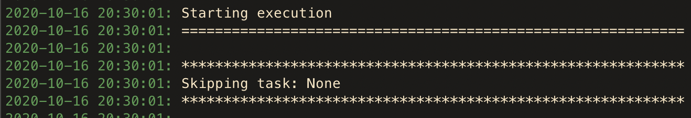

# Configure CumulusCI

The `cumulusci.yml` file is located in the project root directory. This
is where you define project dependencies, configure new tasks and flows,
customize standard tasks and flows for your project, and so much more!

## `cumulusci.yml` Structure

A `cumulusci.yml` file contains these top-level sections.

-   `project`: Contains information about the project's associated
    package (if any) and GitHub repository. This section is largely
    generated by running `cci project init`.

    If you need custom markup that's unique to your project, you can
    store it in a section called `custom` under `project`.

-   `tasks`: Defines the tasks that are available to run in your
    project. See [](task-configurations) for
    configuration options in this section.
-   `flows`: Defines the flows that are available to run in your
    project. See [](flow-configurations) for
    configuration options in this section.
-   `sources`: Defines other CumulusCI projects whose tasks and flows
    you can use in automation. See
    [](tasks-and-flows-from-a-different-project) for more information.
-   `orgs`: Defines the scratch org configurations that are available
    for your project. See [](scratch-org-configurations) for configuration
    options in this section.
-   `plans`: Contains any custom plans defined to install your project
    into a customer org. See the [](metadeploy-publish) task for more
    information.

(task-configurations)=

## Task Configurations

Each task configuration under the `tasks` section of your
`cumulusci.yml` file defines a task that can be run using the
`cci task run` command, or included in a flow step. With a few simple
changes to this section, you can configure build automation
functionality to suit your project's specific needs.

### Override a Task Option

If you repeatedly specify the same value for an option while running a
task, you can configure CumulusCI to use that value as a default value.

For example: Let's enforce a 90% code coverage requirement for Apex
code in your project. The `run_tests` task, which executes all Apex
tests in a target org, can enforce code coverage at a given percentage
by passing the `--required_org_code_coverage_percent` option.

```yaml
run_tests:
    options:
        required_org_code_coverage_percent: 90
```

When the `tasks` section of the `cumulusci.yml` file specifies this
option, CumulusCI overrides the default option with a value of `90`.
Whenever this task is executed, its customized options apply, unless
it's further configured for a particular flow step.

Verify the change by looking for a default option value when running
`cci task info <name>`.

```yaml
$ cci task info run_tests
run_tests

Description: Runs all apex tests

Class: cumulusci.tasks.apex.testrunner.RunApexTests

Command Syntax

    $ cci task run run_tests

Options
    .
    .
    .
  -o required_org_code_coverage_percent PERCENTAGE
    Optional
    Require at least X percent code coverage across the org following the test run.
    Default: 90
```

### Add a Custom Task

To define a new task for your project, add the task name under the
`tasks` section of your `cumulusci.yml` file.

For example, let's create a custom task named `deploy_reports` that
deploys a set of reports stored in your project's unpackaged metadata
located in `unpackaged/config/reports`.

First, look up the Python class associated with the standard task
`deploy`. From there we see that the `deploy` task has a `class_path`
value of `cumulusci.tasks.salesforce.Deploy`.

Store the task under the `tasks` section of the `cumulusci.yml` file.

```yaml
deploy_reports:
    description: Deploy Reports
    class_path: cumulusci.tasks.salesforce.Deploy
    group: projectName
    options:
        path: unpackaged/config/reports
```

```{tip}
Be sure to include the value we retrieved for `class_path`. Also,
consider adding a common `group` attribute to make it easier to see the
tasks specific to your project when running `cci task list`.
```

Congratulations! You created a new custom task in CumulusCI.

### Custom Tasks in Python

You can use Python to implement entirely new functionality. You do so by
putting it in the "tasks" subdiretory of your project. For example, you
might write a file called `tasks/write_file_custom_task.py`.

```python
from pathlib import Path

from cumulusci.core.tasks import BaseTask, CCIOptions
from cumulusci.utils.options import Field


class WriteFileCustomTask(BaseTask):
    class Options(CCIOptions):
        mypath: Path = Field(..., description="A filepath to be used by the task")
        mystring: str = Field("Hello", description="A string to be used by the task")

    parsed_options: Options

    def _run_task(self):
        file = self.parsed_options.mypath
        data = self.parsed_options.mystring
        file.write_text(data)
        self.logger.info(f"Wrote {data} to {file}")
```

You can make it available to
the project by adding it under the `tasks` section of the
`cumulusci.yml` file. If one does not exist, you can
create one.

```yaml
tasks:
    my_new_task:
        description: My custom task to write data to a file
            class_path: tasks.write_file_custom_task.WriteFileCustomTask
            group: projectName
```

This task will be accessible directly to this project. It will also
be accessible to any other project that adds this as a source
(see [Tasks and Flows from a Different Project](tasks-and-flows-from-a-different-project)) with
`allow_remote_code: True`.

#### Options for Custom Tasks

Task options are defined by declaring a nested `Options` class. This class must sublass `cumulusci.utils.options.CCIOptions`. These options are validated via the use of [Pydantic models](https://pydantic-docs.helpmanual.io/usage/models/) which are generated dynamically for each `Options` class.
Each option can define its own type via either a [standard library type](https://pydantic-docs.helpmanual.io/usage/types/) or by utilizing a custom type from [`cumulusci.utils.options`](https://github.com/SFDO-Tooling/CumulusCI/blob/main/cumulusci/utils/options.py).
Additionally the [`Field()`](https://pydantic-docs.helpmanual.io/usage/schema/#field-customisation`) function is useful for further customizing options. This can be imported from `cumulusci.utils.options` and used when defining individual options.
It has the same features as the pydantic function.

The task above (`WriteFileCustomTask`) takes two options: (1) A defaulted string (myString),
and (2) A required file path.

Once the options are defined, they can be accessed via the `parsed_options` property of the task.

Some of the most commonly used types are:

-   `pathlib.Path`: simply uses the type itself for validation by passing the value to Path(v);
-   `FilePath`: like Path, but the path must exist and be a file
-   `DirectoryPath`: like Path, but the path must exist and be a directory
-   `MappingOption`: Parses pairs of values from a string in format "a:b,c:d"
-   `ListOfStringsOption`: Parses a list of comma-separated strings from an argument in the format "abc,def,ghi"
-   `JSON`: Parse a JSON string into a structure, including a deeply nested structure

Others can be found in the [pydantic docs](https://pydantic-docs.helpmanual.io/usage/types).

If you are comfortable with Python types, you can do very sophisticated parsing.
For example:

```python
from typing import Optional

from pydantic import Json

from cumulusci.core.tasks import BaseTask, CCIOptions
from cumulusci.utils.options import Field


class Person(CCIOptions):
    name: str
    children: Optional[dict[str, "Person"]]


People = dict[str, Person]


class ComplexOptionsCustomTask(BaseTask):
    class Options(CCIOptions):
        lineage: Json[People] | People = Field(..., description="Foo")

    parsed_options: Options

    def _run_task(self):
        self.logger.info(f"Got {self.parsed_options.lineage}")
```

Which can parse this commmand line:

```sh
$ cci task run complex_options --lineage '{"Bob": {"name": "Bob Cat Sr", "children": {"Bob": {"name": "Bob Cat Jr"}}}}'
    Got {'Bob': Person(name='Bob Cat Sr', children={'Bob': Person(name='Bob Cat Jr', children=None)})}
```

Or this YAML:

```yaml
complex_options:
    description: Description of the task
    class_path: tasks.complex_options_custom_task.ComplexOptionsCustomTask
    options:
        lineage:
            Bob:
                name: Bob Cat Sr
                children:
                    Bob:
                        name: Bob Cat Jr
```

(use-variables-for-task-options)=

### Use Variables for Task Options

To reference a project configuration value within the `tasks` section of
the `cumulusci.yml` file, use the `$project_config` variable.

For example, NPSP uses a variable for the project's namespace by
setting a value of `$project_config.project__package__namespace`. This
variable is then referenced in the project's custom `deploy_qa_config`
task where it's passed as the value for the `namespace_inject` option.

```{tip}
A double underscore (`__`) refers to a subsequent level in the
`cumulusci.yml` file.
```

```yaml
deploy_qa_config:
    description: Deploys additional fields used for QA purposes only
    class_path: cumulusci.tasks.salesforce.Deploy
    group: Salesforce Metadata
    options:
        path: unpackaged/config/qa
        namespace_inject: $project_config.project__package__namespace
```

In this instance, CumulusCI replaces the variable with the value under
project -\> package -\> namespace in the `cumulusci.yml` file. Here is
the `project` section of NPSP's `cumulusci.yml` file specifying `npsp`
as the namespace value.

```yaml
project:
    name: Cumulus
    package:
        name: Cumulus
        name_managed: Nonprofit Success Pack
        namespace: npsp
        api_version: 48.0
        install_class: STG_InstallScript
        uninstall_class: STG_UninstallScript
```

(flow-configurations)=

## Flow Configurations

Each flow configuration listed under the `flows` section of your
`cumulusci.yml` file defines a flow that can be run using the
`cci flow run` command, or included as a step in another flow. With a
few simple changes to this section, you can configure sophisticated
build automation that execute workflows throughout your development
lifecycle.

### Add a Custom Flow

To define a new flow for your project, add the flow name under the
`flows` section of your `cumulusci.yml` file. Let's define a new
`greet_and_sleep` flow:

```yaml
greet_and_sleep:
    group: projectName
    description: Greets the user and then sleeps for 5 seconds.
    steps:
        1:
            task: command
            options:
                command: echo 'Hello there!'
        2:
            task: util_sleep
```

This flow is comprised of two tasks: `command` greets the user by
echoing a string, and `util_sleep` then tells CumulusCI to sleep for
five seconds.

You can reference how flows are defined in the [universal
cumulusci.yml](https://github.com/SFDO-Tooling/CumulusCI/blob/master/cumulusci/cumulusci.yml)
file.

### Add a Flow Step

To add a step to a flow, first run `cci flow info <name>` to see the
existing steps. In the following example we run this for the `dev_org`
flow.

```console
$ cci flow info dev_org
Description: Set up an org as a development environment for unmanaged metadata
1) flow: dependencies [from current folder]
    1) task: update_dependencies
    2) task: deploy_pre
2) flow: deploy_unmanaged
    0) task: dx_convert_from
    when: project_config.project__source_format == "sfdx" and not org_config.scratch
    1) task: unschedule_apex
    2) task: update_package_xml
    when: project_config.project__source_format != "sfdx" or not org_config.scratch
    3) task: deploy
    when: project_config.project__source_format != "sfdx" or not org_config.scratch
    3.1) task: dx_push
        when: project_config.project__source_format == "sfdx" and org_config.scratch
    4) task: uninstall_packaged_incremental
    when: project_config.project__source_format != "sfdx" or not org_config.scratch
3) flow: config_dev
    1) task: deploy_post
    2) task: update_admin_profile
4) task: snapshot_changes
```

Of this flow's four steps, the first three are themselves flows, and
the last is a task.

All _non-negative numbers and decimals_ are valid as step numbers in a
flow. You can add steps before, between, or after existing flow steps.

The following shows examples of values that you would use for the
various scenarios:

-   Add a step _before_ step 1 by inserting a step number greater than
    or equal to zero and less than 1 (such as 0, 0.3, or even 0.89334).
-   Add a step _between_ steps 2 and 3 by inserting a step number
    greater than 2 or less than 3.
-   Add a step _after_ all steps in the flow by inserting a step number
    greater than 4.

You could also customize the `dev_org` flow to output an additional log
line as its final step:

```yaml
dev_org:
    steps:
        5:
            task: log
            options:
                line: dev_org flow has completed
```

### Skip a Flow Step

To skip a flow step, set the task or flow for that step number to the
value of `None`.

For example, to skip the fourth step of the `dev_org` flow, insert this
code under the `flows` section of your `cumulusci.yml` file.

```yaml
dev_org:
    steps:
        4:
            task: None
```

```{important}
The key `task` must be used when skipping a flow step that is a task.
The key `flow` must be used when skipping a flow step that corresponds
to a flow.
```

When CumulusCI detects a task or flow with a value of `None`, the task
or flow is skipped.



### Replace a Flow Step

Replacing a flow step is easy; just note the name of the flow, step
number, and task or flow you would like to run on the given step.

For example, to replace the default fourth step of the `dev_org` flow
with a custom task that loads data into a dev environment, specify the
custom task to run instead.

```yaml
dev_org:
    steps:
        4:
            task: load_data_dev
```

(configure-options-on-tasks-in-flows)=

### Configure Options on Tasks in Flows

Specify options on specific tasks in a flow with this syntax:

```yaml
<flow_to_modify>:
    steps:
        <step_number>:
            flow: <sub_flow_name>
            options:
                <task>:
                    <option_name>: <value>
```

Replace all objects with `<>` with the desired values.

For example, let's examine the definition of the `ci_master` flow from
the universal `cumulusci.yml` file.

```
ci_master:
    group: Continuous Integration
    description: Deploy the package metadata to the packaging org and prepare for managed package version upload.  Intended for use against main branch commits.
    steps:
        1:
            flow: dependencies
            options:
                update_dependencies:
                    resolution_strategy: production
        2:
            flow: deploy_packaging
        3:
            flow: config_packaging
```

This flow specifies that when the subflow `dependencies` runs, the
`resolution_strategy` option has a value of `production` for the
`update_dependencies` task (which itself executes in the `dependencies`
subflow).

### `when` Clauses

Specify a `when` clause in a flow step to conditionally run that step. A
`when` clause is written in a Pythonic syntax that should evaluate to a
boolean (`True` or `False`) result.

You can use the `project_config` object to reference values from the
`cumulusci.yml` file to help with creation of the `when` clause's
condition. You can use the double underscore (`__`) syntax to indicate
values at subsequent levels of the file. For example, you can reference
a project's namespace with
`project_config.project__package__namespace`.

You can also reference values on the `org_config` object in `when`
clauses. For example, it's common to reference `org_config.scratch`
when building automation that needs to behave differently in a scratch
org and a persistent org.

`when` clauses are frequently used in CumulusCI's standard library to
conditionally run a step in a flow based on the source code format of
the project. Below is the configuration for the standard library flow
`build_feature_test_package`. The `update_package_xml` task will execute
_only if_ the project's source code format is not equal to "`sfdx`".

```yaml
build_feature_test_package:
    group: Release Operations
    description: Create a 2gp managed package version
    steps:
        1:
            task: update_package_xml
            when: project_config.project__source_format != "sfdx"
        2:
            task: create_package_version
            options:
                package_type: Managed
                package_name: $project_config.project__package__name Managed Feature Test
                version_base: latest_github_release
                version_type: minor
                skip_validation: True
```

See [](use-variables-for-task-options)
for more information.

(tasks-and-flows-from-a-different-project)=

### Tasks and Flows from a Different Project

It's also possible to use tasks and flows from another project with
CumulusCI. The other project must be named under the `sources` section
of the project `cumulusci.yml` file.

For example, when tasks or flows are referenced using the `npsp`
namespace, CumulusCI fetches the source from the NPSP GitHub repository.

```yaml
sources:
    npsp:
        github: https://github.com/SalesforceFoundation/NPSP
```

By default, CumulusCI uses the resolution strategy `production`, which
will fetch the most recent production release, or the default branch if
there are no releases. By specifying `resolution_strategy`, the behavior
can be changed to match desired dependency resolution behavior, such as
using beta releases or retrieving feature test packages from a commit
status. See [](dependency-resolution) for
more details about resolution strategies.

```{note}
This feature requires that the referenced repository be readable (for
example, it's public, or CumulusCI's GitHub service is configured with
the token of a user who has read access to it).
```

It's also possible to fetch a specific `tag` or `release`, where `release` is one of `latest`, `previous`, or `latest_beta`. For example:

```yaml
sources:
    eda:
        github: https://github.com/SalesforceFoundation/EDA
        release: latest
    npsp:
        github: https://github.com/SalesforceFoundation/NPSP
        tag: rel/3.163
```

You can also select a specific `commit` or `branch`. We recommend that most projects, however, use a resolution strategy.

When the repo is listed under `sources`, it's possible to run a task
from NPSP\...

```console
$ cci task run npsp:robot
```

Or a flow\...

```console
$ cci flow run npsp:install_prod
```

Or even create a new flow that uses a flow from NPSP:

```yaml
flows:
    install_npsp:
        steps:
            1:
                flow: npsp:install_prod
            2:
                flow: dev_org
```

This flow uses NPSP's `install_prod` flow to install NPSP as a managed
package, and then run this project's own `dev_org` flow.

If the flow uses tasks that are implemented in custom Python code
(see [Add a Custom Task](#add-a-custom-task))
then you must instruct CumulusCI to allow that code to run:

```yaml
sources:
    eda:
        github: https://github.com/SalesforceFoundation/EDA
        allow_remote_code: True
```

(scratch-org-configurations)=

## Scratch Org Configurations

This section defines the scratch org configurations that are available
without explicitly running `cci org scratch` to create a new
configuration. For more information on using scratch orgs with
CumulusCI, see [](scratch-orgs).

### Override Default Values

```{note}
These overrides pertain only to scratch orgs.
```

You can override these values for your org.

-   `days` (integer): Number of days for the scratch org to persist.
-   `namespaced` (boolean): Is the scratch org namespaced or not.
    Applies only to managed package projects.
-   `config_file` (string): Path to the org definition file to use when
    building the scratch org.

```yaml
orgs:
    scratch:
        <org_name>:
            <key>: <value>
```

Replace all objects with `<>` with the desired values.

For example, override the default number of days from 7 to 15 in the
`dev` org.

```yaml
orgs:
    dev:
        days: 15
```

## Configuration Scopes

CumulusCI merges multiple [YAML](https://yaml.org/) files that enable
configuration at several distinct scopes. All of these files have the
same name, `cumulusci.yml`, but live in different locations in the file
system.

You can configure files at these scope levels: _Project_, _Local
Project_ and _Global_. Configurations have an order of override
precedence (from highest to lowest):

1.  Project
2.  Local Project
3.  Global

One override only cascades over another when two configurations set a
value for the same element on a task or flow.

Take for example, task `T` which takes two options, `opt1` and `opt2`.

You can specify a default value for `opt1` in your project
`cumulusci.yml` file and a default value for `opt2` in your global
`cumulusci.yml` file, and you'll see the expected result: both values
are available in the project. (The default of `opt1` is not exposed to
other projects.)

If you change your project `cumulusci.yml` file to also specify a
default value for `opt2`, this new default `opt2` value takes precedence
over the default `opt2` value specified in your global `cumulusci.yml`
file.

### Project Configurations

**macOS/Linux:** `.../path/to/project/cumulusci.yml`

**Windows:** `...\path\to\project\cumulusci.yml`

This `cumulusci.yml` file lives in the project root directory and
applies solely to this project. Changes here are committed back to a
remote repository so other team members can benefit from the
customizations. Configurations in this file apply solely to this
project, and take precedence over any configurations specified in the
global `cumulusci.yml` file, but are overridden by configurations in the
local project `cumulusci.yml` file.

### Local Project Configurations

**macOS/Linux:** `~/.cumulusci/project_name/cumulusci.yml`

**Windows:** `%homepath%\.cumulusci\project_name\cumulusci.yml`

Configurations in this `cumulusci.yml` file apply solely to the project
with the given \<project*name\>, and take precedence over \_all other*
configuration scopes. If you want to make customizations to a project,
but don't need them to be available to other team members, make those
customizations here.

### Global Configurations

**macOS/Linux:** `~/.cumulusci/cumulusci.yml`

**Windows:** `%homepath%\.cumulusci\cumulusci.yml`

Configuration of _all_ CumulusCI projects on your machine.
Configurations in this file have a low precedence, and are overridden by
_all other_ configurations except for those that are in the universal
`cumulusci.yml` file.

### Universal Configurations

There is one more configuration file that exists: the [universal
cumulusci.yml](https://github.com/SFDO-Tooling/CumulusCI/blob/master/cumulusci/cumulusci.yml)
file that ships with CumulusCI itself. This file actually holds the
lowest precedence of all, as all other scopes override this file's
contents. That said, it contains all of the definitions for the tasks,
flows, and org configurations that come standard with CumulusCI.

The commands `cci task info` and `cci flow info` display all of the
information about a task's or flow's configuration. They display the
information in the standard library alongside any customizations defined
in your cumulusci.yml file.

## Advanced Configurations

### Customizing Metadata Deployment

CumulusCI's `deploy` task offers deep flexibility to customize your deployment process. Review [](deploy) for an in-depth guide.

```{toctree}
---
maxdepth: 1
---

deploy
```

### Reference Task Return Values

```{attention}
Current task return values are _not_ documented, so finding return
values set by a specific task (if any) requires you to read the source
code for the given task.
```

It is sometimes useful for return values to be used as input by a
subsequent task in the context of a flow. Tasks can set arbitrary return
values on themselves while executing. These values can then be
referenced by subsequent tasks in a flow.

To reference a return value on a previous task use the following syntax:

```yaml
^^prior_task.return_value
```

To discover what's available for `return_value`, find the source code
for an individual task in the [CumulusCI
repository](https://github.com/SFDO-Tooling/CumulusCI/).

For example, let's examine how CumulusCI defines the standard
`upload_beta` task in the universal `cumulusci.yml` file.

```yaml
upload_beta:
    description: Uploads a beta release of the metadata currently in the packaging org
    class_path: cumulusci.tasks.salesforce.PackageUpload
    group: Release Operations
```

To see if anything is being set on `self.return_values`, find the file
that defines the class `cumulusci.tasks.salesforce.PackageUpload`. A
little digging yields that this class is defined in the file
[package_upload.py](https://github.com/SFDO-Tooling/CumulusCI/blob/main/cumulusci/tasks/salesforce/package_upload.py)
and has a method called `_set_return_values()`. [This
method](https://github.com/SFDO-Tooling/CumulusCI/blob/3cad07ac1cecf438aaf087cdeff7b781a1fc74a1/cumulusci/tasks/salesforce/package_upload.py##L165)
sets `self.return_values` to a dictionary with these keys:
`version_number`, `version_id`, and `package_id`.

Now look at the standard `release_beta` flow defined in the universal
`cumulusci.yml` file:

```yaml
release_beta:
    description: Upload and release a beta version of the metadata currently in packaging
    steps:
        1:
            task: upload_beta
            options:
                name: Automated beta release
        2:
            task: github_release
            options:
                version: ^^upload_beta.version_number
        3:
            task: github_release_notes
            ignore_failure: True ## Attempt to generate release notes but don't fail build
            options:
                link_pr: True
                publish: True
                tag: ^^github_release.tag_name
                include_empty: True
                version_id: ^^upload_beta.version_id
        4:
            task: github_master_to_feature
```

This flow shows how subsequent tasks can reference the return values of
a prior task. In this case, the `github_release` task uses the
`version_numer` set by the `upload_beta` task as an option value with
the `^^upload_beta.version_number` syntax. Similarly, the
`github_release_notes` task uses the `version_id` set by the
`upload_beta` task as an option value with the
`^^upload_beta.version_id` syntax.

## Troubleshoot Configurations

Use `cci task info <name>` and `cci flow info <name>` to see how a given
task or flow behaves with current configurations.

For example, the `util_sleep` task has a `seconds` option with a default
value of 5 seconds.

```console
$ cci task info util_sleep
util_sleep

Description: Sleeps for N seconds

Class: cumulusci.tasks.util.Sleep

Command Syntax

    $ cci task run util_sleep

Options

    -o seconds SECONDS
    Required
    The number of seconds to sleep
    Default: 5
```

To change the default value to 30 seconds for all projects on your
machine, add the desired value in your [global](Global%20Configurations)
`cumulusci.yml` file.

```yaml
tasks:
    util_sleep:
        options:
            seconds: 30
```

Now `cci task info util_sleep` shows a default of 30 seconds.

```console
$ cci task info util_sleep
util_sleep

Description: Sleeps for N seconds

Class: cumulusci.tasks.util.Sleep

Command Syntax

    $ cci task run util_sleep

Options

    -o seconds SECONDS
    Required
    The number of seconds to sleep
    Default: 30
```

Displaying the active configuration for a given task or flow can help
with cross-correlating which configuration scope affects a specific
scenario.

```{tip}
The `cci task info` and `cci flow info` commands show information about
how a task or flow is _currently_ configured. The information output by
these commands change as you make further customizations to your
project's `cumulusci.yml` file.
```
