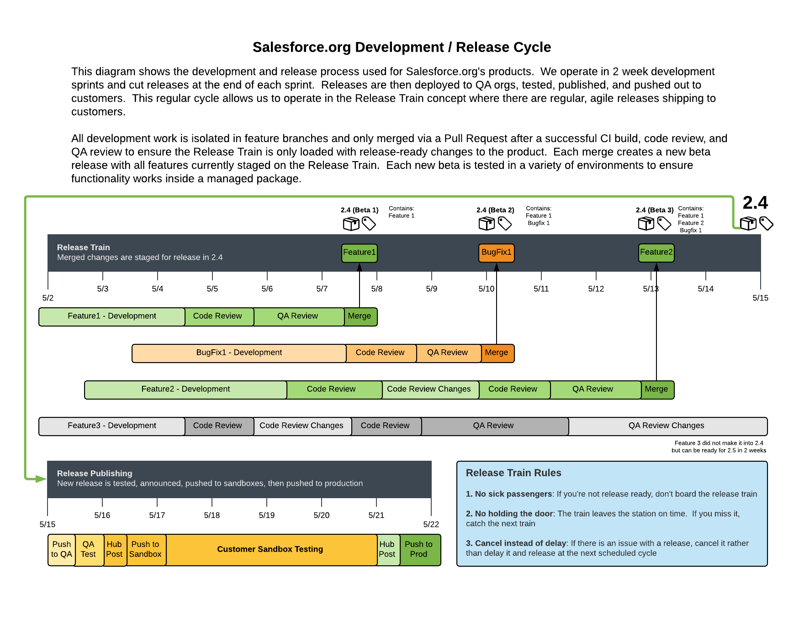

# CumulusCI Flow

CumulusCI Flow is the process that Salesforce.org uses to develop, test,
and release our products. This process encompasses both a development
and testing philosophy as well as a specific GitHub branching structure.
There are several key reasons we like using CumulusCI Flow:

-   Everything is done in scratch orgs to eliminate "state drift" that
    occurs over time in persistent orgs. The only persistent org in this
    process is the packaging org or production org.
-   Changes to branches that are being actively developed are thoroughly
    tested on each commit.
-   For managed package projects, a new beta version of the package is
    created and tested for each commit on a project's `main` branch.
-   Auto-merging functionality keeps branches up-to-date with the `main`
    branch.

CumulusCI Flow is implemented in the standard library flows provided by
CumulusCI, but the approach to working with a GitHub repository does not
require the use of CumulusCI.



## Project Considerations

CumulusCI Flow was designed for use with Salesforce development
projects, which inject some unique considerations into finding the right
branching model:

-   You cannot re-cut a Salesforce first-generation managed package
    release with the same version as a prior release. As a result, Git
    Tags are the best representation of our releases in a repository
    since they are a read only reference to the exact code we put into a
    given release.
-   Releasing managed packages has some overhead involved including
    manual checks by release managers to ensure nothing gets permanently
    locked into the package in a release. As a result, true continuous
    delivery isn't an option. Whether you're on a team that wants to
    deliver quickly (e.g. a two week sprint cycle) or at team that makes
    several larger releases a year, CumulusCI offers functionality to
    help cut releases for all products with any changes.

## Main Builds

The main goal of the CumulusCI Flow is to always have the main branch
ready to release. This way, we can merge a fix and cut an emergency
release at any time in the development process.

To test that we can package main, we upload a beta release on every
commit to main and then test that beta release in a variety of
Salesforce org environments concurrently. A passing build is proof we
can package main at any point in time.

When the upload of the beta release is completed, the main branch is
[auto-merged](auto-merging) into all open
feature branches. New betas are published on GitHub as a GitHub Release,
along with automatically generated release notes drawn from the content
of the Pull Requests merged since the last production release.

### CumulusCI and Main Builds

There are three main flows that facilitate main builds:

-   `ci_master`: Deploys the main branch and all dependencies into the
    packaging org including incrementally deleting any metadata removed
    since the previous deployment. The end result is to prepare the
    packaging org to upload a new version.
-   `release_beta`: Uploads a beta release of the code staged in the
    packaging org, creates a GitHub Tag and Release, generates release
    notes, adds them to the release, and merges `main` into all feature
    branches.
-   `ci_beta`: Installs the beta and all dependencies into a fresh
    scratch org and runs the Apex tests.

### CumulusCI and Tag Naming

CumulusCI Flow uses two different tag prefixes for differentiating
between beta and production releases of a managed package. The default
prefix values for tags are `beta/` and `release/`.

-   Example beta release tag: `beta/1.2-Beta_3`
-   Example production release tag: `release/1.2`

By differentiating beta and release tags, we allow tooling to query for
the latest beta and the latest production release of each repository.

To change the default prefix values see [](branch-configuration).

## Feature Branches

Like GitHub Flow, CumulusCI Flow uses a simple main/feature branch
model. The main branch is the only permanent branch in the repository.
All development work (features and bug fixes) is done in feature
branches prefixed with `feature/`. All commits on all feature branches
are tested concurrently via continuous integration, such as MetaCI or
another solution.

Once a developer is done with a feature branch, they create a Pull
Request to merge their branch into the main branch. The Pull Review
serves as the container for the following:

-   **Code Review**: We use GitHub's built in review functionality for
    Pull Requests to conduct line by line code reviews
-   **Release Notes**: We use the Pull Request body to create release
    notes content relevant to the PR. This content is automatically
    parsed by CumulusCI's release notes generation task to
    automatically build cumulative release notes on each release.
-   **QA**: The goal of the Pull Request is to serve as a gate blocking
    a change from going into main until it's ready to release. As a
    result, we do QA on the feature before merging the Pull Request.

When a Pull Request is approved and passing build, it is merged using
the Merge button in GitHub's web interface. We use GitHub Protected
Branches to enforce both code reviews and passing builds before a Pull
Request can be merged to main.

Once the Pull Request is merged, the feature branch is deleted.

### Feature Branch Flows

CumulusCI facilitates working with feature branches (mainly) through two
default flows:

-   `dev_org`: Used to deploy the unmanaged code and all dependencies
    from the feature branch into a Salesforce org to create a usable
    development environment.
-   `ci_feature`: Deploys the unmanaged code and all dependencies into a
    Salesforce org (typically a fresh scratch org) and run the Apex
    tests. This flow is run by a CI app on new commits to any feature
    branch.

## Release Branches

Some teams deliver large releases several times a year. For this type of
release cadence, Salesforce.org uses a special type of branch referred
to as a release branch. Release branches are simply a feature branch
named with a number. These long-lived branches are created off of the
`main` branch, serve as the target branch for all features associated
with that release and are eventually merged back to the `main` branch
when a release occurs. To be able to clearly track what work is
associated with a specific release, release branches must fulfill these
criteria:

-   They are the parent branches of _all_ feature work associated with a
    release. That is, all feature branches associated with a release are
    child branches of the target release branch.
-   Release branches use a strict naming format: `feature/release_num`
    where `release_num` is a valid integer.

Using the `feature/` branch prefix for the release branch names allow
those branches to stay in sync with the `main` branch. Like any other
feature branch, they participate in CumulusCI's parent-to-child merge
operations. The release number immediately after the `feature/` prefix
allows CumulusCI to detect and merge changes from one release branch to
other future release branches. See [Release to (Future) Release
Merges](release-to-future-release-merges) for more information.

An example of a release branch with two items of work associated with it
could look like this:

-   `feature/001`
-   `feature/001__feature1`
-   `feature/001__feature2`

(branch-configuration)=

## Branch Configuration

The name of the main (default) branch, as well as the branch prefixes
are configurable in your projects `cumulusci.yml` file. The following
shows the default values that CumulusCI comes with:

```yaml
project:
    git:
        default_branch: main
        prefix_feature: feature/
        prefix_beta: beta/
        prefix_release: release/
```

These values can be changed to match naming conventions used by your own
project.

(auto-merging)=

## Auto Merging

CumulusCI Flow helps to keep large diffs and merge conflicts from being
the norm. CumulusCI's auto-merge functionality helps teams:

-   Keep feature branches up-to-date with the `main` branch (main to
    feature merges)
-   Manage long-lived feature branches for larger features worked on by
    multiple developers (parent to child merges)
-   Manage large releases that occur several times a year (release to
    future release merges).

### Main to Feature Merges

One of the bigger differences between CumulusCI Flow and GitHub Flow or
git-flow is that CumulusCI Flow automates the merging of commits to a
project's `main` branch into all open feature branches. This auto-merge
does a lot for us:

-   Ensures feature branches are in sync with the main branch.
-   Re-tests each feature branch with any changes to main since the
    merge generates a new commit.
-   Eliminates merge conflicts when merging a Pull Request to main.

To understand the benefit of auto-merging to feature branches, consider
the following scenario: A developer starts work on a feature branch,
puts in a few weeks on it, and then has to leave unexpectedly for a few
months. While they are on leave, their feature branch gets automatically
updated with any new commits on main and rebuilt. A few weeks into their
leave, a new commit on main gets merged to their feature branch and
breaks the build. When the developer returns after their leave, they can
look at the build history to find which commit from main broke their
feature branch.

Without auto-merging, the developer would return, merge main into their
feature branch, and then have to sift through all the commits to main
during their leave to figure out which one broke their feature branch.
More testing and build history is always a good thing in addition to the
other benefits we gain from auto-merging.

CumulusCI facilitates the auto-merge to feature branches via the
`github_automerge_main` task, which is included by default in the
`release_beta` flow. The `release_beta` flow is run, in CumulusCI Flow,
on new commits to the `main` branch.

### Parent to Child Merges

There is sometimes a need for multiple developers to collaborate on
different parts of a single larger feature. To enable this collaboration
CumulusCI expands the concept of auto-merging main-to-feature branches
to also handle the concept of Parent and Child Feature Branches.

Parent/Child feature branches are created using a simple naming format:

-   **Parent**: feature/parent-branch-name
-   **Child**: feature/parent-branch-name\_\_child-branch-name

A child branch extends the parent's name with two additional
underscores (`__`) and an additional description.

Auto-merging from parent to child branches works as follows:

-   Child branches never receive the auto-merge from `main`
-   Parent branches do receive the merge from `main` which kicks off a
    Feature Test build. (This assumes the parent branch is not itself a
    child.)
-   At the end of a successful Feature Test build on a Parent branch,
    the parent branch is auto-merged into all child branches

This allows us to support multiple developers working on a single large
feature while keeping that feature isolated from main until we're ready
to release it. The parent branch is the branch representing the overall
feature. Each developer can create child branches for individual
components of the larger feature. Their child branch still gets CI
builds like all feature branches. When they are ready to merge from
their child branch to the parent branch, they create a Pull Request
which gets code reviewed by other developers working on the parent
feature branch and finally merged to the parent branch.

CumulusCI facilitates parent to child auto-merges via the
[](github-automerge-feature) task, which is included by
default in the [](ci-feature) flow. If a parent feature branch
passes the build, it is automatically merged into all child branches.

The parent to child merge functionality works across _multiple levels_
of branching. The effects of automerging remains the same, with children
only receiving merges from their parents only (e.g. no merges from
grandparents) This allows us to have branching structures such as:

-   `main`
-   `feature/large-feature`
-   `feature/large-feature__section1`
-   `feature/large-feature__section1__work-item1`
-   `feature/large-feature__section1__work-item2`
-   `feature/large-feature__section2`
-   `feature/large-feature__section2__work-item1`

In this scenario, a commit to the `main` branch triggers the
`github_automerge_main` task to run and will automerge that commit into
`feature/large-feature`. This triggers a build to run against
`feature/large-feature`, and assuming the build passes, runs the
`github_automerge_feature` task. This task detects two child branches of
`feature/large-feature`: `feature/large_feature__section1` and
`feature/large-feature__section2`. The task automerges the commit from
the parent, into the child branches, and builds begin to run against
those branches. If the build for `feature/large-feature__section1`
fails, it doest not trigger `github_automerge_feature` to merge to its
child branches. This means that despite
`feature/large-feature__section1` having two child branches, they would
not receive automerges until the parent branch tests successfully.

### Release to (Future) Release Merges

Because release branches are so long-lived, and so much work goes into
them, their diffs can get quite large. This means headaches are
inevitable the day after a major release, and you need to pull down all
of the changes from the new release into the next release branch (which
has likely been in development for months already). To alleviate this
pain point, CumulusCI can ensure that all release branches propagate
commits they receive to other existing release branches that correspond
to future releases.

Consider the following branches in a GitHub repository:

-   `main` - Source of Truth for Production
-   `feature/002` - The next major production release
-   `feature/002__feature1` - A single feature associated with release
    `002`
-   `feature/002__large_feature` - A large feature associated with
    release `002`
-   `feature/002__large_feature__child1` - First chunk of work for the
    large feature
-   `feature/002__large_feature__child2` - Second chunk of work for the
    large feature
-   `feature/003` - The release that comes after `002`
-   `feature/003__feature1` - A single feature associated with release
    `003`

In this scenario, CumulusCI ensures that when `feature/002` receives a
commit, that that commit is also merged into `feature/003`. This kicks
off tests in our CI system and ensures that functionality going into
`feature/002` doesn't break work being done for future releases. Once
those tests pass, the commit on `feature/003` is merged to
`feature/003__feature1` because they adhere to the parent/child naming
convention described above. Commits **never** propagate in the opposite
direction. (A commit to `feature/002` would never be merged to
`feature/001` if it was an existing branch in the GitHub repository).

**Propagating commits to future release branches is turned off by
default.** If you would like to enable this feature for your GitHub
repository, you can set the `update_future_releases` option on the
`github_automerge_feature` task in your `cumulusci.yml` file:

```yaml
tasks:
    github_automerge_feature:
        options:
            update_future_releases: True
```

### Orphan Branches

If you have both a parent and a child branch, and the parent is deleted,
this creates an orphaned branch. Orphaned branches do not receive any
auto-merges from any branches. You can rename an orphaned branch to
include the `feature/` prefix and contain no double underscores
('\_\_') to begin receiving merges from the main branch again.

If we have a parent and child branch: `feature/myFeature` and
`feature/myFeature__child`, and `feature/myFeature` (the parent) is
deleted, then `feature/myFeature__child` would be considered an orphan.
Renaming `feature/myFeature__child` to `feature/child` will allow the
orphan to begin receiving automerges from the main branch.

## CumulusCI Flow vs. GitHub Flow

Since CumulusCI Flow is largely an extension of GitHub Flow, the
differences are mostly additional processes in CumulusCI Flow that help
make it more effective for large-scale Salesforce projects:

-   Feature branches must be prefixed feature/ or they don't get built
    or receive auto-merges. This allows developers to have experimental
    branches that don't get built or merged.
-   CumulusCI Flow is focused on an agile release process that works
    well with the technical constraints of Salesforce packaging..
-   CumulusCI Flow requires the beta and release tag naming convention
    so tooling can use the GitHub API to determine the latest beta and
    the latest production release.
-   CumulusCI Flow utilizes parent/child branch relationships and
    performs auto-merging of commits between branches, where as GitHub
    flow does not.

## CumulusCI Flow vs git-flow

When our team first started figuring out our development/release
process, we started where most people do in looking at git-flow. Unlike
both CumulusCI Flow and GitHub Flow, git-flow uses multiple permanent
branches to separate development work from releases. We decided to go
with a main/feature branching model instead of git-flow for a few
reasons:

-   We only cut and release new releases. We never patch old releases
    which makes the complexity of git-flow less necessary.
-   git-flow is not natively supported in git or GitHub. Using git-flow
    effectively usually requires extending your git tooling to enforce
    structure and merging rules for a more complex branching model.
-   The main reason for git-flow is to be able to integrate your
    features together. We get this, along with many other benefits,
    already from auto-merging main to feature branches.
-   Feature branches provide better isolation necessary for a rapid,
    agile release cycle by keeping all features not ready for release
    out of the release. Doing testing in the development branch means
    you've already integrated your features together. If one feature is
    bad, it is harder to unwind that feature from the development branch
    than if it were still isolated in its feature branch, tested there,
    and only merged when truly ready. Plus, with the auto-merge of main,
    we get the same integration as a development branch.
-   In short, auto-merging and parent/child feature branches in
    CumulusCI Flow provide us everything we would want from git-flow in
    a simpler branching model.
