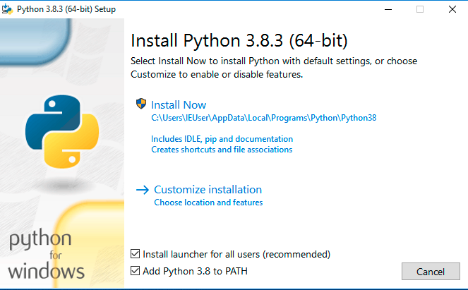
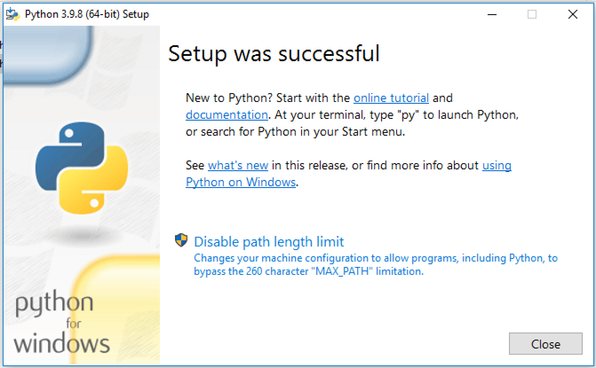
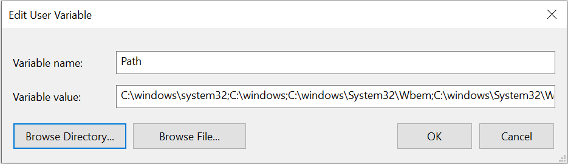
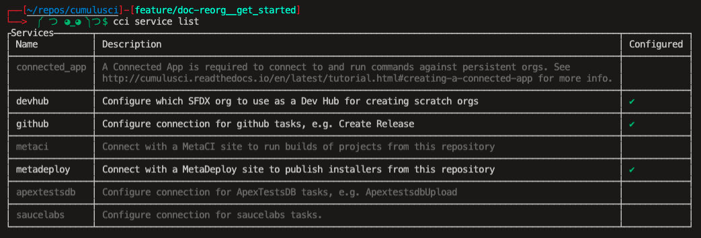

# Get Started

(install-cumulusci)=

## Install CumulusCI

```{tip}
These installation instructions assume some familiarity with entering
commands into a terminal. If that's completely new to you, we recommend
visiting the [CumulusCI
Setup](https://trailhead.salesforce.com/content/learn/modules/cumulusci-setup)
module on Trailhead for a step-by-step walkthrough.
```

### On macOS

[Homebrew](https://brew.sh/) is a prerequisite for installing CumulusCI
on macOS. Follow the instructions on the Homebrew website to install
Homebrew before continuing.

#### Install via `pipx`

`pipx` ensures that CumulusCI and its dependencies are installed into
their own Python environment separate from other Python software on your
computer. **We cannot recommend it enough!**

First, install `pipx` with these commands:

```console
$ brew install pipx
$ pipx ensurepath
```

After `pipx` installs, install CumulusCI:

```console
$ pipx install cumulusci
```

```{note}
Upgrading Homebrew's Python version can result in a `bad interpreter` error. To resolve this, run `pipx reinstall cumulusci`.
```

When finished, [verify your installation](verify-your-installation).

### On Linux

#### Install via `pipx`

`pipx` ensures that CumulusCI and its dependencies are installed into
their own Python environment separate from other Python software on your
computer. **We cannot recommend it enough!**

Installation instructions for `pipx` can be found
[here](https://pipxproject.github.io/pipx/installation/).

After `pipx` installs, install CumulusCI:

```console
$ pipx install cumulusci
```

When finished, [verify your installation](verify-your-installation).

### On Windows

#### Install Python 3

1.  Go to the [Python downloads
    page](https://www.python.org/downloads/windows/).

2.  Download the latest Python 3.9 release. Most users select the
    "Windows Installer (64-bit)" link, but it depends on your
    particular computer setup.

3.  Install using the installation wizard.

    -   Select **Add Python \<version\> to PATH**.
    -   Click "Install Now".

    

4.  On the screen entitled "Setup was successful," click the "Disable
    path length limit" button (if it's present).

    

#### Install via `pipx`

`pipx` ensures that CumulusCI and its dependencies are installed into
their own Python environment separate from other Python software on your
computer. **We cannot recommend it enough!**

Open your preferred terminal application (such as
[cmd.exe](https://docs.microsoft.com/en-us/windows-server/administration/windows-commands/cmd)
on Windows). If your terminal is already open, close it and reopen it.
Enter the following commands:

```console
$ python -m pip install --user pipx
$ python -m pipx ensurepath
```

Close your current command prompt and open a new one to verify that `pipx` was successfully installed:

```console
pipx --version
```

Look for a version number after entering this command, such as:
`0.12.3.1`.

If you encounter an error, such as
`'pipx' is not recognized as an internal or external command, operable program or batch file.`,
you can try [updating your environment variables manually](#update-environment-variables-manually).

Finally, install CumulusCI with this command:

```console
pipx install cumulusci
```

When finished, [verify your installation](verify-your-installation).

#### Update Environment Variables Manually

1.  Click Start and search for `edit environment variables`, or open
    System properties and click `Advanced system settings`.
2.  Click the `Environment Variables` button.
3.  To change System variables, you need non-restricted access
    (administrator rights) to your machine. Add these paths to your PATH
    environment variable:
    -   `%USERPROFILE%\.local\bin`
    -   `%USERPROFILE%\AppData\Roaming\Python\Python38\Scripts`



```{note}
Be precise when entering these paths. Add them at the very end of the
Variable Value already in place. Separate each path by a semicolon (;)
with no space between path names.
```

(verify-your-installation)=

### Verify Your Installation

In a new terminal window, verify that CumulusCI installed correctly by
running `cci version`.

```console
$ cci version
CumulusCI version: 3.29.0 (/path/to/bin/cci)
Python version: 3.8.5 (/path/to/bin/python)

You have the latest version of CumulusCI.
```

You can also use this command to check whether your CumulusCI
installation is up to date.

Still need help? Feel free to submit a question on our [Trailblazer
community
group](https://trailblazers.salesforce.com/_ui/core/chatter/groups/GroupProfilePage?g=0F9300000009M9ZCAU).

(set-up-sfdx)=

## Set Up SFDX

Scratch orgs created by Salesforce DX allow teams to work efficiently in
individual, fully-configured environments that are easy to create and
destroy. We recommend working with scratch orgs throughout the
development process.

To set up Salesforce DX:

1.  [Install Salesforce
    CLI](https://developer.salesforce.com/docs/atlas.en-us.sfdx_setup.meta/sfdx_setup/sfdx_setup_install_cli.htm)
2.  [Enable Dev Hub Features in Your
    Org](https://developer.salesforce.com/docs/atlas.en-us.228.0.sfdx_dev.meta/sfdx_dev/sfdx_setup_enable_devhub.htm)
3.  [Connect SFDX to Your Dev Hub
    Org](https://developer.salesforce.com/docs/atlas.en-us.sfdx_dev.meta/sfdx_dev/sfdx_dev_auth_web_flow.htm) -
    Be sure to use the `--setdefaultdevhubusername` option!

If you have the `sfdx` command installed, are connected to your Dev Hub,
and set the `defaultdevhubusername` config setting (use
`sfdx force:config:list` to verify), you're now ready to use `cci` with
`sfdx` to build scratch orgs.

```{important}
SFDX supports multiple Dev Hubs, so CumulusCI uses the one set as
`defaultdevhubusername` when creating scratch orgs.
```

```{tip}
For a detailed introduction on how to set up Salesforce CLI and Visual
Studio Code to work with CumulusCI, review the [Build Applications with
CumulusCI](https://trailhead.salesforce.com/en/content/learn/trails/build-applications-with-cumulusci)
module on Trailhead.
```

Learn more about Salesforce DX at
<https://developer.salesforce.com/platform/dx>.

## Connect to GitHub

In order to allow CumulusCI to work with your repositories in GitHub,
connect GitHub as a service in `cci`. Simply run:

```console
$ cci service connect github mygithub
```

to open a browser and authenticate with your GitHub account using the
one-time code shown by the CLI. Verify the GitHub service is connected
by running `cci service list`:



After you've configured the `github` service, it's available to _all_
CumulusCI projects.

```{note}
If your GitHub organization has enabled OAuth App access restrictions,
CumulusCI will not be able to access organization repositories until it
has been [approved by an
owner](https://docs.github.com/en/account-and-profile/setting-up-and-managing-your-github-user-account/managing-your-membership-in-organizations/requesting-organization-approval-for-oauth-apps).
You can use a personal access token instead.
```

Alternatively, you may [create a new personal access
token](https://github.com/settings/tokens/new) with both **repo** and
**gist** scopes specified. (Scopes appear as checkboxes when creating
the personal access token in GitHub.) Copy the access token to use when
configuring the GitHub service.

Next, run the following command and provide your GitHub username and
access token:

```console
$ cci service connect github mygithub --username $GITHUB_USERNAME --token $GITHUB_TOKEN
```

Services are stored in the global CumulusCI keychain by default.

### GitHub Enterprise Server Support

_GitHub Enterprise Server Support is an experimental feature that may change._

As of CumulusCI version 3.66, a new GitHub service type is available named `github_enterprise` to allow connections to a GitHub Enterprise Server (GES). The `github_enterprise` service works like the `github` service but includes a `server_domain` field that must be supplied with the GES server domain.

In some cases, you may receive an error connecting to a GitHub Enterprise Server that states "a self-signed certificate is in the chain". This may happen when you need to validate server TLS certificates using the system’s certificate authorities, instead of the set of CA certs that is bundled with requests. You may need to set a ENV variable `CUMULUSCI_SYSTEM_CERTS` to "True". See [](cumulusci-system-certs).

Here's an example command to configure a `github_enterprise` service:

```console
$ cci service connect github_enterprise enterprise --token <access token> --username <username> --email <email> --server_domain <repo url>
```

#### Limitations of _GitHub Enterprise Server Support_

The GitHub Enterprise Server service only allows one `github_enterprise` service to be configured per server domain. This means the access token you are using must have permission to access all required resources at a given repository location.

(work-on-an-existing-cumulusci-project)=

## Work On an Existing CumulusCI Project

If you'd like to work on an existing CumulusCI project on GitHub, these
are the prerequisites.

1.  [Install CumulusCI](install-cumulusci)
2.  [Install
    Git](https://git-scm.com/book/en/v2/Getting-Started-Installing-Git)
3.  [Clone the Project's GitHub
    Repository](https://docs.github.com/en/free-pro-team@latest/desktop/contributing-and-collaborating-using-github-desktop/adding-and-cloning-repositories)

```{note}
CumulusCI does not support projects stored on other Git hosts such as
BitBucket or GitLab at this time.
```

You can change directories into the project's root directory and begin
executing `cci` commands.

For example, `cci project info` shows information about the project:

```console
$ cd cumulusci-test

$ cci project info
name: CumulusCI Test
package:
    name: CumulusCI Test
    name_managed: None
    namespace: ccitest
    install_class: None
    uninstall_class: None
    api_version: 33.0
git:
    default_branch: main
    prefix_feature: feature/
    prefix_beta: beta/
    prefix_release: release/
    release_notes:
        parsers:
            1:
                class_path: cumulusci.tasks.release_notes.parser.GithubLinesParser
                title: Critical Changes
            2:
                class_path: cumulusci.tasks.release_notes.parser.GithubLinesParser
                title: Changes
            3:
                class_path: cumulusci.tasks.release_notes.parser.GithubIssuesParser
                title: Issues Closed
            4:
                class_path: cumulusci.tasks.release_notes.parser.GithubLinesParser
                title: New Metadata
            5:
                class_path: cumulusci.tasks.release_notes.parser.GithubLinesParser
                title: Deleted Metadata
    repo_url: https://github.com/SFDO-Tooling/CumulusCI-Test
test:
    name_match: %_TEST%
```

(start-a-new-cumulusci-project)=

## Start a New CumulusCI Project

If you'd like to start a new CumulusCI project, these are the
prerequisites.

1.  [Install CumulusCI](install-cumulusci)
2.  [Install
    Git](https://git-scm.com/book/en/v2/Getting-Started-Installing-Git)
3.  [Install the Salesforce
    CLI](https://developer.salesforce.com/tools/sfdxcli)

Run the following commands to create a directory with your project's
name, navigate to said directory, and initialize it as a Git repository:

```console
$ mkdir cci_project
$ cd cci_project
$ git init
```

Then, initialize the project as a CumulusCI project.

(project-initialization)=

### Project Initialization

Use the `cci project init` command within a Git repository to generate
the initial version of a project's `cumulusci.yml` file. CumulusCI
creates a customized `cumulusci.yml` file by first asking questions
about your project.

| Prompt                                                           | What’s it for?                                                                                                                                                                                                                                                                                                       |
| ---------------------------------------------------------------- | -------------------------------------------------------------------------------------------------------------------------------------------------------------------------------------------------------------------------------------------------------------------------------------------------------------------- |
| Project Info                                                     | The name is usually the same as your repository name.<br>NOTE: Do **not** use spaces in the project name.                                                                                                                                                                                                            |
| Package Name                                                     | CumulusCI uses an unmanaged package as a container for your project’s metadata.<br>Enter the name of the package you want to use.                                                                                                                                                                                    |
| Is this a managed package project?                               | Yes, if this project is a managed package.                                                                                                                                                                                                                                                                           |
| Salesforce API Version                                           | Which Salesforce API version does your project use? Defaults to the latest API version.                                                                                                                                                                                                                              |
| Which source format do you want to use? [sfdx \| mdapi]          | DX source format (aka “SFDX Format”) stores data under the `force-app` directory.<br>Metadata API format is the “older” format and stores data under the `src` directory.                                                                                                                                            |
| Are you extending another CumulusCI project such as NPSP or EDA? | CumulusCI makes it easy to build extensions of other projects <br>configured for CumulusCI like Salesforce.org’s NPSP and EDA. If you are<br> building an extension of another project using CumulusCI and have <br>access to its GitHub repository, use this section to configure this <br>project as an extension. |
| Default Branch                                                   | Your project’s main/master branch in GitHub. Defaults to the branch that is currently checked out in your local repository.                                                                                                                                                                                          |
| Feature Branch Prefix                                            | Your project’s feature branch prefix (if any). Defaults to `feature/`.                                                                                                                                                                                                                                               |
| Beta Tag Prefix                                                  | Your project’s beta branch prefix (if any). Defaults to `beta/`.                                                                                                                                                                                                                                                     |
| Release Tag Prefix                                               | Your project’s release branch prefix (if any). Defaults to `release/`.                                                                                                                                                                                                                                               |
| Test Name Match                                                  | The CumulusCI Apex test runner uses a SOQL `WHERE` clause to select which tests to run. Enter the SOQL pattern to match test class names. Defaults to match classes ending in `TEST`.                                                                                                                                |
| Do you want to check Apex code coverage when tests are run?      | If yes, checks Apex code coverage when tests are run.                                                                                                                                                                                                                                                                |
| Minimum code coverage percentage                                 | Sets the minimum allowed code coverage percentage for your project.                                                                                                                                                                                                                                                  |

### Verify Project Initialization

Verify successful project initialization by verifying that
`cumulusci.yml` exists and has contents.

```console
$ cat cumulusci.yml
project:
    name: SampleProjectName
    package:
        name: SamplePackageName
        namespace: sampleNamespace
    .
    .
    .
```

The `cumulusci.yml` file configures your project-specific tasks, flows,
and customizations.

Once you're satisfied, add and commit it to your Git repository.

```console
$ git add cumulusci.yml
$ git commit -m "Initialized CumulusCI Configuration"
```

(add-your-repo-to-github)=

### Add Your Repo to GitHub

With your `cumulusci.yml` file committed, create a repository on GitHub
for your new project and push your changes there, using whichever method
you prefer.

-   Our [Community Project Development with
    CumulusCI](https://trailhead.salesforce.com/content/learn/modules/community-project-development-with-cumulusci?trail_id=build-applications-with-cumulusci)
    module covers GitHub Desktop in the "Set Up the Project" section.
-   If you prefer the command line, GitHub has excellent guides on both
    [git remote](https://github.com/git-guides/git-remote) and [git
    push](https://github.com/git-guides/git-push).

## Convert an Existing Salesforce Project

Converting an existing Salesforce project to use CumulusCI can follow a
number of different paths, depending on whether you're practicing the
Org Development Model or the Package Development Model; whether or not
you're already developing in scratch orgs; and the complexity of your
project's dependencies on the org environment.

If you're developing in persistent orgs and not already using source
control, you'll also need to retrieve the existing metadata from the
org. Note that the processes of adopting source control and moving from
persistent orgs to scratch orgs tend to look different for everyone, and
these transitions sometimes require additional work.

You're welcome to discuss project conversion in the [CumulusCI (CCI)
Trailblazer
group](https://trailblazers.salesforce.com/_ui/core/chatter/groups/GroupProfilePage?g=0F9300000009M9Z).

### Project Setup

Before retrieving your project's metadata, set up the project's root
directory.

-   Create a project directory and initialize it as a Git repository as
    outlined in [start a new CumulusCI
    project](start-a-new-cumulusci-project).
-   Initialize the directory as a CumulusCI project as outlined in
    [project initialization](project-initialization).

### Retrieve Metadata from the Persistent Org

This documentation assumes that your project currently lives in a
persistent org, such as a Developer Edition org or a Sandbox. We
recommend retrieving metadata via the Metadata API (using the Salesforce
CLI), followed by converting the source from Metadata API to SFDX
format.

1.  If the metadata you want to retrieve isn't already in a package, create one. See [creating packages](https://help.salesforce.com/articleView?id=creating_packages.htm) for more info.

```{note}
If your project contains a managed package, ensure that the
package namespace matches the namespace you entered when running
`cci project init`.
```

2.  Run the
    [retrieve](https://developer.salesforce.com/docs/atlas.en-us.sfdx_cli_reference.meta/sfdx_cli_reference/cli_reference_force_mdapi.htm##cli_reference_retrieve)
    command to extract your package metadata.

```console
$ sfdx force:source:retrieve -n package_name /path/to/project/
```

That's it! You now have all of the metadata you care about in a single
Git repository configured for use with CumulusCI. At this point [add
your repo to GitHub](add-your-repo-to-github), or perhaps begin to
[configure CumulusCI](config).

### Setup Scratch Orgs

To see how to use scratch orgs with CumulusCI see the
[](scratch-orgs) section.

### Other Conversion Considerations

-   If you or your team have been working with [scratch org definition
    files](https://developer.salesforce.com/docs/atlas.en-us.sfdx_dev.meta/sfdx_dev/sfdx_dev_scratch-orgs_def_file.htm)
    for use with `sfdx`, see [](scratch-orgs)
    for details on using them with CumulusCI.
-   If you have metadata that you would like deployed pre- or
    post-deployment, see [](roles-of-unpackaged-metadata).
-   If you have data that you need to include for testing or production
    purposes, see [](data).
