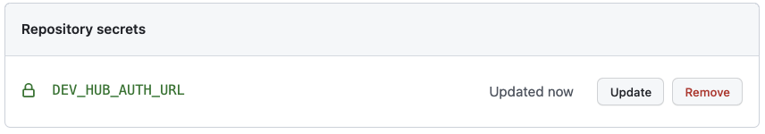
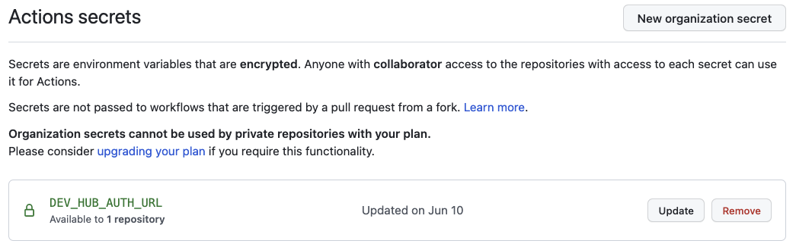
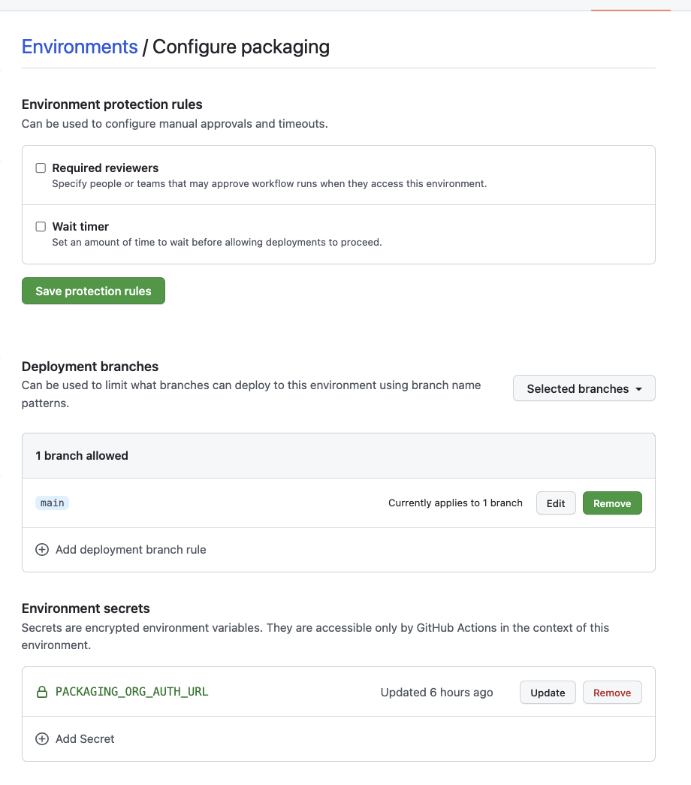
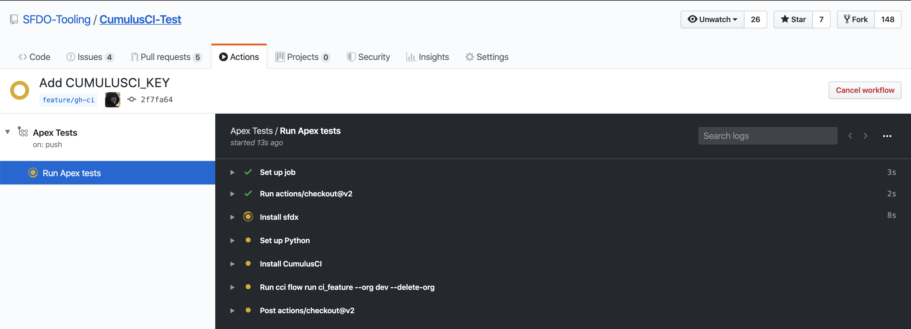
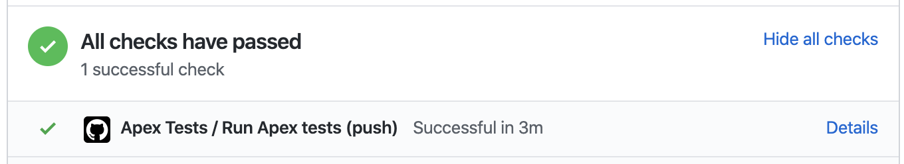
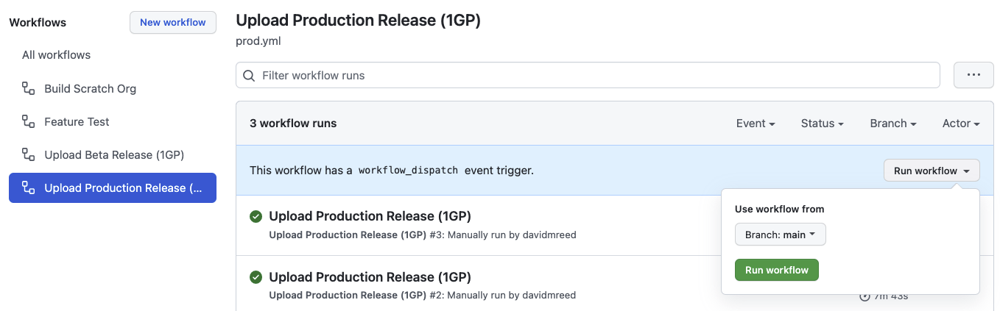

# Run CumulusCI from GitHub Actions

CumulusCI can be used to run continuous integration builds with GitHub
Actions. In order to follow along, you should already have a repository
that is hosted on GitHub and configured as a CumulusCI project. In other
words, we're assuming your project already has a `cumulusci.yml` and
that you are successfully running CumulusCI flows locally.

There is also a [template
repository](https://github.com/SFDO-Tooling/CumulusCI-CI-Demo) that is
setup to run [](cumulusci-flow) with our GitHub
Actions framework. This repository can be used as a starting point for
implementing your own project or as a reference for the following
material.

```{note}
GitHub Actions are free for open source (public) repositories. Check
with GitHub about pricing for private repositories.
```

## Actions Framework

Our GitHub Actions framework lets you choose how much customization you wish to perform versus how much out-of-the-box functionality you'd like to use.
Applications that use our predefined workflows can get started by simply copying and pasting an example file into the repository. Applications that
prefer deep customization or do not use [](cumulusci-flow) can easily compose our building-block Actions to suit their specific needs.

### Reusable Workflows

At the highest tier of abstraction, your application can consume reusable workflows from `cumulus-actions/standard-workflows`. These workflows offer easy onboarding and don't require any customization of the YAML to create a complete pipeline for a 1GP or 2GP project. The standard workflows include definitions of dependencies between jobs, ensuring that (for example) a Beta Test job runs after an Upload Beta job.

We recommend cloning the `cumulus-actions/standard-workflows` repository and pushing it into your org. (Do not fork the repository; GitHub Actions currently does not consume reusable workflows from a fork). This repository is a central control console for all of your applications using the shared workflows, making it easy to introduce (for example) new feature test-level jobs across all repos without individually updating those repos' configurations. We reserve the right to change `cumulus-actions/standard-workflows` at any time without notice and without tagging a new version to support this control-console use case; this is the reason we encourage cloning the repository to support your own standard workflow usage.

We provide the following standard workflows:

**Packaging Workflows**

-   `beta-1gp`, expected to run on the main branch, executes Release Beta (1GP) followed by Beta Test.
-   `production-1gp`, expected to run on the main branch, executes Release Production (1GP) followed by Release Test.
-   `beta-2gp`, expected to run on the main branch, executes Release Beta (2GP) followed by Beta Test.
-   `production-2gp`, expected to run on the main branch, executes Release Production (2GP) followed by Release Test.

**Feature Testing Workflows**

Because there is wide variance in the types of tests run in feature-level testing, we provide a number of Feature Test workflows
that combine different jobs. All of these workflows are expected to run on `feature/**` branches. Note that references to 2GP below
are part of the [](2gp-testing) process, and can be used on both first- and second-generation package projects.

-   `feature` runs unmanaged feature-test builds: Feature Test.
-   `feature-with-robot` adds a Robot Framework test job to `feature`.
-   `feature-2gp` runs unmanaged and 2GP feature-test package builds: Feature Test, Build Feature Test Package, Feature Test - 2GP.
-   `feature-2gp-with-robot` adds a 2GP Robot Framework test job to `feature-2gp`.
-   `feature-namespaced` runs unmanaged and namespaced-org tests: Feature Test and Feature Test - Namespaced.

To consume a standard workflow, follow these steps.

1. Clone the `cumulus-actions/standard-workflows` repo. Don't use a fork!
2. Select one or more reusable workflows you want to consume.
3. For each workflow, create a file in your repository under `.github/workflows`. Design your own
   triggers, or copy from the examples below.
4. Commit the file and merge a Pull Request to your main branch.

**Example 1: Feature Test workflow**

This workflow runs on feature branches before merging.

```yaml
name: Feature Test
on:
    push:
        branches:
            # Customize as needed for your project's branching structure.
            - feature/**
            - main
jobs:
    feature-test:
        name: "Feature Test"
        # Replace this URL with your forked repo.
        # Use the feature test workflow that matches your project needs.
        uses: cumulus-actions/standard-workflows/.github/workflows/feature-2gp.yml@main
        secrets:
            dev-hub-auth-url: "${{ secrets.DEV_HUB_AUTH_URL }}"
```

**Example 2: Upload Beta workflow**

This workflow runs on every main-branch commit to upload a beta package release.

```yaml
name: Upload Beta Release
on:
    push:
        branches:
            - "main"
jobs:
    upload-beta:
        # Replace this URL with your forked repo.
        # Use the `beta-2gp` workflow if this is a 2GP project.
        uses: SFDO-Community/standard-workflows/.github/workflows/beta-1gp.yml@main
        secrets:
            # If this is a 2GP project, omit the packaging org auth URL.
            packaging-org-auth-url: "${{ secrets.PACKAGING_ORG_AUTH_URL }}"
            dev-hub-auth-url: "${{ secrets.DEV_HUB_AUTH_URL }}"
```

**Example 3: Upload Release workflow**

```yaml
name: Upload Production Release
on:
    workflow_dispatch:
jobs:
    upload-production-release:
        name: "Upload Production Release"
        # Replace this URL with your forked repo.
        # Use the `beta-2gp` workflow if this is a 2GP project.
        uses: SFDO-Community/standard-workflows/.github/workflows/production-1gp.yml@main
        secrets:
            # If this is a 2GP project, omit the packaging org auth URL.
            packaging-org-auth-url: "${{ secrets.PACKAGING_ORG_AUTH_URL }}"
            dev-hub-auth-url: "${{ secrets.DEV_HUB_AUTH_URL }}"
```

You can choose whether or not to pin to a version tag in your cloned `standard-workflows` repo. In many use cases, it makes the most sense _not_ to do so, as we do here by referencing `@main`. This allows you to use your `standard-workflows` repo as a central control console to instantly update workflow definitions across repos. For example, when prerelease scratch orgs are made available in advance of each major Salesforce release, you can add a `feature-test-prerelease` job to your standard feature workflows - enabling it for all of your projects without individually updating their repos.

### Job-Based Actions

If you prefer to construct your own workflows, you can consume our job-based Actions as building blocks. Each job-based Action will set up
the CumulusCI and SFDX CLIs, authorize a Dev Hub and/or packaging org, check out the project, and run one or more Cumulus flows and tasks.

-   `cumulus-actions/release-beta-1gp` runs the flows `ci_master` and `release_beta`.
-   `cumulus-actions/release-beta-2gp` runs the flow `release_beta_2gp`.
-   `cumulus-actions/beta-test` runs the flow `ci_beta`.
-   `cumulus-actions/release-production-1gp` runs the flows `ci_master` and `release_production`.
-   `cumulus-actions/release-production-2gp` runs the flow `release_production_2gp`.
-   `cumulus-actions/release-test` runs the flow `ci_release`.
-   `cumulus-actions/build-unlocked-test-package` runs the flow `build_unlocked_test_package` and populates the package id onto a commit status.
-   `cumulus-actions/build-feature-test-package` runs the flow `build_feature_test_package` and populates the package id onto a commit status.
-   `cumulus-actions/feature-test` runs the flow `ci_feature`.
-   `cumulus-actions/feature-test-2gp` runs the flow `ci_feature_2gp`.
-   `cumulus-actions/feature-test-namespaced` runs the flow `ci_feature`.
-   `cumulus-actions/feature-test-robot` runs the flow `qa_org`, followed by the `robot` task.
-   `cumulus-actions/feature-test-robot-2gp` runs the flow `qa_org_2gp`, followed by the `robot` task.

For examples of how to apply these actions, review the standard workflows in `cumulus-actions/standard-workflows`. Each Action accepts version parameters (see Version Pinning). Each Action that creates a scratch org accepts the `dev-hub-auth-url`parameter (required) and the`org-name`parameter (defaulted). Each Action that interacts with a packaging org (1GP only) accepts the`packaging-org-auth-url` parameter.

### Scratch Org Base Actions

All job-based Actions that create scratch orgs consume the `cumulus-actions/run-flow-scratch` or `cumulus-actions/run-robot-flow-scratch` scratch org base Actions. You can use these base Actions to create your own job-based Actions for your custom Cumulus flows.

`cumulus-actions/run-flow-scratch` checks out your code, creates a scratch org on a given configuration (`org-name`), runs a given flow (`flow-name`) on that org, and then disposes the org. Optionally, it extracts information from the job log that matches a regex (`commit-status-regex`) and stores that information as the description on a new commit status (`commit-status-name`), prefixed by `commit-status-description-prefix`. This optional feature is used to support jobs that create per-commit package versions. The action also accepts version-pinning options (see Tool Version Pinning).

`cumulus-actions/run-robot-flow-scratch` accepts the parameters `dev-hub-auth-url`, `org-name`, and `setup-flow`. The latter two options are required. The Action will check out your code, create an org from the configuration `org-name`, and execute `setup-flow` against it before running Robot Framework tests. It stores Robot results as an artifact. The action also accepts version-pinning options (see Tool Version Pinning).

### Primitive Actions

Finally, we also provide a suite of primitive Actions that underlie the base scratch org Actions and all persistent-org Actions.
You can use these primitive Actions to construct your own SDLC automation, even if it's very different from CumulusCI Flow. Compose primitive
Actions to create workflow automation that delivers to persistent orgs, authenticates using the JWT flow, or sits within your existing
automation structures.

`cumulus-actions/default-package-versions` accepts as input user-supplied `cumulusci-version` and `sfdx-version` values. If these values are non-empty, they are returned; otherwise, default values are returned. The outputs have the same names as the inputs.

`cumulus-actions/setup-cumulus` installs CumulusCI and SFDX. It accepts optional `cumulusci-version` and `sfdx-version` inputs and uses `cumulus-actions/default-package-versions@main` to populate them if not supplied (see below under Tool Version Pinning for discussion). The action uses the built-in caching functionality of GitHub Actions to cache installed NPM and Python packages, using your supplied versions as the cache key.

`cumulus-actions/authorize-org` accepts an `auth-url` and `org-name`, and ingests that org authorization into the SFDX and CumulusCI keychains. If the optional `dev-hub` input is set to `true`, it assigns this org as the default Dev Hub.

`cumulus-actions/run-flow` executes a given flow (`flow-name`) against a given org (`org-name`). The org must be available in the keychain, or be a scratch org configuration, and CumulusCI and SFDX must already be set up.

`cumulus-actions/run-task` executes a given task (`task-name`) against a given org (`org-name`). The org must be available in the keychain, or be a scratch org configuration, and CumulusCI and SFDX must already be set up.

## Tool Version Pinning

All non-primitive Actions that run Cumulus operations accept two optional parameters, `cumulusci-version` and `sfdx-version`. If these inputs are supplied, the Actions will ensure that the specified versions of the tools are installed.

If the inputs are not populated, the Action will source a default version for each tool from `cumulus-actions/default-package-versions@main`. Note that we do not pin a tag on `default-package-versions`: the default CumulusCI and SFDX versions may be changed without publishing a new Action tag, provided that the overall behavior of the Action is not altered. We use this flexibility to ensure that we pin stable versions, and reserve the right to roll back the default in case of unexpected regressions.

The Cumulus Suite Actions **require CumulusCI 3.61.1 or greater** for any operation that references a packaging org.

## Environment Setup and Org Authorization

All Actions that interact with persistent orgs (such as a packaging org or Dev Hub) authorize those orgs using SFDX Auth URLs.
These URLs are obtained via by first authorizing an org to the CLI:

`sfdx auth:web:login -a packaging`

and then retrieving the auth URL from the JSON output of the command

`sfdx force:org:display --json --verbose`

under the key `sfdxAuthUrl` under `result`.

If you have `jq` installed, you can do `sfdx force:org:display -u packaging-gh --json --verbose | jq -r .result.sfdxAuthUrl`.

First-generation package projects will have two auth-URL secrets, for the packaging org and for the Dev Hub.
Second-generation and Unlocked package projects will have at least one auth-URL secret, for the Dev Hub, and may have
two to provide distinct access levels (see below).

Auth URLs should always be stored in GitHub Secrets. There are a number of different ways to organize secret storage.
While we offer recommended best practices here, you should always follow the security guidance of your own
teams.

### Dev Hub Auth URLs for Scratch Org Builds

Every Action that creates a scratch org requires a `dev-hub-auth-url` parameter containing an Auth URL.
We recommend storing this URL in a GitHub Secret called `DEV_HUB_AUTH_URL`, a convention used in our
reusable workflows.

If you're working on a single repository, you can store your Dev Hub auth URL in a repository secret.
Locate the Settings->Secrets->Actions section of your GitHub repo, and click "New repository secret".
Add your auth URL and save the secret.



If you're working in a GitHub organization with multiple repositories, and you want to share the same
user access to the Dev Hub across repositories, you can store your auth URL as an organization secret.
Locate the Organization->Settings->Secrets->Actions section, and click "New organization secret".
Add your auth URL and save the secret.



You can select which repositories to expose the secret to. Using an organization secret makes rotating
this credential easy.

It's important to use a credential with minimal privileges, as
using this secret in feature-level builds that are executed before code review may open routes for
unscrupulous users to access the credential. We recommend permissioning a Dev Hub user
with the [Limited Access - Free License](https://developer.salesforce.com/docs/atlas.en-us.sfdx_dev.meta/sfdx_dev/dev_hub_license.htm)
to avoid exposing any other information or functionality to that user.

### Packaging Org and Dev Hub Auth URLs for Package Uploads

Packaging org credentials, and Dev Hub credentials that have permissions to upload and promote package versions,
are high risk. It's critical to ensure that these credentials are protected and cannot be exfiltrated by
malicious changes to your workflow definitions.

We recommend creating a GitHub Environment called `packaging` and adding the auth URL as an environment secret there.
This means that the secret will _not_ be available to Actions that run against environments other than packaging.



Our standard workflows for creating package versions are pre-configured to use an environment named `packaging`. If you
build your own workflows, or use an environment name other than `packaging`, include the declaration

```yaml
environment: packaging # or other name
```

in your workflows that need to access this secret.

We recommend adding the following configurations to avoid disclosure of the packaging org secret:

1. Configure package-upload builds to run only on `main` (using workflow triggers).
1. Configure the `packaging` environment to be available only to builds on `main`.
1. Configure Code Owners to identify one or more trusted staff members as owners of your `.github` directory.
1. Configure Branch Protection for `main` to require code review and Code Owners review prior to merging Pull Requests.
   This ensures that rogue Actions cannot disclose this sensitive credential without being reviewed by your trusted staff members.

If you are building a second-generation package, you can still use this pattern to protect the higher-privileged
Dev Hub credentials required to upload and promote a package. Set up a second Dev Hub user with the appropriate
permissions, and store the Dev Hub auth URL for that user in a `packaging` environment.


---

Environments also allow you to secure your workflow for promoting a production release.

You can choose to set up required reviewers on your `packaging` environment. Your approvers will then need
to sign off on all beta and production releases.

If you'd like beta builds to run automatically on commits to `main` _without_ individual review, while
still requiring review on production releases, you can set up two environments: `packaging` and `packaging-prod`.
Configure required reviewers on `packaging-prod`, but not on `packaging`, and set the auth URL secret for your
packaging org on both environments.

If you use a trigger, such as modification to a specific file protected by Code Owners, to initiate production
package builds rather than a manually-initiated workflow, you may not need to use required reviewers on your
`packaging` environment at all.

## Concurrency Protection

All Actions other than package uploads are safe to run in parallel, because they run against independent scratch orgs.
First-generation package uploads, however, are generally serialized.

In GitHub Actions, concurrency protection takes place at the level of the workflow, not the individual Action. We recommend
following the pattern shown in `cumulus-actions/standard-workflows` by ensuring that package-upload Actions are run in a job
with the key `concurrency` set to `packaging`. This ensures that GitHub Actions serializes execution of jobs against the
packaging org. Note that this concurrency setup is independent of your decisions around environment setup.

## Deploying to a Production Org

We've chosen not to provide standard workflows or actions for deploying to a production org.
If you're operating in an org development model, you're likely to have specific requirements
about how production deployments take place.

In many cases, you'll want to use the `deploy_unmanaged` flow or the `deploy` task.
`deploy_unmanaged` deploys metadata, but also unschedules Scheduled Apex and uninstalls
previously-deployed components that have been removed from the source
repository. If you do not want incremental component removal or Apex
unscheduling, use the `deploy` task.

You may also wish to compose custom flows that perform other configuration, deployments,
or setup operations on your production org.

Our `release-production-1gp` Action is an example of running Cumulus
automation against a production org (in that case, the packaging org). We recommend
using this Action as a model for your own deployment Actions that target Production
or long-lived sandbox orgs.

## Building from Scratch

If you prefer to build your own GitHub Actions workflows for scratch, or need to
extend the capabilities in our workflow framework, you can learn more
about [how CumulusCI consumes services and authenticated orgs](headless) and how
to [](register-environment-services).

If you need to use a different type of authentication, such as the JWT Flow, instead
of SFDX auth URLs, you'll need to compose your own workflows from our supplied
primitives.

## Running and Reviewing Actions Workflows



If you open a pull request for a branch that triggers a run of your Actions workflow, you
will find a section at the bottom of the pull request that shows the
results of the checks that were performed by the workflow:



Some Actions are manually triggered, including our `release-production-1gp` and `release-production-2gp`
Actions, which upload a production release of a package. To run an Action manually, navigate to
the Actions tab, then select the workflow by name from the list. Click the **Run workflow** dropdown,
choose the appropriate branch, and click the **Run workflow** button to start the run.



You can set any Action as a required status on a _protected branch_, such as your `main` branch.
This means that changes can only be merged to that branch if these Actions complete successfully.

See GitHub's documentation for instructions to [configure protected
branches](https://help.github.com/en/github/administering-a-repository/configuring-protected-branches)
and [enable required status
checks](https://help.github.com/en/github/administering-a-repository/enabling-required-status-checks).

## References

-   [GitHub Actions Documentation](https://help.github.com/en/actions)
