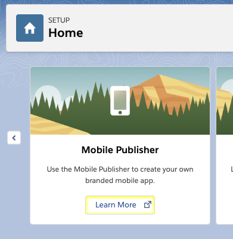

# Robot Debugger

CumulusCI includes a rudimentary Robot debugger which can be enabled by
setting the `robot_debug` option of the `robot` task to `true`. When the
debugger is enabled you can use the
[Breakpoint](https://cumulusci.readthedocs.io/en/stable/Keywords.html#Salesforce.Breakpoint) keyword from the
[Salesforce
Library](https://cumulusci.readthedocs.io/en/stable/Keywords.html#file-cumulusci.robotframework.Salesforce) keyword
library to pause execution.

Once the `Breakpoint` keyword is encountered you will be given a prompt
from which you can interactively issue commands.

For the following examples we'll be using this simple test:

```robotframework
*** Settings ***
Resource  cumulusci/robotframework/Salesforce.robot

Suite Setup     Open test browser
Suite Teardown  Close all browsers

*** Test Cases ***
Example test case
    log  this is step one
    Breakpoint
    log  this is step two
    log  this is step three
```

## Enabling the debugger

To enable the debugger you must set the `robot_debug` option to `true`
for the `robot` task. **You should never do this in the project's
cumulusci.yml file.** Doing so could cause tests to block when run on a
CI server such as MetaCI.

Instead, you should set it from the command line when running tests
locally.

For example, assuming you have the example test in a file named
`example.robot`, you can enable the debugger by running the `robot` task
like this:

```console
$ cci task run robot --robot_debug true --suites example.robot
```

## Setting breakpoints

The Salesforce keyword library includes a keyword named
[Breakpoint]{.title-ref}. Normally it does nothing. However, once the
debugger is enabled it will cause the test to pause. You will then be
presented with a prompt where you can interactively enter commands.

```console
$ cci task run robot --robot_debug true --suites example.robot
2019-10-01 15:29:01: Getting scratch org info from Salesforce DX
2019-10-01 15:29:05: Beginning task: Robot
2019-10-01 15:29:05:        As user: test-dp7to8ww6fec@example.com
2019-10-01 15:29:05:         In org: 00D0R000000ERx6
2019-10-01 15:29:05:
==============================================================================
Example
==============================================================================
Example test case                                                     .

:::
::: Welcome to rdb, the Robot Framework debugger
:::

Type help or ? to list commands.

> Example.Example test case
-> <Keyword: cumulusci.robotframework.Salesforce.Breakpoint>
rdb>
```

Note: the `Breakpoint` keyword has no effect on a test if the
`robot_debug` option is not set to `true`. While we don't encourage you
to leave this keyword in your test cases, it's safe to do so as long as
you only ever set the `robot_debug` option when running tests locally.

## Getting Help

Whenever you see the debugger prompt `rdb>`, you can request help by
typing `help` or `?` and pressing return. You will be given a list of
available commands. To get help with a specific command you can type
`help` followed by the command you want help on.

```console
rdb> help

Documented commands (type help <topic>):
========================================
continue  locate_elements  quit            shell  vars
help      pdb              reset_elements  step   where

rdb> help vars
Print the value of all known variables
rdb>
```

## Examining Variables

There are two ways you can examine the current value of a Robot
variable. The simplest method is to enter the name of a variable at the
prompt and press return. The debugger will show you the value of that
single variable:

```console
rdb> ${BROWSER}
chrome
```

To see a list of all variables and their values, enter the command
`vars`.

```console
rdb> vars
┌────────────────────────────────────┬──────────────────────────────────────────────────┐
│ Variable                           │ Value                                            │
├────────────────────────────────────┼──────────────────────────────────────────────────┤
│ ${/}                               │ /                                                │
├────────────────────────────────────┼──────────────────────────────────────────────────┤
│ ${:}                               │ :                                                │
├────────────────────────────────────┼──────────────────────────────────────────────────┤
│ ${BROWSER}                         │ chrome                                           │
├────────────────────────────────────┼──────────────────────────────────────────────────┤
... <more output> ...
```

## Executing Robot keywords

You can execute Robot keywords at the prompt by entering the command
`shell` (or the shortcut `!`) followed by the keyword and arguments just
as you would in a test. The following example runs the SeleniumLibrary
keyword [Get
Location](http://robotframework.org/SeleniumLibrary/SeleniumLibrary.html#Get%20Location):

```console
rdb> shell get location
status: PASS
result: https://ability-enterprise-4887-dev-ed.lightning.force.com/lightning/setup/SetupOneHome/home
```

Notice that the `shell` command will run the keyword and then report the
status of the keyword and display the return value.

Note: just like in a test, you must separate arguments from keywords by
two or more spaces.

## Setting Robot variables

To capture the output of a keyword into a variable, you do it the same
way you would do it in a test: use a variable name, two or more spaces,
then the keyword:

```console
rdb> ! ${loc}  get location
status: PASS
${loc} was set to https://ability-enterprise-4887-dev-ed.lightning.force.com/lightning/setup/SetupOneHome/home
rdb> ${loc}
https://ability-enterprise-4887-dev-ed.lightning.force.com/lightning/setup/SetupOneHome/home
```

In addition to setting variables from the results of keywords, you can
also set variables with the `shell` command using the built-in keywords
[Set Test
Variable](http://robotframework.org/robotframework/latest/libraries/BuiltIn.html#Set%20Test%20Variable),
[Set Suite
Variable](http://robotframework.org/robotframework/latest/libraries/BuiltIn.html#Set%20Suite%20Variable),
or [Set Global
Variable](http://robotframework.org/robotframework/latest/libraries/BuiltIn.html#Set%20Global%20Variable).

```console
rdb> ! set test variable  ${message}  hello, world
status: PASS
result: None
rdb> ${message}
hello, world
```

## Locating elements on the web page

One of the most powerful features of the debugger is the ability to
locate elements on the screen. This makes it easy to experiment with
xpaths or other types of locators.

In the following example, we want to find all items on the page that
contain the title "Learn More":

```console
rdb> locate_elements  //button[@title='Learn More']
Found 1 matches
```

The elements will be highlighted with a yellow border:



To remove the highlighting you can use the debugger command
`reset_elements`

## Step through the test

The debugger allows you to step through a test one keyword at a time.
From the rdb prompt, enter the command `step` to continue to the next
step in the test.

```console
rdb> step
.

> Example.Example test case
-> <Keyword: BuiltIn.Log  this is step two>
```

The last two lines help to give context. It is showing that you are
currently right before the keyword `BuiltIn.Log this is step 2`. To get
a full stack you can issue the command `where`

```console
rdb> where
0: -> Example
1:   -> Example.Example test case
2:     -> BuiltIn.Log
```

## Continuing or quitting the test

To let the test continue to the end, or to the next `Breakpoint`
keyword, issue the command `continue`. To stop execution gracefully (ie:
allow all test and suite teardowns to run), issue the command `quit`.
