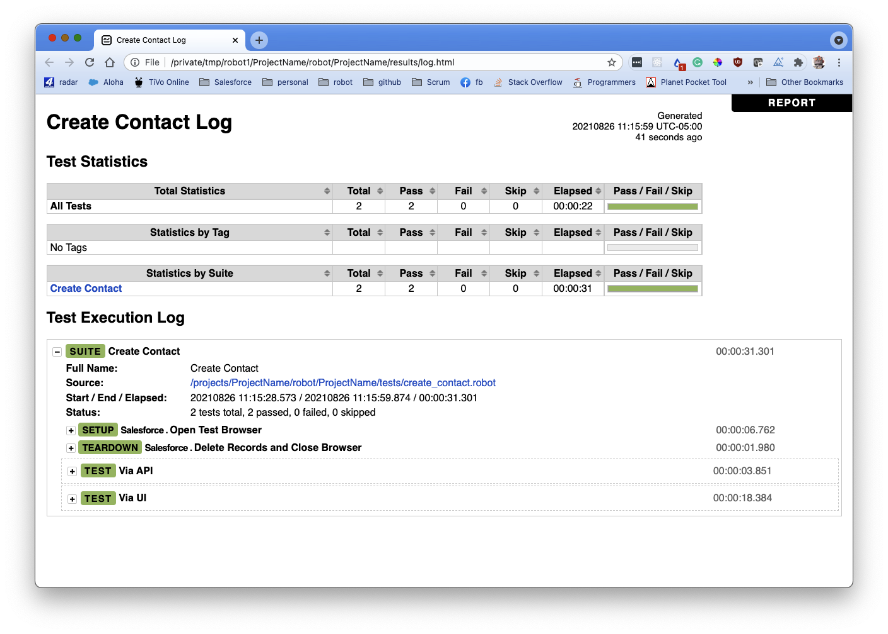
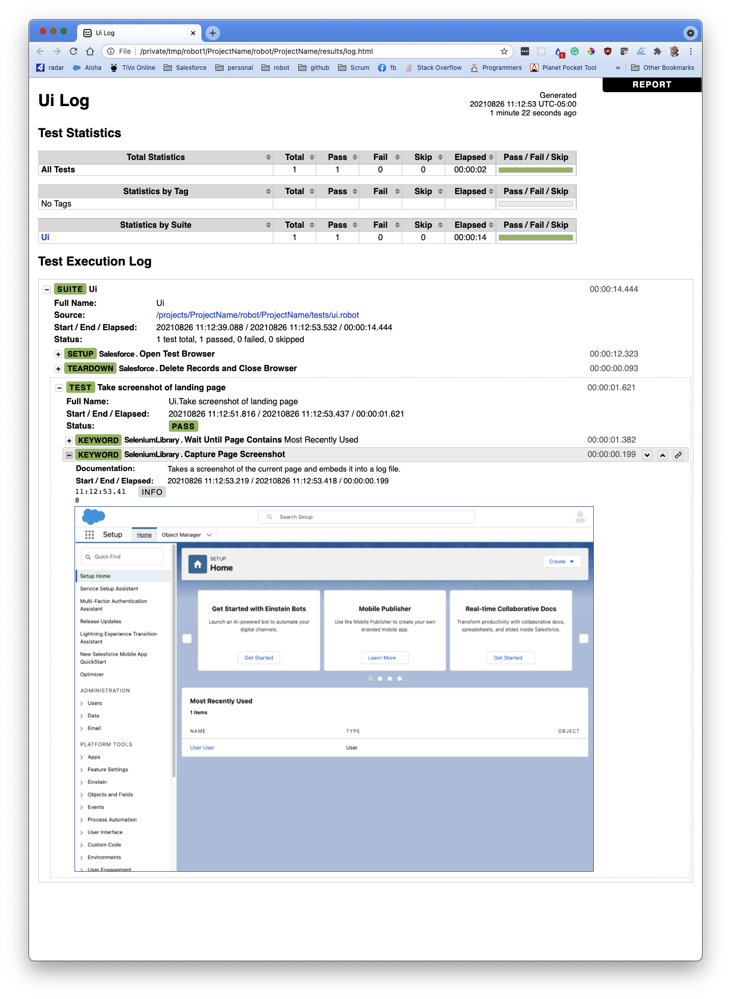

(acceptance-testing-with-robot-framework)=

# Acceptance Testing with Robot Framework

CumulusCI comes with a testing framework called [Robot
Framework](https://robotframework.org/) (or just Robot), which is
specifically for writing acceptance tests. These are typically
end-to-end tests that verify that the high-level requirements of a
project have been satisfied. (Think "Add a new student and verify they
have been assigned a mentor" or "Create a case plan when the student
is not enrolled in a program".) Usually, this involves automating a
browser session with Salesforce, but Robot can also be used to test new
APIs created by your team.

Later sections of this document will show you how to write tests, call
APIs, create custom keywords, and so on. But first there's a bit of
manual configuration to do.

## Get Started

The test that comes with CumulusCI opens a browser and performs some
automation. For that to work, you need to install
[Chrome](https://www.google.com/chrome/), and a driver for your specific
version of Chrome. We don't ship this driver by default because browser
versions are continually updating, and different platforms require
different drivers.

If you don't already have Chrome on your machine, download and install
it in the default location, and then download the appropriate driver
from the [chromedriver download
page](https://chromedriver.chromium.org/downloads). Download the latest
stable version that corresponds to your Chrome version, and place it
where Robot can find it. This usually means `/usr/local/bin` for Linux
and OSX-based systems. (It can go anywhere as long as it's on your
PATH.)

For more information, see [Getting
Started](https://sites.google.com/chromium.org/driver/getting-started?authuser=0)
on the chromedriver website.

```{admonition} Fun Fact
You can skip this step and still see Robot in action with CumulusCI. The
tests will fail, but you can still see what it's like to run a test,
and the output that it produces.
```

### You Get a Test! And You Get a Test!

When you initialize a repository to work with CumulusCI (see [Start a
new CumulusCI
Project](https://cumulusci.readthedocs.io/en/stable/get-started.html?highlight=project%20init##start-a-new-cumulusci-project)),
you automatically get a preconfigured `robot` task to run all of your
Robot tests at the same time. We also install one example test,
`create_contact.robot`, that shows how to write both browser-based and
API-based tests. In fact, we've gone ahead and created a complete
folder hierarchy for tests, test results, and everything else related to
Robot, all starting in a folder named `robot` at the top of your
repository.

```console
<ProjectName>
├── robot
│   └── <ProjectName>
│       ├── doc
│       ├── resources
│       └── tests
│           └── create_contact.robot
```

```{note}
The `create_contact.robot` file is in plain text, so you can open it
with any text editor you have on your machine. One of the features we
love about Robot is that the files are not in a proprietary format.
```

## Run Your First Test

You can run all tests for a project with a simple command line. In case
you don't have a default org defined, we'll include instructions on
which scratch org to use.

```console
$ cci task run robot --org dev
```

If all goes well, the browser pops up, navigates around a bit, and then
closes. The output on your screen looks something like this, though you
might see additional information about creating the scratch org.

```console
$ cci task run robot --org dev
2021-08-04 16:28:32: Getting org info from Salesforce CLI for test-yeqqkbxks2ny@example.com
2021-08-04 16:28:35: Beginning task: Robot
2021-08-04 16:28:35: As user: test-yeqqkbxks2ny@example.com
2021-08-04 16:28:35: In org: 00D0R000000Tz56
2021-08-04 16:28:35:
==============================================================================
Tests
==============================================================================
Tests.Create Contact
==============================================================================
Via API                                                               | PASS |
------------------------------------------------------------------------------
Via UI                                                                | PASS |
------------------------------------------------------------------------------
Tests.Create Contact                                                  | PASS |
2 tests, 2 passed, 0 failed
==============================================================================
Tests                                                                 | PASS |
2 tests, 2 passed, 0 failed
==============================================================================
Output:  /projects/<ProjectName>/robot/<ProjectName>/results/output.xml
Log:     /projects/<ProjectName>/robot/<ProjectName>/results/log.html
Report:  /projects/<ProjectName>/robot/<ProjectName>/results/report.html
```

Notice the three lines at the end that point to an XML file and two HTML
files. These paths will be different on your machine and reflect the
path to your repository. All Robot results go into the
`robot/<ProjectName>/results` folder. These files are overwritten each
time you run your Robot tests.

Robot places all of the test results in `output.xml`, and then generates
`log.html` and `report.html`, which contain two different human-readable
views of the results. `log.html` is more developer-friendly and contains
debugging information. `report.html` is a high-level report of successes
and failures.

### View Log and Report Files

You can open these files in a browser with the `open` command.

```console
$ open robot/<ProjectName>/results/log.html
```



Feel free to open `output.xml` or `report.html` if you're curious. In
our experience, `log.html` is the most useful for humans, and it's the
one we use when reporting test results.

Want to learn more? The next section goes into more detail about why we
love Robot Framework, and how you can write your own tests.

## So Why Robot?

Robot is a
[keyword-driven](https://robocorp.com/docs/languages-and-frameworks/robot-framework/keywords)
acceptance testing framework, which means that users can write test
cases in an intuitive, human-readable language made up of high-level,
reusable keywords (`Open test browser`,
`Delete records and close browser`) rather than in a programming
language.

For example, this basic Robot test case file creates a new `Contact`
record, and then examines the record to confirm that the fields listed
are correct. You can see how straightforward the keyword syntax is. Even
someone brand new to test automation can grasp the function of the
`Salesforce Insert`, `Salesforce Get`, and `Should be equal` keywords.

```robotframework
*** Settings ***
Resource        cumulusci/robotframework/Salesforce.robot
Documentation   A simple Robot test

*** Test Cases ***
Create a Contact using the API

   ## Create a new Contact
   ${contact id}=   Salesforce Insert  Contact
   ...  FirstName=Eleanor
   ...  LastName=Rigby

   ## Get the new Contact and examine it
   &{contact}=      Salesforce Get  Contact  ${contact id}
   Should be equal  ${contact}[FirstName]    Eleanor
   Should be equal  ${contact}[LastName]     Rigby
```

## The Robot Framework Advantage

Acceptance testing touches on multiple aspects of an application such as
the data model, custom APIs, performance, and the user experience in the
browser. Existing tools like Apex and Jest are good for writing unit
tests and low-level integration tests. However, it can be difficult to
understand the intent of a test, and the features being tested, when the
test itself involves multiple lines of code detailing where to fetch
data from, and how, and other such implementation details.

Robot addresses these challenges with a few strategies, helping you
write high-level acceptance tests for every aspect of an application,
often in a single test suite.

-   Human-readable, domain-specific test cases: Robot lets you create a
    language tailored to the domain of testing Salesforce applications
    (a domain-specific language, or DSL). The DSL consists of reusable
    keywords that present a complex set of instructions in a
    human-readable language. The result? Test cases that all project
    stakeholders can easily understand, such as a product manager, scrum
    master, documentation teams, and so on--not just the test authors.
    In the previous example, `Salesforce Insert`, `Salesforce Get` and
    `Should be equal` are all keywords.
-   Keyword libraries: Robot organizes keywords into libraries, which
    provide a simple, effective method to organize and share keywords
    between tests and projects. CumulusCI comes with a comprehensive
    standard library of Robot keywords created specifically to
    anticipate the needs of Salesforce testers. In the previous example,
    when you define `Salesforce.robot` as a resource, it automatically
    pulls in dozens of Salesforce-specific keywords.
-   Streamlined test cases: Keywords allow implementation details to be
    handled by the test but not explicitly itemized in the test. In the
    previous example, a new `Contact` record is created with the
    `Salesforce Insert` keyword, but we don't see all the steps
    required to make an API call to create the record, such as getting
    an access token, creating an API payload, making the API call, and
    parsing the results. We see only two keywords that communicate with
    Salesforce via an API: one to create the `Contact` record, and
    another to retrieve the new record to confirm it has the correct
    first and last names.

### Robot-specific Tasks

CumulusCI integrates with Robot via custom tasks, such as:

-   `robot`: Runs one or more Robot tests. This task is the most common.
-   `robot_libdoc`: Runs the
    [libdoc](http://robotframework.org/robotframework/latest/RobotFrameworkUserGuide.html#library-documentation-tool-libdoc)
    command, which creates an HTML file defining all the keywords in a
    library or resource file.
-   `robot_testdoc`: Runs the
    [testdoc](http://robotframework.org/robotframework/latest/RobotFrameworkUserGuide.html#test-data-documentation-tool-testdoc)
    command, which creates an HTML file documenting all the tests in a
    test suite.
-   `robot_lint`: Runs the static analysis tool
    [rflint](https://github.com/boakley/robotframework-lint/), which can
    validate Robot tests against a set of rules related to code quality.

Like with any CumulusCI task, you can get documentation and a list of
arguments with the `cci task info` command. For example,
`cci task info robot` displays documentation for the `robot` task.

### Custom Keywords

CumulusCI provides a set of keywords unique to both Salesforce and
CumulusCI for acceptance testing. These keywords can run other tasks,
interact with Salesforce applications, call Salesforce APIs, and so on.
For a list of all custom keywords provided by CumulusCI, see
[Keywords.html](https://cumulusci.readthedocs.io/en/stable/Keywords.html).

```{tip}
In addition to the keywords that come with CumulusCI, you can write
project-specific keywords that are either based on existing keywords, or
implemented in Python.
```

## Write a Sample Robot Test Case

Now that you have a general understanding of why Robot is ideal for
acceptance testing with CumulusCI, let's construct a test case file
that creates a new `Contact` record.

1.  Run `cci project init`, which creates the `create_contact.robot`
    test case file that comes standard whenever you initialize a project
    with CumulusCI.
2.  In the `robot/<ProjectName>/tests` folder, save this code in a new
    file named `new_contact_record.robot`.

```robotframework
*** Settings ***
Resource        cumulusci/robotframework/Salesforce.robot
Documentation   A simple Robot test

*** Test Cases ***
Create a Contact using the API

   ## Create a new Contact
   ${contact id}=   Salesforce Insert  Contact
   ...  FirstName=Eleanor
   ...  LastName=Rigby

   ## Get the new Contact and examine it
   &{contact}=      Salesforce Get  Contact  ${contact id}
   Should be equal  ${contact}[FirstName]    Eleanor
   Should be equal  ${contact}[LastName]     Rigby
```

You can tell that both `create_contact.robot` and
`new_contact_record.robot` are test case files because each one has a
`.robot` extension and contains a `Test Cases` section. The
`new_contact_record.robot` test case file is a simplified version of
`create_contact.robot`. We feature it in this documentation for simpler
code samples.

### Syntax

Here's a quick primer on the syntax in the `new_contact_record.robot`
test case file.
| Symbol | Name | Description and Usage |
| ------ | ----------------- | ------------------------------------------------------------------------------------------------------------------------------------------------------------------------------------------------------------------------------------------------------------------------------------- |
| `***` | Section Heading | A line that begins with one or more asterisks is a section heading. By<br>convention, we use three asterisks on both sides of a heading to designate<br>a section heading. Section headings include `Settings`, `Test Cases`, `Keywords`, `Variables`, `Comments`, and `Tasks`. |
| # | Hash | Designates code comments. |
| ${}    | Variable          | Curly braces surrounding a name designate a variable. The lead `$`character refers to a single value. Variable names are case-insensitive. Spaces and underscores are allowed<br>and are treated the same. | | &{} | Dictionary or Map | A lead`&`character refers to a variable that contains a dictionary or<br>map for key-value pairs, such as`&{contact}`, which in this test has<br>defined values for the keys `FirstName`and`LastName`. |
| = | Assignment | Equals sign is optional yet convenient for showing that a variable is<br>assigned a value. Before the equals sign, up to one space is allowed but _not_ required. After the equals sign, two spaces are required, but more<br>are allowed to format test cases into readable columns. |
| … | Ellipses | Ellipses designate the continuation of a single-line row of code split<br>over multiple lines for easier readability. |
| | Space | Two or more spaces separate arguments from the keywords, and arguments<br>from each other. Multiple spaces can be used to align data and to aid in<br>readability. |

For more details on Robot syntax, visit the official [Robot syntax
documentation](http://robotframework.org/robotframework/2.9.2/RobotFrameworkUserGuide.html#test-data-syntax).

### Settings

The `Settings` section of the `.robot` file sets up the entire test
suite. Configurations established under `Settings` affect all test
cases, such as:

-   `Suite Setup` and `Suite Teardown`, which support processes before
    the test begins and cleanup after the test finishes.
-   `Documentation`, which describes the purpose of the test suite.
-   `Tags`, which lets a user associate individual test cases with a
    label.
-   `Resource`, which imports keywords from external files.

For example, these are the settings stored in the
`new_contact_record.robot` file.

```robotframework
*** Settings ***
Resource        cumulusci/robotframework/Salesforce.robot
Documentation   A simple Robot test
```

The `cumulusci/robotframework/Salesforce.robot` resource file comes with
CumulusCI and automatically inherits useful configuration and keywords
for Salesforce testing. The `Salesforce.robot` resource file is the
primary method of importing all keywords and variables provided by
CumulusCI, so it's best practice for the file to be the first item
imported as a `Resource` under `Settings`. It also imports the
[CumulusCI
Library](https://cumulusci.readthedocs.io/en/stable/Keywords.html#file-cumulusci.robotframework.CumulusCI),
the [Salesforce
Library](https://cumulusci.readthedocs.io/en/stable/Keywords.html#file-cumulusci.robotframework.Salesforce),
the third-party
[SeleniumLibrary](http://robotframework.org/SeleniumLibrary/SeleniumLibrary.html)
for browser testing via Selenium, and these most commonly used Robot
libraries.

-   [Collections](http://robotframework.org/robotframework/latest/libraries/Collections.html)
-   [OperatingSystem](http://robotframework.org/robotframework/latest/libraries/OperatingSystem.html)
-   [String](http://robotframework.org/robotframework/latest/libraries/String.html)
-   [XML](http://robotframework.org/robotframework/latest/libraries/XML.html)

CumulusCI also comes bundled with these third-party keyword libraries,
which must be explicitly imported by any test suite that needs them.

-   [RequestsLibrary](https://marketsquare.github.io/robotframework-requests/doc/RequestsLibrary.html)
    for testing REST APIs. To use `RequestsLibrary`, explicitly import
    it under the `Settings` section of your Robot test.
-   All other libraries listed in the Standard tab of the [Robot
    libraries documentation](https://robotframework.org/##libraries).

### Test Cases

In the `Test Cases` section of the `.robot` file, each test case gets
its own code block; the test case name is the first line of code, with
no indentation. The body of the test case is all the indented text
underneath.

For example, here is the `Test Cases` section of the
`new_contact_record.robot` test case file. It has a single test case
named `Create a Contact using the API`.

```robotframework
*** Test Cases ***
Create a Contact using the API

   ## Create a new Contact
   ${contact id}=   Salesforce Insert  Contact
   ...  FirstName=Eleanor
   ...  LastName=Rigby

   ## Get the new Contact and examine it
   &{contact}=      Salesforce Get  Contact  ${contact id}
   Should be equal  ${contact}[FirstName]    Eleanor
   Should be equal  ${contact}[LastName]     Rigby
```

Notice these keywords used in the test case.

-   `Salesforce Insert` creates a new `Contact` record with the
    arguments it's given for the `FirstName` and `LastName` fields.
-   `Salesforce Get` retrieves the requested `Contact` record based on
    its ID.
-   `Should Be Equal` compares the arguments to the values of the
    `FirstName` and `LastName` fields of the newly created `Contact`
    record.

```{tip}
Keywords in the test cases are separated from arguments by two or more
spaces.
```

## Suite Setup and Teardown

Most real-world tests require setup before the test begins (such as
opening a browser or creating test data), and cleanup after the test
finishes (such as closing the browser or deleting test data). Robot
supports setup and teardown at both the suite level (such as opening the
browser before the first test, _and_ closing the browser after the last
test) and the test level (such as opening and closing the browser at the
start _and_ the end of the test).

If you run the `new_contact_record.robot` test case file several times,
you add a new `Contact` record to your scratch org each time it runs. If
you have a test that requires a specific number of `Contact` records,
the test can fail the second time you run it. To maintain the required
record count, you can add a teardown that deletes any `Contact` records
created by running the test.

Let's modify the `new_contact_record.robot` test case file with a
`Suite Teardown` that deletes the `Contact` records created by any tests
in the suite.

```robotframework
*** Settings ***
Resource        cumulusci/robotframework/Salesforce.robot
Documentation   A simple Robot test
Suite Teardown  Delete session records

*** Test Cases ***
Create a Contact using the API

   ## Create a new Contact
   ${contact id}=   Salesforce Insert  Contact
   ...  FirstName=Eleanor
   ...  LastName=Rigby

   ## Get the new Contact and examine it
   &{contact}=      Salesforce Get  Contact  ${contact id}
   Should be equal  ${contact}[FirstName]    Eleanor
   Should be equal  ${contact}[LastName]     Rigby
```

```{note}
The `Salesforce Insert` keyword keeps track of the record IDs created.
The `Delete session records` keyword deletes those records.
```

To run this test from the command line:

```console
$ cci task run robot --suites robot/<ProjectName>/tests/new_contact_record.robot
```

## Generate Fake Data with Faker

The `get fake data` keyword comes with the Faker library that's
installed with CumulusCI, and saves you from hard-coding test data for
Robot tests. `Get fake data` does much more than just return random
strings; it generates strings in an appropriate format. You can ask it
for a name, address, date, phone number, credit card number, and so on,
and get back properly formatted data.

For example, let's modify the `new_contact_record.robot` test case file
to generate a fake name. Because the new `Contact` name is randomly
generated in this updated example, you can't hard-code an assertion on
the name of the created `Contact` to verify the name. Instead, for
illustrative purposes, this test logs the `Contact` name in the test's
`log.html` file.

```robotframework
*** Settings ***
Resource        cumulusci/robotframework/Salesforce.robot
Documentation   A simple Robot test
Suite Teardown  Delete session records

*** Test Cases ***
Create a Contact with a generated name
   [Teardown]       Delete session records

   ## Generate a name to use for Contact
   ${first name}=   Get fake data  first_name
   ${last name}=    Get fake data  last_name

   ## Create a new Contact
   ${contact id}=   Salesforce Insert  Contact
   ...  FirstName=${first name}
   ...  LastName=${last name}

   ## Get the new Contact and add name to the log
   &{contact}=      Salesforce Get  Contact  ${contact id}
   Log  Contact name: ${contact}[Name]
```

To run this test from the command line:

```console
$ cci task run robot --suites robot/<ProjectName>/tests/new_contact_record.robot
```

(create-custom-keywords)=

## Create Custom Keywords

We mentioned earlier that Robot makes use of a domain-specific language.
By creating a collection of reusable custom keywords, we can create this
DSL for testing Salesforce apps.

Let's create a new Robot test that includes a custom keyword called
`Create a test Contact`, which creates a `Contact` record and then saves
the data for this record in a test variable. Save this code in a file
named `custom_keyword.robot` in the `tests` folder of your project's
repository.

```robotframework
*** Settings ***
Resource        cumulusci/robotframework/Salesforce.robot
Suite Teardown  Delete session records

*** Test Cases ***
Example of using a custom keyword in a setup step
   [Setup]      Create a test Contact

   ## Get the new Contact that's stored in a test variable,
   ## and add the name to the log
   Log  New Contact: ${new contact}[Name]

*** Keywords ***
Create a test Contact
   [Documentation]  Create a temporary Contact and return it

   ## Generate a name to use for Contact
   ${first name}=   Get fake data  first_name
   ${last name}=    Get fake data  last_name

   ## Create a new Contact
   ${contact id}=   Salesforce Insert  Contact
   ...  FirstName=${first name}
   ...  LastName=${last name}

   ## Fetch the Contact object to be returned and save
   ## it to a test variable
   &{new contact}=    Salesforce Get    Contact    ${contact_id}
   Set test variable  &{new contact}
```

Because the `Contact` record was created inside the
`Create a test Contact` keyword, the `&{new contact}` variable is not
going to be visible to any test case or keyword that calls the
`Create a test Contact` keyword. It's only when we use the built-in
keyword [Set test
variable](http://robotframework.org/robotframework/latest/libraries/BuiltIn.html#Set%20Test%20Variable)
that the newly created `&{new contact}` variable becomes visible in the
`Example of using a custom keyword in a setup step` test case.

You can create settings for individual test cases and keywords by specifying the setting names in square brackets. These settings are often used to override setting defaults in the Setting section. In the previous example:

-   `[Setup]` is a setting for the
    `Example of using a custom keyword in a setup step` test case.
-   `[Documentation]` is a setting for the `Create a test Contact`
    keyword.

For details, see the [Settings in the Test Case
section](http://robotframework.org/robotframework/latest/RobotFrameworkUserGuide.html#settings-in-the-test-case-section)
in the official Robot Framework documentation.

To run this test from the command line:

```console
$ cci task run robot --suites robot/<ProjectName>/tests/custom_keyword.robot
```

## Create a Resource File

Now that you know how to create a reusable custom keyword in a test case
file, you can build a library of custom keywords to be shared
project-wide with a resource file.

A resource file is similar to a test case file, except it can't contain
test cases. Typically, a resource file stores settings that are used by
every test in the project, such as defining project-specific variables,
or importing project-specific keyword libraries and resource files.

Let's create a resource file that stores the `Create a test Contact`
custom keyword, which is currently in the `custom_keyword.robot` test
case file defined in [Create Custom Keywords](create-custom-keywords).
There aren't any requirements for naming resource files. However, most
teams have standardized creating a resource file named after the
project, such as `NPSP.robot` for NPSP.

For this example, we'll stick to this convention and create a file
named after your project. Save this code in a file named
`robot/<ProjectName>/resources/<ProjectName>.robot`.

```robotframework
*** Settings ***
Resource        cumulusci/robotframework/Salesforce.robot

Create a test Contact
   [Documentation]  Create a temporary Contact and return it

   ## Generate a name to use for Contact
   ${first name}=   Get fake data  first_name
   ${last name}=    Get fake data  last_name

   ## Create a new Contact
   ${contact id}=   Salesforce Insert  Contact
   ...  FirstName=${first name}
   ...  LastName=${last name}

   ## Fetch the Contact object to be returned and save
   ## it to a test variable
   &{new contact}=    Salesforce Get   Contact    ${contact_id}
   Set test variable  &{new contact}
```

```{note}
Along with moving the `Keywords` section in the `custom_keyword.robot`
test case file to this file, you must also import `Salesforce.robot` as
a `Resource` because that's where the Faker library is defined.
```

Next, let's modify the `custom_keyword.robot` test case file. Remove
the `Keywords` section, and then under `Settings`, add as many
`Resource` statements as needed to import keywords from their specific
`.robot` resource files.

```robotframework
*** Settings ***
Resource        cumulusci/robotframework/Salesforce.robot
Resource        <ProjectName>/resources/<ProjectName>.robot

Suite Teardown  Delete session records

*** Test Cases ***
Example of using a custom keyword in a setup step
   [Setup]      Create a test Contact

   ## Get the new Contact that's stored in a test variable,
   ## and add the name to the log
   Log  New Contact: ${new contact}[Name]
```

```{note}
Keywords defined in resource files are accessible to all tests in a
suite that imports the resource files.
```

## Create a Simple Browser Test

Now that you know how to create records using the API, you can use those
records in a browser test.

Let's create a Robot test that uses `Suite Setup` to call the
`Open test browser` keyword. Save this code in a file named `ui.robot`
in the `tests` folder of your project's repository.

```robotframework
*** Settings ***
Resource        cumulusci/robotframework/Salesforce.robot

Suite Setup     Open test browser
Suite Teardown  Delete records and close browser

*** Test Cases ***
Take screenshot of landing page
   Wait until page contains  Most Recently Used
   Capture page screenshot
```

Because this test case file calls `Open test browser`, a browser window
appears while the test runs. The test case takes a screenshot, which can
be a useful tool when debugging tests (a tool used sparingly because
screenshots can take up a lot of disk space). `Suite Teardown` then
calls the `Delete records and close browser` keyword to complete the
test.

```{note}
`Open test browser` doesn't always wait long enough for Salesforce to
render. That's why the `Wait until page contains` keyword comes in
handy. It waits until the "Most Recently Used" section of the web page
appears, which is a good indication that the site has loaded.
```

To run this test from the command line:

```console
$ cci task run robot --suites robot/<ProjectName>/tests/ui.robot
```

In addition to the usual output files (`log.html`, `report.html`,
`output.xml`), this test also creates a screenshot in the `results`
folder. If you open `log.html`, you can see whether each step of the
test case passed or failed. Toggle the `+` tab of the
`Take screenshot of landing page` test header to examine the results of
the test. Then toggle the `+` tab of the `Capture page screenshot`
keyword to examine the screenshot taken of the landing page.



### Open the Browser

The Selenium library comes with a keyword for opening the browser.
However, CumulusCI comes with its own keyword, [Open Test
Browser](https://cumulusci.readthedocs.io/en/stable/Keywords.html#Salesforce.robot.Open%20Test%20Browser),
which not only opens the browser but also takes care of the details of
logging into the org. This keyword uses a variable named `${BROWSER}`,
which can be set from the command line or in the `cumulusci.yml` file to
specify which browser to use.

Specify variables in the `cumulusci.yml` file or in the `vars` option
under `robot` in the `tasks` section. For example, `${BROWSER}` defaults
to `chrome` in Robot, but it can be set to `firefox`.

```robotframework
tasks:
   robot:
      options:
      vars:
         - BROWSER:firefox
```

To set the browser to `firefox` from the command line _for a single test
run_:

```console
$ cci task run robot --vars BROWSER:firefox
```

### Supported Browsers

The `robot` task supports both Chrome and Firefox browsers, and the
headless variations of these browsers, `headlesschrome` and
`headlessfirefox`. With the headless version, browser tests run without
opening a browser window. The tests still use a browser, but you can't
see it while the test runs. This variation is most useful when you run a
test on a continuous integration server like MetaCI, where a physical
display isn't connected to the server.

To specify the headless version of a browser, prepend `headless` to the
browser name. For example, the command line option to specify headless
Chrome is `--var BROWSER:headlesschrome`.

```{tip}
When you run a test in headless mode, you can still capture screenshots
of the browser window. The `Capture Page Screenshot` keyword is
indispensable for debugging tests that failed in headless mode.
```

## Combine API Keywords and Browser Tests

In Robot, API and browser keywords can be used together to build more
elaborate acceptance tests.

Let's build on the original `new_contact_record.robot` test to
integrate the previous configurations covered so far. Replace the
entirety of the `new_contact_record.robot` test case file in the `tests`
folder of your project's repository with this code.

```robotframework
*** Settings ***
Resource        cumulusci/robotframework/Salesforce.robot
Documentation   A simple Robot test

Suite Setup     Open test browser
Suite Teardown  Delete records and close browser

*** Test Cases ***
Take screenshot of list of Contacts
   [Setup]  Create a test Contact

   Go to object home  Contact
   Capture page screenshot

*** Keywords ***
Create a test Contact
   [Documentation]  Create a temporary Contact and return the ID
   [Return]         ${contact id}

   ## Generate a name to use for Contact
   ${first name}=   Get fake data  first_name
   ${last name}=    Get fake data  last_name

   ## Create a new Contact
   ${contact id}=   Salesforce Insert  Contact
   ...  FirstName=${first name}
   ...  LastName=${last name}
```

The `new_contact_record.robot` test case file not only creates a
`Contact` record, it also opens the browser to see that the `Contact`
record appears in a list of `Contacts`, takes a screenshot of the list,
then deletes all new records created during the test run, and closes the
browser.

To run this test from the command line:

```console
$ cci task run robot --suites robot/<ProjectName>/tests/new_contact_record.robot --org dev
```

## Run an Entire Test Suite

At this point, the `robot` folder in your project repository should look
like this.

```console
<ProjectName>
├── robot
│   └── <ProjectName>
│       ├── doc
│       ├── resources
│       │   └── <ProjectName>.robot
│       ├── results
│       │   ├── log.html
│       │   ├── output.xml
│       │   ├── report.html
│       │   ├── selenium-screenshot-1.png
│       │   └── selenium-screenshot-2.png
│       └── tests
│           ├── create_contact.robot
│           ├── custom_keyword.robot
│           ├── new_contact_record.robot
│           └── ui.robot
```

While a single `.robot` file is considered to be a test suite, Robot
also considers folders to be suites. You can pass a folder to Robot to
run all tests stored in that folder. So if you've saved the
`new_contact_record.robot`, `custom_keyword.robot`, and `ui.robot` test
case files in the `tests` folder, you can run all of the tests in the
command line.

```console
$ cci task run robot --suites robot/<ProjectName>/tests --org dev
```

In the output, you can see that all of the test case files in the
`tests` folder have been run, including the `create_contact.robot` test
case file that comes with CumulusCI.

```console
$ cci task run robot --suites robot/<ProjectName>/tests --org dev
2021-08-24 16:45:36: Getting org info from Salesforce CLI for test-4g5sxdzt9sj3@example.com
2021-08-24 16:45:39: Beginning task: Robot
2021-08-24 16:45:39: As user: test-4g5sxdzt9sj3@example.com
2021-08-24 16:45:39: In org: 00D56000000KC1g
2021-08-24 16:45:39:
==============================================================================
Tests
==============================================================================
Tests.Create Contact
==============================================================================
Via API                                                               | PASS |
------------------------------------------------------------------------------
Via UI                                                                | PASS |
------------------------------------------------------------------------------
Tests.Create Contact                                                  | PASS |
2 tests, 2 passed, 0 failed
==============================================================================
Tests.Custom Keyword
==============================================================================
Example of using a custom keyword in a setup step                     | PASS |
------------------------------------------------------------------------------
Tests.Custom Keyword                                                  | PASS |
1 test, 1 passed, 0 failed
==============================================================================
Tests.New Contact Record :: A simple Robot test
==============================================================================
Take screenshot of list of Contacts                                   | PASS |
------------------------------------------------------------------------------
Tests.New Contact Record :: A simple Robot test                       | PASS |
1 test, 1 passed, 0 failed
==============================================================================
Tests.Ui :: A simple Robot test
==============================================================================
Take screenshot of list of Contacts                                   | PASS |
------------------------------------------------------------------------------
Tests.Ui :: A simple Robot test                                       | PASS |
1 test, 1 passed, 0 failed
==============================================================================
Tests                                                                 | PASS |
5 tests, 5 passed, 0 failed
==============================================================================
Output:  /projects/<ProjectName>/robot/<ProjectName>/results/output.xml
Log:     /projects/<ProjectName>/robot/<ProjectName>/results/log.html
Report:  /projects/<ProjectName>/robot/<ProjectName>/results/report.html
```

```{tip}
Test suite folders can also contain nested folders of tests, which makes
it easy to organize tests into functional groups. For example, you can
store all API tests in a `tests/api` folder, and store all UI tests in a
`tests/ui` folder.
```

Because running everything in the `tests` folder is such common
practice, it's the default behavior for the `robot` task.

To run an entire suite of tests with the `robot` task:

```console
$ cci task run robot --org dev
```

## Learn More About Robot Framework

To learn more about Robot, visit the [Robot Framework User
Guide](http://robotframework.org/robotframework/latest/RobotFrameworkUserGuide.html).
We also have these resources in the CumulusCI documentation.

```{toctree}
---
maxdepth: 1
---

robot-locators
robot-advanced
robot-tutorial
robot-debugger
robot-playwright
```
