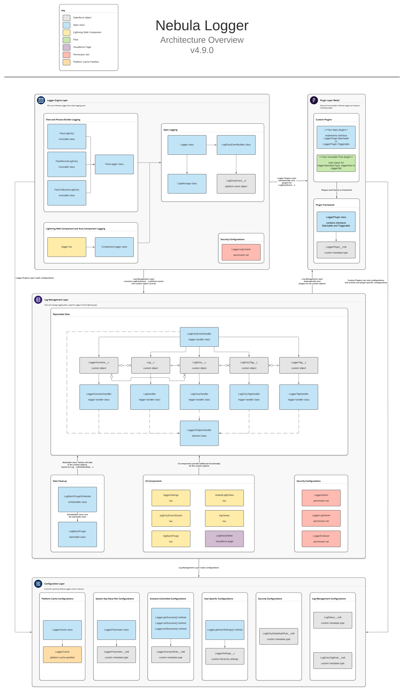

Nebula Logger is built natively on Salesforce - everything is built using Apex, lightning components and various types of objects.

As shown in the above diagram, all of the metadata is broken down into 4 layers/modules:

## 1. Logger Engine Layer

The core of Nebula Logger that makes logging work. Currently, logging is supported for:

-   Apex
-   Lightning web components & aura components
-   Flow, including a generic Flow log entry, a record-specific Flow log entry, and a collection-specific Flow log entry

This layer includes 1 platform event object:

-   `LogEntryEvent__e` platform event

## 2. Log Management Layer

This provides the ability to view and manage logging data, using the Logger Console lightning app. This layer includes 4 custom objects:

-   `Log__c` custom object
-   `LogEntry__c` custom object
-   `LogEntryTag__c` custom object
-   `LoggerTag__c` custom object

## 3. Configuration Layer

Admins, developers, and architects can control & customize Nebula Logger's built-in features, using custom settings, custom metadata types, and permision sets. This layer includes:

-   Custom Hierarchy Settings
    -   `LoggerSettings__c` for user-specific configurations
-   Custom Metadata Types
    -   `LoggerParameter__mdt` for system-wide key-value pair configurations
    -   `LogEntryDataMaskRule__mdt` for configuring regex-based data masking rules
    -   `LogStatus__mdt` for configuring which picklist values in `Log__c.Status__c` map to `IsClosed__c` and `IsResolved__c`
    -   `LogEntryTagRule__mdt` for configuring tagging rules
-   Permission Sets
    -   `LoggerAdmin`
    -   `LoggerLogViewer`
    -   `LoggerEndUser`
    -   `LoggerLogCreator`

## 4. Plugin Layer

This layer provides the ability to add new functionality to Nebula Logger by creating or installing plugins. Currently, a plugin is available for Slack, and other plugins are in development. Plugins can be built for any of the 5 included objects

-   `LogEntryEvent__e` platform event
-   `Log__c` custom object
-   `LogEntry__c` custom object
-   `LogEntryTag__c` custom object
-   `LoggerTag__c` custom object
