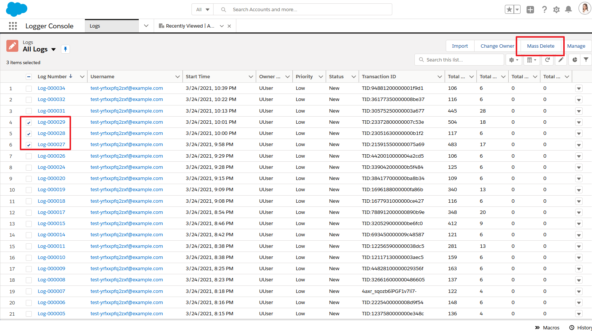
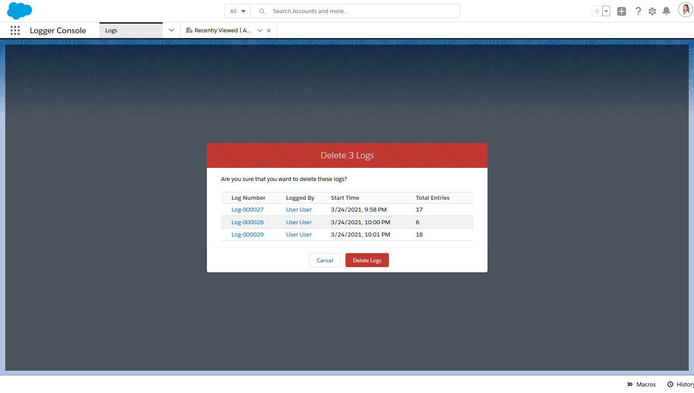

Admins can easily delete old logs using 2 methods: list views or Apex batch jobs

## Mass Deleting with List Views

Salesforce (still) does not support mass deleting records out-of-the-box. There's been [an Idea for 11+ years](https://trailblazer.salesforce.com/ideaView?id=08730000000BqczAAC) about it, but it's still not standard functionality. A custom button is available on `Log__c` list views to provide mass deletion functionality.

1. Admins can select 1 or more `Log__c` records from the list view to choose which logs will be deleted

2. The button shows a Visualforce page `LogMassDelete` to confirm that the user wants to delete the records

## Batch Deleting with Apex Jobs

Two Apex classes are provided out-of-the-box to handle automatically deleting old logs

1. `LogBatchPurger` - this batch Apex class will delete any `Log__c` records with `Log__c.LogRetentionDate__c <= System.today()`.
   - By default, this field is populated with "TODAY + 14 DAYS" - the number of days to retain a log can be customized in `LoggerSettings__c`.
   - Admins can also manually edit this field to change the retention date - or set it to null to prevent the log from being automatically deleted
2. `LogBatchPurgeScheduler` - this schedulable Apex class can be schedule to run `LogBatchPurger` on a daily or weekly basis
