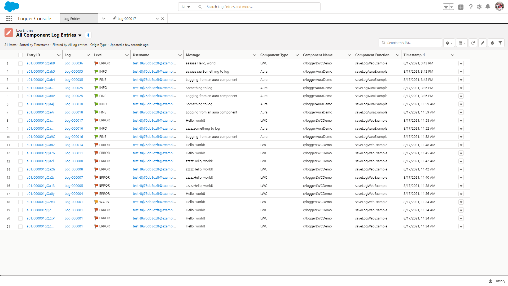
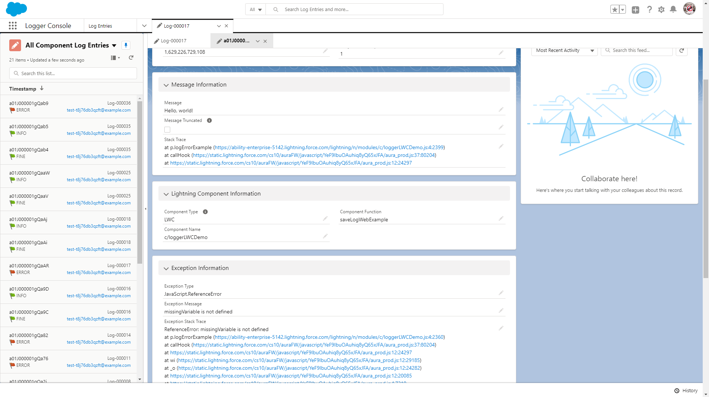

## Quick Start

For lightning component developers, the `logger` lwc provides very similar functionality that is offered [in Apex](./Logger-for-Apex). Simply embed the `logger` lwc in your component, and call the desired logging methods within your code.

```javascript
// For lwc, retrieve logger from your component's template
const logger = this.template.querySelector("c-logger");

logger.error("Hello, world!").addTag("some important tag");
logger.warn("Hello, world!");
logger.info("Hello, world!");
logger.debug("Hello, world!");
logger.fine("Hello, world!");
logger.finer("Hello, world!");
logger.finest("Hello, world!");
logger.saveLog();
```

```javascript
// For aura, retrieve logger from your component's markup
const logger = component.find("logger");

logger.error("Hello, world!").addTag("some important tag");
logger.warn("Hello, world!");
logger.info("Hello, world!");
logger.debug("Hello, world!");
logger.fine("Hello, world!");
logger.finer("Hello, world!");
logger.finest("Hello, world!");
logger.saveLog();
```

## Features for Lightning Component Developers

For lightning component developers, the included `logger` lwc can be used in other lwc & aura components for frontend logging. Similar to `Logger` and `LogEntryBuilder` Apex classes, the lwc has both `logger` and `logEntryBuilder` classes. This provides a fluent API for javascript developers so they can chain the method calls.

Once you've incorporated `logger` into your lightning components, you can see your `LogEntry__c` records using the included list view "All Component Log Entries'.



Each `LogEntry__c` record automatically stores the component's type ('Aura' or 'LWC'), the component name, and the component function that called `logger`. This information is shown in the section "Lightning Component Information"



#### Example LWC Usage

To use the logger component, it has to be added to your lwc's markup:

```html
<template>
  <c-logger></c-logger>

  <div>My component</div>
</template>
```

Once you've added logger to your markup, you can call it in your lwc's controller:

```javascript
import { LightningElement } from "lwc";

export default class LoggerDemo extends LightningElement {
  logSomeStuff() {
    const logger = this.template.querySelector("c-logger");

    logger.error("Hello, world!").addTag("some important tag");
    logger.warn("Hello, world!");
    logger.info("Hello, world!");
    logger.debug("Hello, world!");
    logger.fine("Hello, world!");
    logger.finer("Hello, world!");
    logger.finest("Hello, world!");

    logger.saveLog();
  }
}
```

#### Example Aura Usage

To use the logger component, it has to be added to your aura component's markup:

```html
<aura:component implements="force:appHostable">
  <c:logger aura:id="logger" />

  <div>My component</div>
</aura:component>
```

Once you've added logger to your markup, you can call it in your aura component's controller:

```javascript
({
  logSomeStuff: function (component, event, helper) {
    const logger = component.find("logger");

    logger.error("Hello, world!").addTag("some important tag");
    logger.warn("Hello, world!");
    logger.info("Hello, world!");
    logger.debug("Hello, world!");
    logger.fine("Hello, world!");
    logger.finer("Hello, world!");
    logger.finest("Hello, world!");

    logger.saveLog();
  },
});
```
