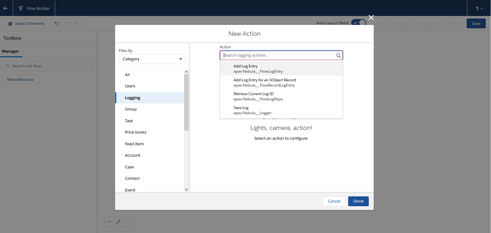
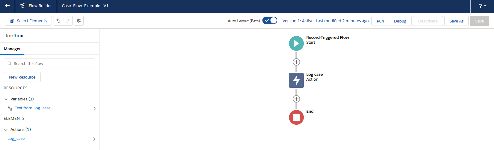
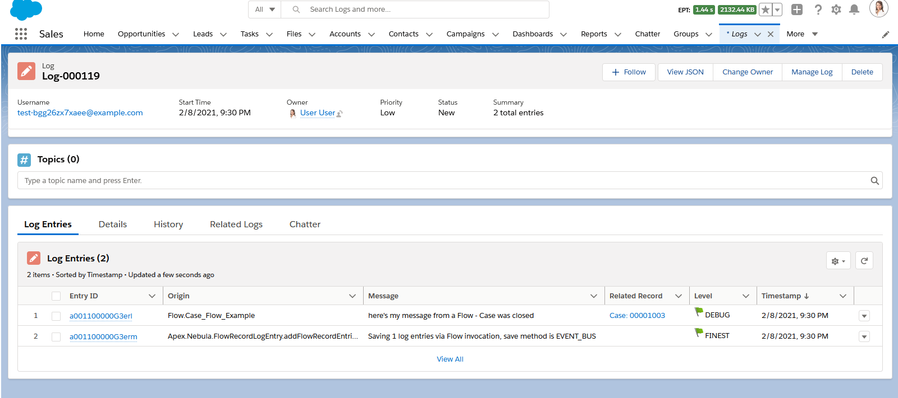

## Quick Start

Within Flow & Process Builder, you can select 1 of the several Logging actions

In this simple example, a Flow is configured after-insert and after-update to log a Case record (using the action 'Add Log Entry for an SObject Record')

This results in a `Log__c` record with related `LogEntry__c` records.

## Features for Flow Builders

Within Flow (and Process Builder), there are 4 invocable actions that you can use to leverage Nebula Logger

1. 'Add Log Entry' - uses the class `FlowLogEntry` to add a log entry with a specified message
2. 'Add Log Entry for an SObject Record' - uses the class `FlowRecordLogEntry` to add a log entry with a specified message for a particular SObject record
3. 'Add Log Entry for an SObject Record Collection' - uses the class `FlowCollectionLogEntry` to add a log entry with a specified message for an SObject record collection
4. 'Save Log' - uses the class `Logger` to save any pending logs

