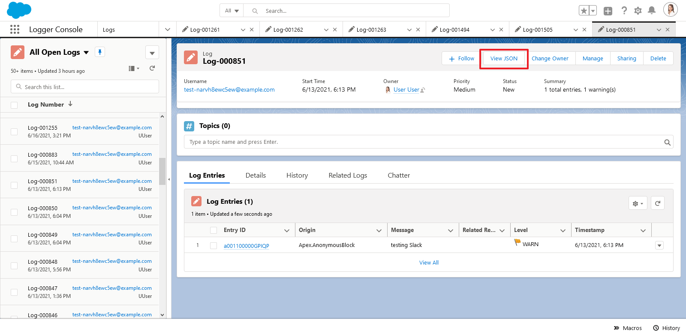

To help development and support teams better manage logs (and any underlying code or config issues), some fields on `Log__c` are provided to track the owner, priority and status of a log. These fields are optional, but are helpful in critical environments (production, QA sandboxes, UAT sandboxes, etc.) for monitoring ongoing user activities.

## 'Manage' Quick Action

- All editable fields on `Log__c` can be updated via the 'Manage Log' quick action (shown below)
- Additional fields are automatically set based on changes to `Log__c.Status__c`
  - `Log__c.ClosedBy__c` - The user who closed the log
  - `Log__c.ClosedDate__c` - The datetime that the log was closed
  - `Log__c.IsClosed__c` - Indicates if the log is closed, based on the selected status (and associated config in the 'Log Status' custom metadata type)
  - `Log__c.IsResolved__c` - Indicates if the log is resolved (meaning that it required analaysis/work, which has been completed). Only closed statuses can be considered resolved. This is also driven based on the selected status (and associated config in the 'Log Status' custom metadata type)

### Customizing `Log__c.Status__c` Picklist Values

Out-of-the-box, Nebula Logger provides these picklist values for the `Log__c.Status__c` field

To customize the statuses provided, simply update the picklist values for `Log__c.Status__c` and create/update corresponding records in the custom metadata type `LogStatus__mdt`. This custom metadata type controls which statuses are considered closed and resolved.

## Log's 'View JSON' Quick Action

Everyone loves JSON - so to make it easy to see a JSON version of a `Log__c` record, you can use the 'View JSON' quick action button. It displays the current `Log__c` + all related `LogEntry__c` records in JSON format, as well as a handy button to copy the JSON to your clipboard. All fields that the current user can view (based on field-level security) are dynamically returned, including any custom fields added directly in your org or by plugins.

