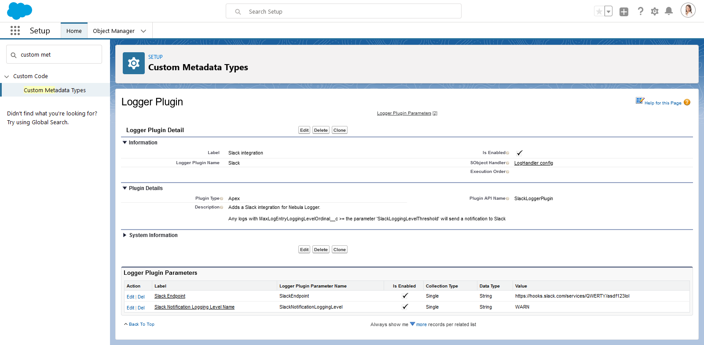

If you want to add your own automation to the included custom objects, you can leverage Apex or Flow to define "plugins" - the logger system will then automatically run the plugins after each trigger event (BEFORE_INSERT, BEFORE_UPDATE, AFTER_INSERT, AFTER_UPDATE, and so on). Currently, these objects are supported:

- `LogEntryEvent__e` platform event
- `Log__c` custom object
- `LogEntry__c` custom object
- `LogEntryTag__c` custom object
- `LoggerTag__c` custom object

This framework (currently in beta) makes it easy to build your own plugins, or deploy/install others' prebuilt packages, without having to modify the logging system directly.

## Build a Flow Plugin

Your Flow should be built as auto-launched Flows with these parameters:

1. `Input` parameter `triggerOperationType` - The name of the current trigger operation (such as BEFORE_INSERT, BEFORE_UPDATE, etc.)
2. `Input` parameter `triggerNew` - The list of logger records being processed (`Log__c` or `LogEntry__c` records)
3. `Output` parameter `updatedTriggerNew` - If your Flow makes any updates to the collection of records, you should return a record collection containing the updated records
4. `Input` parameter `triggerOld` - The list of logger records as they exist in the datatabase

## Build an Apex Plugin

Your Apex class should extend the abstract class `LoggerSObjectHandlerPlugin`. For example:

```java
public class ExamplePlugin extends LoggerSObjectHandlerPlugin {
    public override void execute(
        TriggerOperation triggerOperationType,
        List<SObject> triggerNew,
        Map<Id, SObject> triggerNewMap,
        List<SObject> triggerOld,
        Map<Id, SObject> triggerOldMap
    ) {
        switch on triggerOperationType {
            when BEFORE_INSERT {
                for (Log__c log : (List<Log__c>) triggerNew) {
                    log.Status__c = 'On Hold';
                }
            }
        }
    }
}

```

Once you've created your Apex or Flow plugin(s), you will also need to configure the plugin:

- 'Logger Plugin' - use the custom metadata type `LoggerSObjectHandlerPlugin__mdt` to define your plugin, including the plugin type (Apex or Flow) and the API name of your plugin's Apex class or Flow
- 'Logger Plugin Parameter' - use the custom metadata type `LoggerSObjectHandlerPluginParameter__mdt` to define any configurable parameters needed for your plugin, such as environment-specific URLs and other similar configurations



Note: the logger plugin framework is not available in the managed package due to some platform limitations & considerations with some of the underlying code. The unlocked package is recommended (instead of the managed package) when possible, including if you want to be able to leverage the plugin framework in your org.
