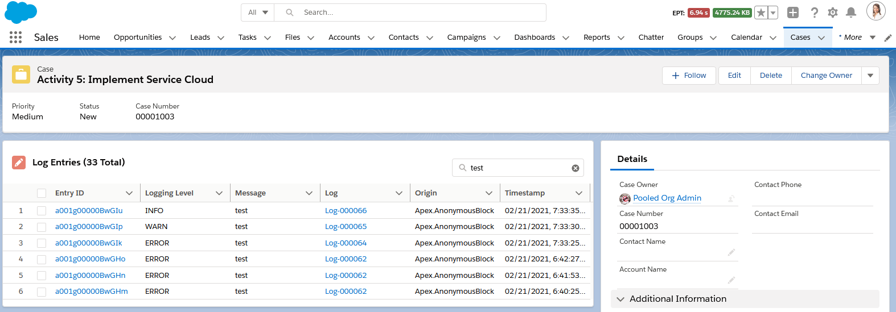

Within App Builder, admins can add the 'Related Log Entries' lightning web component (lwc) to any record page. Admins can also control which columns are displayed be creating & selecting a field set on `LogEntry__c` with the desired fields.

- The component automatically shows any related log entries, based on `LogEntry__c.RecordId__c == :recordId`
- Users can search the list of log entries for a particular record using the component's built-insearch box. The component dynamically searches all related log entries using SOSL.
- Component automatically enforces Salesforce's security model
  - Object-Level Security - Users without read access to `LogEntry__c` will not see the component
  - Record-Level Security - Users will only see records that have been shared with them
  - Field-Level Security - Users will only see the fields within the field set that they have access to

