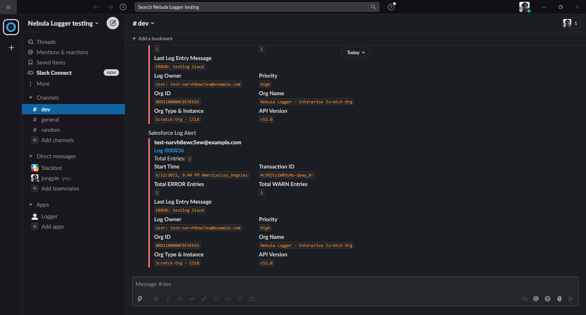

The optional [Slack plugin (beta)](https://github.com/jongpie/NebulaLogger/tree/main/nebula-logger-plugins/Slack) leverages the Nebula Logger plugin framework to automatically send Slack notifications for logs that meet a certain (configurable) logging level. The plugin also serves as a functioning example of how to build your own plugin for Nebula Logger, such as how to:

-   Use Apex to apply custom logic to `Log__c` and `LogEntry__c` records
-   Add custom fields and list views to Logger's objects
-   Extend permission sets to include field-level security for your custom fields
-   Leverage the new `LoggerSObjectHandlerPluginParameter__mdt` CMDT object to store configuration for your plugin

Check out the [Slack plugin](https://github.com/jongpie/NebulaLogger/tree/main/nebula-logger-plugins/Slack) for more details on how to install & customize the plugin

