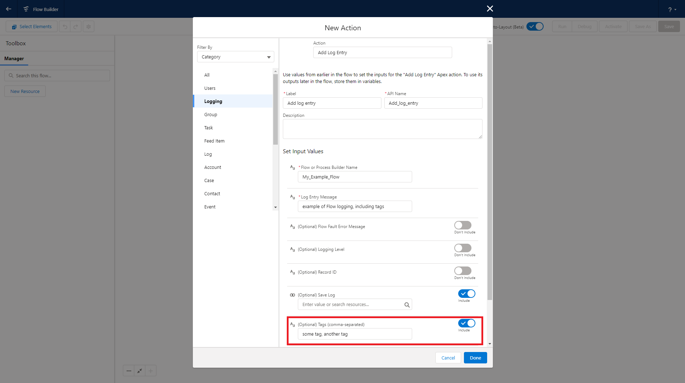
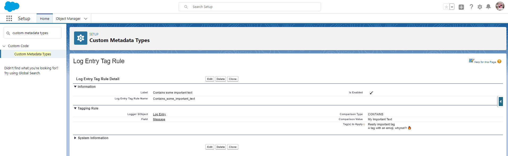

Nebula Logger supports dynamically tagging/labeling your `LogEntry__c` records via Apex, Flow, and custom metadata records in `LogEntryTagRule__mdt`. Tags can then be stored using one of the two supported modes (discussed below).

## Adding Tags in Apex

Apex developers can use 2 new methods in `LogEntryBuilder` to add tags - `LogEntryEventBuilder.addTag(String)` and `LogEntryEventBuilder.addTags(List<String>)`.

```java
// Use addTag(String tagName) for adding 1 tag at a time
Logger.debug('my log message').addTag('some tag').addTag('another tag');

// Use addTags(List<String> tagNames) for adding a list of tags in 1 method call
List<String> myTags = new List<String>{'some tag', 'another tag'};
Logger.debug('my log message').addTags(myTags);
```

## Adding Tags in Flow

Flow builders can use the `Tags` property to specify a comma-separated list of tags to apply to the log entry. This feature is available for all 3 Flow classes: `FlowLogEntry`, `FlowRecordLogEntry` and `FlowCollectionLogEntry`.



## Adding Tags with Custom Metadata Records

Admins can configure tagging rules to append additional tags using the custom metadata type `LogEntryTagRule__mdt`.

-   Rule-based tags are only added when `LogEntry__c` records are created (not on update).
-   Rule-based tags are added in addition to any tags that have been added via Apex and/or Flow.
-   Each rule is configured to apply tags based on the value of a single field on `LogEntry__c` (e.g., `LogEntry__c.Message__c`).
-   Each rule can only evaluate 1 field, but multiple rules can evaluate the same field.
-   A single rule can apply mulitple tags. When specifying multiple tags, put each tag on a separate line within the Tags field (`LogEntryTagRule__mdt.Tags__c`).

Rules can be set up by configuring a custom metadata record with these fields configured:

1. Logger SObject: currently, only the "Log Entry" object (`LogEntry__c`) is supported.
2. Field: the SObject's field that should be evaluated - for example, `LogEntry__c.Message__c`. Only 1 field can be selected per rule, but multiple rules can use the same field.
3. Comparison Type: the type of operation you want to use to compare the field's value. Currently supported options are: `CONTAINS`, `EQUALS`, `MATCHES_REGEX`, and `STARTS_WITH`.
4. Comparison Value: the comparison value that should be used for the selected field operation.
5. Tags: a list of tag names that should be dynamically applied to any matching `LogEntry__c` records.
6. Is Enabled: only enabled rules are used by Logger - this is a handy way to easily enable/disable a particular rule without having to entirely delete it.

Below is an example of what a rule looks like once configured. Based on this rule, any `LogEntry__c` records that contain "My Important Text" in the `Message__c` field will automatically have 2 tags added - "Really important tag" and "A tag with an emoji, whynot?! 🔥"



## Choosing a Tagging Mode

Once you've implementing log entry tagging within Apex or Flow, you can choose how the tags are stored within your org. Each mode has its own pros and cons - you can also build your own plugin if you want to leverage your own tagging system (note: plugins are not currently available in the managed package).

<table>
    <thead>
        <tr>
            <th><strong>Tagging Mode</strong></th>
            <th>Logger's Custom Tagging Objects (Default)</th>
            <th>Salesforce <code>Topic</code> and <code>TopicAssignment</code> Objects</th>
        </tr>
    </thead>
    <tbody>
        <tr>
            <td>Summary</td>
            <td>Stores your tags in custom objects <code>LoggerTag__c</code> and <code>LogEntryTag__c</code></td>
            <td>Leverages Salesforce's <a href="https://www.salesforce.com/products/chatter/features/online-collaboration-tools">Chatter Topics functionality</a> to store your tags. This mode is not available in the managed package.</td>
        </tr>
        <tr>
            <td>Data Model</td>
            <td>
                <ul>
                    <li><code>LoggerTag__c</code>: this represents the actual tag you want to apply to your log entry record. Tags are unique, based on the field <code>LoggerTag__c.Name</code>. The logging system will automatically create <code>LoggerTag__c</code> records if a matching record does not already exist in your org.</li>
                    <li><code>LogEntryTag__c</code>: a junction object between <code>LoggerTag__c</code> and <code>LogEntry__c</code></li>
                </ul>
            </td>
            <td>
                <ul>
                    <li><code>Topic</code>: a standard object, used to tag any Salesforce record (with Topics enabled). This object is used similar to how <code>LoggerTag__c</code> is used. See <a href="https://developer.salesforce.com/docs/atlas.en-us.object_reference.meta/object_reference/sforce_api_objects_topic.htm">object reference docs for more details</a></li>
                    <li><code>TopicAssignment</code>: a junction object between a <code>Topic</code> record and any (supported) SObject, using a polymorphic <code>EntityId</code> field. See <a href="https://developer.salesforce.com/docs/atlas.en-us.object_reference.meta/object_reference/sforce_api_objects_topicassignment.htm">object reference docs for more details</a></li>
                </ul>
            </td>
        </tr>
        <tr>
            <td>Data Visibility</td>
            <td>
                <ul>
                    <li>Access to the <code>LoggerTag__c</code> object can be granted/restricted using standard Salesforce object and record-sharing functionality (OWD, sharing rules, profiles, permission sets, etc). By default, <code>LoggerTag__c</code> OWD is set to 'public read-only' for internal users and 'private' for external users</li>
                    <li>Since <code>LogEntryTag__c</code> is a junction object, access to these records is controlled by a user's access to the related <code>LogEntry__c</code> and <code>LoggerTag__c</code> records</li>
                </ul>
            </td>
            <td>
                <ul>
                    <li>In Chatter, all <code>Topic</code> records are visible - including any <code>Topic</code> records created via Logger. For some orgs that are ok with this visibility within Chatter, this is considered a great feature. But for some orgs, this visibility may not be ideal.</li>
                    <li>Although <code>Topic</code> records are visible to all Chatter users, <code>TopicAssignment</code> records are only visible to users that have access to the related <code>EntityId</code> (in this case, the <code>LogEntry__c</code> record)</li>
                </ul>
            </td>
        </tr>
        <tr>
            <td>Leveraging Data</td>
            <td>Since the data is stored in custom objects, you can leverage any platform functionality you want, such as building custom list views, reports & dashboards, enabling Chatter feeds, creating activities/tasks, and so on.</a>
            <td>Topics can be used to <a href="http://releasenotes.docs.salesforce.com/en-us/winter20/release-notes/rn_lex_lists_topic_filters.htm">filter list views</a>, which is a really useful feature. However, using Topics <a href="https://trailblazer.salesforce.com/ideaView?id=08730000000l12wAAA">in reports and dashboards is only partially implemented</a> at this time.
            </td>
        </tr>
    </tbody>
</table>
