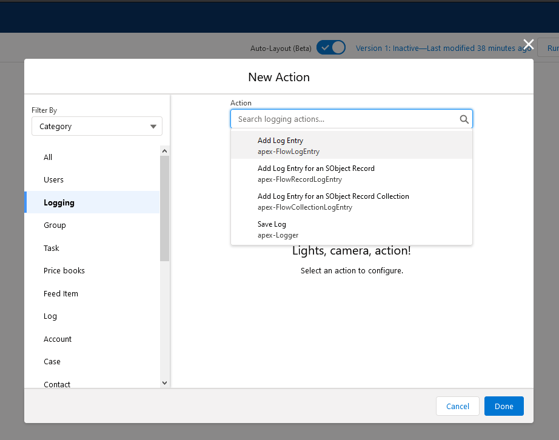

# Quick Start Guide

Get up and running with Nebula Logger in 5 minutes.

## Prerequisites

- Nebula Logger installed in your org (see [Installation Guide](installation.md))
- Appropriate permissions assigned (admin or Logger user permission set)

## Your First Log Entry

### In Apex

Open Developer Console and execute anonymous Apex:

```apex
// Log a simple message
Logger.info('Hello from Nebula Logger!');
Logger.saveLog();
```

**What happened?**
1. Logger captured the message with INFO level
2. `saveLog()` published a platform event
3. Event handler created a `Log__c` and `LogEntry__c` record
4. Your log is now queryable and reportable!

### View Your Log

1. Navigate to **App Launcher** → **Logger Console**
2. Click the **Logs** tab
3. Open the most recent log
4. See your log entry with full context: timestamp, user, class, method, line number

## Adding More Context

### Log with Tags

```apex
Logger.info('Processing important record')
    .addTag('important')
    .addTag('customer-facing');
Logger.saveLog();
```

Tags help you filter and search logs later.

### Log with a Scenario

```apex
Logger.setScenario('User Registration');
Logger.info('Starting registration validation');
Logger.debug('Checking email format');
Logger.info('Registration completed successfully');
Logger.saveLog();
```

Scenarios group related log entries by business process.

### Log an Exception

```apex
try {
    // Your code that might fail
    Integer result = 10 / 0;
} catch (Exception e) {
    Logger.error('Calculation failed')
        .setExceptionDetails(e)
        .addTag('critical');
    Logger.saveLog();
}
```

Captures full exception details including stack trace.

### Log with Record Context

```apex
Account acc = [SELECT Id, Name FROM Account LIMIT 1];

Logger.info('Processing account')
    .setRecord(acc)
    .addTag('account-processing');
Logger.saveLog();
```

Links the log entry to a Salesforce record.

## In Lightning Web Components

**yourComponent.js:**

```javascript
import { LightningElement } from 'lwc';
import { getLogger } from 'c/logger';

export default class YourComponent extends LightningElement {
    logger = getLogger();

    connectedCallback() {
        this.logger.info('Component initialized');
        this.logger.saveLog();
    }

    handleError() {
        this.logger.error('Something went wrong')
            .addTag('ui-error');
        this.logger.saveLog();
    }
}
```

**yourComponent.js-meta.xml** (add logger to your component):

```xml
<?xml version="1.0" encoding="UTF-8"?>
<LightningComponentBundle xmlns="http://soap.sforce.com/2006/04/metadata">
    <!-- ... other config ... -->
</LightningComponentBundle>
```

## In Flow

1. Add the **Add Log Entry** action to your flow
2. Set the **Logging Level** to `INFO`
3. Set the **Message** to `Hello from Flow!`
4. Add the **Save Log** action at the end of your flow



## Understanding Log Levels

Use the right level for the right situation:

```apex
Logger.error('Payment processing failed');    // Critical issues
Logger.warn('API rate limit approaching');    // Potential problems
Logger.info('Order submitted successfully');  // Business events
Logger.debug('Cache hit for product data');   // Diagnostic info
Logger.fine('Entering method processOrder'); // Trace-level detail
```

**Tip:** Start with INFO and ERROR. Add DEBUG/FINE when troubleshooting.

## Common Patterns

### Pattern 1: Log at Entry and Exit

```apex
public void processOrder(Order__c order) {
    Logger.fine('Entering processOrder, orderId: ' + order.Id);
    
    // Your business logic
    
    Logger.fine('Exiting processOrder');
    Logger.saveLog();
}
```

### Pattern 2: Log Inside Try-Catch

```apex
try {
    // Risky operation
    callExternalAPI();
    Logger.info('API call succeeded');
} catch (Exception e) {
    Logger.error('API call failed').setExceptionDetails(e);
} finally {
    Logger.saveLog(); // Always save, even if no errors
}
```

### Pattern 3: Conditional Logging

```apex
Logger.info('Processing batch of ' + records.size() + ' records');

if (records.size() > 1000) {
    Logger.warn('Large batch size may impact performance')
        .addTag('performance');
}

Logger.saveLog();
```

### Pattern 4: Multiple Entries in a Transaction

```apex
Logger.setScenario('Data Migration');

Logger.info('Migration started, processing ' + accounts.size() + ' accounts');

for (Account acc : accounts) {
    Logger.debug('Migrating account: ' + acc.Name);
    // ... migration logic ...
}

Logger.info('Migration completed successfully');
Logger.saveLog(); // One Log__c with multiple LogEntry__c records
```

## When to Save Logs

### Always Save When:
- An error occurs
- A critical business event happens
- You need to troubleshoot an issue

### Consider NOT Saving When:
- Everything works perfectly in routine operations
- You're generating logs in high-volume scenarios
- Logs contain only DEBUG/FINE level entries with no issues

```apex
// Example: Conditional save
try {
    processRecords();
    // Don't save if everything is fine
} catch (Exception e) {
    Logger.error('Processing failed').setExceptionDetails(e);
    Logger.saveLog(); // Save when there's an issue
}
```

## Viewing and Searching Logs

### Logger Console App

The **Logger Console** provides several views:

- **Logs** tab - View all Log__c records
- **Log Entries** tab - View all LogEntry__c records
- **Logger Tags** tab - Browse tags
- **Logger Scenarios** tab - Browse scenarios

### Quick Filters

Use list views to find logs quickly:

- Recent Logs
- My Logs
- Error Logs
- Logs by Scenario
- Logs by Tag

### SOQL Queries

Search logs programmatically:

```apex
// Find all ERROR level logs from today
List<LogEntry__c> errors = [
    SELECT Id, Message__c, Timestamp__c, ExceptionMessage__c
    FROM LogEntry__c
    WHERE LoggingLevel__c = 'ERROR'
    AND Timestamp__c = TODAY
];

// Find logs tagged with 'payment'
List<LogEntry__c> paymentLogs = [
    SELECT Id, Message__c, Tags__c
    FROM LogEntry__c
    WHERE Id IN (
        SELECT LogEntry__c 
        FROM LogEntryTag__c 
        WHERE Tag__r.Name = 'payment'
    )
];
```

## Next Steps

Now that you've logged your first entries, explore:

- **[Apex Guide](apex-guide.md)** - Advanced Apex logging patterns
- **[LWC Guide](lwc-guide.md)** - Lightning Web Component logging
- **[Tagging Guide](tagging-guide.md)** - Organize logs with tags
- **[Scenarios Guide](scenarios-guide.md)** - Track business processes
- **[Best Practices](best-practices.md)** - Production-ready logging patterns
- **[Configuration Reference](configuration-reference.md)** - Configure Logger for your needs

## Troubleshooting

### Logs Not Appearing?

1. **Check permissions** - Ensure you have Logger permissions
2. **Check settings** - Verify `LoggerSettings__c.IsEnabled__c = true`
3. **Check platform events** - Look for `LogEntryEvent__e` records
4. **Check debug logs** - Look for "Nebula Logger" messages

### Performance Concerns?

- Use `Logger.getBufferSize()` to check pending entries
- Set appropriate log levels (don't log FINEST in production)
- Use `Logger.flushBuffer()` if needed
- See [Performance Guide](performance.md) for optimization tips

### Need Help?

- Check the [FAQ](faq.md)
- Review [Troubleshooting Guide](troubleshooting.md)
- Open an issue on GitHub
