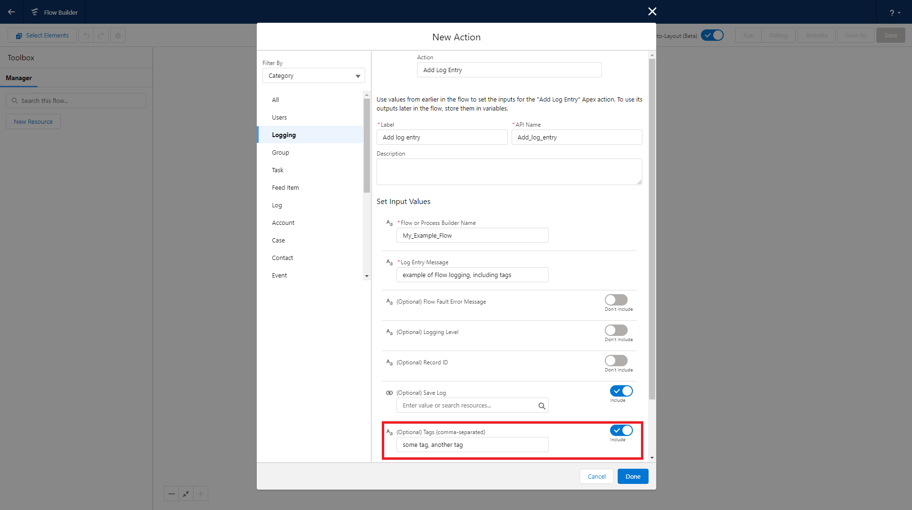

# Tagging System Guide

Complete guide to organizing and categorizing logs with Nebula Logger's tagging system.

## Overview

Tags are flexible labels you can apply to log entries to organize, filter, and search logs. Think of tags like hashtags on social media - they help you find related content quickly.

### Tags vs Scenarios

| Feature | Tags | Scenarios |
|---------|------|-----------|
| **Cardinality** | Many per log entry | One per log entry |
| **Relationship** | Many-to-many (via junction) | Lookup field |
| **Use Case** | Categorization, filtering | Business process tracking |
| **Example** | "payment", "critical", "api-error" | "Order Processing", "User Registration" |

See [Scenarios Guide](scenarios-guide.md) for more on scenarios.

## How Tagging Works

### Data Model

**LoggerTag__c** - The tag itself (unique by name)
- Name: "payment"
- Description: Optional description
- TotalLogEntries__c: Rollup count

**LogEntryTag__c** - Junction object
- LogEntry__c: Master-detail to LogEntry__c
- Tag__c: Master-detail to LoggerTag__c

### Tag Creation

Tags are automatically created when first referenced:

```apex
Logger.info('Processing payment')
    .addTag('payment');  // Creates LoggerTag__c if it doesn't exist
Logger.saveLog();
```

## Adding Tags

### In Apex

**Single tag:**
```apex
Logger.info('Important event').addTag('important');
```

**Multiple tags (chaining):**
```apex
Logger.error('Payment failed')
    .addTag('payment')
    .addTag('critical')
    .addTag('requires-investigation');
```

**Multiple tags (list):**
```apex
List<String> tags = new List<String>{'integration', 'external-api', 'stripe'};
Logger.debug('API call completed').addTags(tags);
```

**All together:**
```apex
Logger.setScenario('Order Processing');

Logger.info('Order validation started')
    .setRecord(order)
    .addTag('order')
    .addTag('validation');

try {
    validateOrder(order);
    Logger.info('Order validated successfully').addTag('order').addTag('success');
} catch (Exception e) {
    Logger.error('Order validation failed')
        .setExceptionDetails(e)
        .addTag('order')
        .addTag('validation-error')
        .addTag('critical');
}

Logger.saveLog();
```

### In Lightning Web Components

```javascript
import { LightningElement } from 'lwc';
import { getLogger } from 'c/logger';

export default class PaymentComponent extends LightningElement {
    logger = getLogger();

    handlePayment() {
        this.logger.info('Payment initiated')
            .addTag('payment')
            .addTag('user-action');
        
        try {
            // Process payment
            this.logger.info('Payment successful')
                .addTag('payment')
                .addTag('success');
        } catch (error) {
            this.logger.error('Payment failed')
                .setExceptionDetails(error)
                .addTag('payment')
                .addTag('error')
                .addTag('critical');
        } finally {
            this.logger.saveLog();
        }
    }
}
```

### In Aura Components

```javascript
var logger = component.find('logger');

logger.error('Record save failed')
    .addTag('record-save')
    .addTag('ui-error');

logger.saveLog();
```

### In Flow

1. Add the **Add Log Entry** action
2. Set the **Message** field
3. Set the **Tags** field to a comma-separated list: `payment,critical,user-action`
4. Add the **Save Log** action



## Automatic Tagging

### Tag Rules (LogEntryTagRule__mdt)

Automatically apply tags based on field values.

#### Example 1: Tag All Errors

**Setup → Custom Metadata Types → Log Entry Tag Rules → New**

```
Label: Auto-tag Errors
Logger SObject: Log Entry
Field: LoggingLevel__c
Comparison Type: EQUALS
Comparison Value: ERROR
Tags: error
        requires-attention
Is Enabled: ✓
```

Now all ERROR-level logs automatically get tagged with "error" and "requires-attention".

#### Example 2: Tag Payment Logs

```
Label: Payment Detection
Logger SObject: Log Entry
Field: Message__c
Comparison Type: CONTAINS
Comparison Value: payment
Tags: payment
        financial
Is Enabled: ✓
```

Any log entry with "payment" in the message gets tagged automatically.

#### Example 3: Tag Integration Logs

```
Label: Integration Detection
Logger SObject: Log Entry
Field: OriginLocation__c
Comparison Type: STARTS_WITH
Comparison Value: ExternalAPIService
Tags: integration
        external-api
Is Enabled: ✓
```

Logs from the `ExternalAPIService` class are automatically tagged.

#### Example 4: Tag with Regex

```
Label: SSN Detection
Logger SObject: Log Entry
Field: Message__c
Comparison Type: MATCHES_REGEX
Comparison Value: \d{3}-\d{2}-\d{4}
Tags: contains-ssn
        sensitive
        pii
Is Enabled: ✓
```

Detects logs containing SSN patterns (but consider data masking instead!).

### Comparison Types

| Type | Description | Example |
|------|-------------|---------|
| **EQUALS** | Exact match | Field = "ERROR" |
| **CONTAINS** | Substring match | Field contains "payment" |
| **STARTS_WITH** | Prefix match | Field starts with "External" |
| **MATCHES_REGEX** | Regex pattern | Field matches `\d{3}-\d{3}-\d{4}` |

## Tag Naming Conventions

### Recommended Taxonomy

Establish consistent naming conventions across your organization:

#### By Category

**System/Technical:**
```apex
.addTag('integration')
.addTag('batch')
.addTag('scheduled')
.addTag('trigger')
.addTag('api')
.addTag('database')
.addTag('cache')
```

**Severity/Priority:**
```apex
.addTag('critical')
.addTag('high-priority')
.addTag('low-priority')
.addTag('informational')
.addTag('requires-investigation')
.addTag('requires-manual-review')
```

**Feature/Domain:**
```apex
.addTag('payment')
.addTag('inventory')
.addTag('authentication')
.addTag('authorization')
.addTag('notification')
.addTag('reporting')
.addTag('analytics')
```

**External Systems:**
```apex
.addTag('stripe')
.addTag('netsuite')
.addTag('aws')
.addTag('slack')
.addTag('external-api')
```

**Status:**
```apex
.addTag('success')
.addTag('failure')
.addTag('warning')
.addTag('retry')
.addTag('timeout')
```

**Team/Ownership:**
```apex
.addTag('team-platform')
.addTag('team-integrations')
.addTag('team-product')
.addTag('team-support')
```

**Customer/Business:**
```apex
.addTag('customer-facing')
.addTag('internal-only')
.addTag('premium-feature')
.addTag('free-tier')
```

**Compliance:**
```apex
.addTag('pii')
.addTag('sensitive')
.addTag('compliance')
.addTag('audit-trail')
.addTag('gdpr')
.addTag('hipaa')
```

### Naming Style Guide

**✅ DO:**
- Use lowercase
- Use hyphens for multi-word tags: `user-action`, `api-error`
- Be specific: `payment-timeout` not just `timeout`
- Be consistent: always use same tag for same concept

**❌ DON'T:**
- Mix cases: `Payment` vs `payment`
- Use spaces: `user action` (use `user-action`)
- Use underscores: `user_action` (use `user-action`)
- Use abbreviations unless clear: `usr-act` (use `user-action`)

### Tag Hierarchy

Use prefixes for hierarchical tags:

```apex
// Feature hierarchy
.addTag('payment')
.addTag('payment-processing')
.addTag('payment-processing-stripe')

// Environment hierarchy
.addTag('prod')
.addTag('prod-us-west')
.addTag('prod-us-west-pod-1')

// Error hierarchy
.addTag('error')
.addTag('error-validation')
.addTag('error-validation-required-field')
```

## Searching and Filtering

### SOQL Queries

**Find all entries with a specific tag:**
```apex
List<LogEntry__c> paymentLogs = [
    SELECT Id, Message__c, Timestamp__c
    FROM LogEntry__c
    WHERE Id IN (
        SELECT LogEntry__c
        FROM LogEntryTag__c
        WHERE Tag__r.Name = 'payment'
    )
    ORDER BY Timestamp__c DESC
];
```

**Find entries with multiple tags (AND):**
```apex
// Find entries tagged with BOTH 'payment' AND 'critical'
Set<Id> paymentEntries = new Set<Id>();
Set<Id> criticalEntries = new Set<Id>();

for (LogEntryTag__c let : [
    SELECT LogEntry__c, Tag__r.Name
    FROM LogEntryTag__c
    WHERE Tag__r.Name IN ('payment', 'critical')
]) {
    if (let.Tag__r.Name == 'payment') {
        paymentEntries.add(let.LogEntry__c);
    } else if (let.Tag__r.Name == 'critical') {
        criticalEntries.add(let.LogEntry__c);
    }
}

// Intersection = entries with both tags
paymentEntries.retainAll(criticalEntries);

List<LogEntry__c> results = [
    SELECT Id, Message__c, Timestamp__c
    FROM LogEntry__c
    WHERE Id IN :paymentEntries
];
```

**Find entries with any of multiple tags (OR):**
```apex
List<LogEntry__c> logs = [
    SELECT Id, Message__c, Timestamp__c
    FROM LogEntry__c
    WHERE Id IN (
        SELECT LogEntry__c
        FROM LogEntryTag__c
        WHERE Tag__r.Name IN ('payment', 'stripe', 'financial')
    )
];
```

**Count entries by tag:**
```apex
AggregateResult[] results = [
    SELECT Tag__r.Name, COUNT(Id) entryCount
    FROM LogEntryTag__c
    WHERE CreatedDate = LAST_N_DAYS:7
    GROUP BY Tag__r.Name
    ORDER BY COUNT(Id) DESC
];

for (AggregateResult ar : results) {
    System.debug(ar.get('Name') + ': ' + ar.get('entryCount'));
}
```

### List Views

Create custom list views for quick filtering:

**List View: Payment Errors**
```
Object: Log Entries
Filters:
  - Id IN LogEntryTag (Tag Name = 'payment')
  - Logging Level = ERROR
  - Created Date = THIS_MONTH
```

**List View: Critical Issues**
```
Object: Log Entries
Filters:
  - Id IN LogEntryTag (Tag Name = 'critical')
  - Created Date = THIS_WEEK
```

### Reports

**Report: Top 10 Tags This Month**
```
Report Type: Log Entry Tags
Group By: Logger Tag Name
Filters: Created Date = THIS_MONTH
Summary: Count of Log Entry Tags
Sort By: Count DESC
Limit: 10
```

**Report: Errors by Tag**
```
Report Type: Log Entry Tags
Join: Log Entries (Logging Level = ERROR)
Group By: Logger Tag Name
Filters: Created Date = THIS_WEEK
Columns: Tag Name, Count, Sample Messages
```

## Tag Management

### Viewing Tags

Navigate to **App Launcher → Logger Console → Logger Tags**

Each tag shows:
- Name
- Total log entries (rollup)
- Description (if set)
- Owner
- Created date

### Editing Tags

You can add descriptions to tags for documentation:

1. Open a LoggerTag__c record
2. Edit the **Description** field
3. Example: "Used for payment processing logs. Includes Stripe, PayPal, and internal payment gateway."
4. Save

### Deleting Tags

**⚠️ Warning:** Deleting a LoggerTag__c record deletes all related LogEntryTag__c junction records.

Only delete tags that are:
- Misspelled
- No longer needed
- Test/development tags

**To delete:**
1. Navigate to the LoggerTag__c record
2. Click **Delete**
3. Confirm

**Alternative:** Instead of deleting, add a description like "DEPRECATED - use 'new-tag-name' instead"

### Merging Tags

If you have duplicate or similar tags (e.g., "payment" and "payments"), merge them:

1. Query for all LogEntryTag__c records with the old tag
```apex
List<LogEntryTag__c> oldTags = [
    SELECT Id, LogEntry__c, Tag__c
    FROM LogEntryTag__c
    WHERE Tag__r.Name = 'payments'
];
```

2. Get or create the target tag
```apex
LoggerTag__c newTag = [SELECT Id FROM LoggerTag__c WHERE Name = 'payment' LIMIT 1];
```

3. Update junction records
```apex
for (LogEntryTag__c let : oldTags) {
    let.Tag__c = newTag.Id;
}
update oldTags;
```

4. Delete the old tag
```apex
delete [SELECT Id FROM LoggerTag__c WHERE Name = 'payments'];
```

## Tag Storage Modes

Nebula Logger supports two tag storage modes:

### Mode 1: Custom Objects (Default)

**Pros:**
- Full control over sharing and security
- Can add custom fields
- Works in managed package
- Supports all features

**Cons:**
- Uses custom object storage
- Requires junction object

**Configuration:**
This is the default mode, no configuration needed.

### Mode 2: Chatter Topics

**Pros:**
- Uses standard Salesforce Topics
- No custom object storage
- Familiar UX (if users know Topics)

**Cons:**
- Not available in managed package
- Limited customization
- Different security model

**Configuration:**
Set via custom metadata (unlocked package only).

## Best Practices

### 1. Establish Tag Standards Early

Create a wiki page or document with:
- Approved tag names
- Tag categories
- When to use each tag
- Naming conventions

**Example Standards Document:**
```markdown
# Logger Tag Standards

## Categories

### Error Severity
- critical: System down, data loss, customer-impacting
- high-priority: Important but not critical
- low-priority: Minor issues, cosmetic

### Features
- payment: Any payment-related logs
- inventory: Inventory management
- authentication: User login/logout

### External Systems
- stripe: Stripe payment integration
- netsuite: NetSuite ERP integration
- aws: AWS services
```

### 2. Use Tag Rules for Consistency

Configure LogEntryTagRule__mdt to automatically apply common tags:
- All ERRORs get tagged "error"
- All integration logs get tagged "integration"
- All logs from specific classes get feature tags

### 3. Tag Liberally, Query Specifically

It's better to have multiple tags than to under-tag:

```apex
// ✅ Good: Multiple relevant tags
Logger.error('Stripe payment failed')
    .addTag('payment')
    .addTag('stripe')
    .addTag('external-api')
    .addTag('critical')
    .addTag('requires-investigation');

// ❌ Bad: Under-tagged
Logger.error('Stripe payment failed')
    .addTag('error');
```

### 4. Combine Tags and Scenarios

Use scenarios for process context and tags for categorization:

```apex
Logger.setScenario('Order Processing');  // What process

Logger.info('Order validated')
    .addTag('order')           // What feature
    .addTag('validation')      // What action
    .addTag('success');        // What result
```

### 5. Review and Prune Tags Regularly

Monthly:
- Review new tags created
- Look for duplicates or misspellings
- Merge similar tags
- Update tag standards document

### 6. Use Tags for Alerting

Create alerts based on tag combinations:

```apex
// Process Builder: Alert on critical payment errors
Object: Log Entry
Criteria: Tags CONTAINS "payment" AND Tags CONTAINS "critical"
Action: Send email to payment-team@company.com
```

### 7. Tag for Your Dashboard Needs

Think about dashboards and reports when tagging:

```apex
// Tags that enable useful dashboards
.addTag('user-facing')      // For customer impact dashboard
.addTag('team-integrations') // For team ownership dashboard
.addTag('api-error')        // For API health dashboard
.addTag('performance-warning') // For performance dashboard
```

## Common Patterns

### Pattern 1: Feature + Status

```apex
// Feature: payment, Status: success/failure
Logger.info('Payment processed').addTag('payment').addTag('success');
Logger.error('Payment failed').addTag('payment').addTag('failure');
```

### Pattern 2: System + Severity

```apex
// System: stripe, Severity: critical/warning
Logger.error('Stripe API down').addTag('stripe').addTag('critical');
Logger.warn('Stripe slow response').addTag('stripe').addTag('warning');
```

### Pattern 3: Feature + Action + Result

```apex
// Feature: order, Action: validation, Result: success
Logger.info('Order validation passed')
    .addTag('order')
    .addTag('validation')
    .addTag('success');
```

### Pattern 4: Team + Priority

```apex
// Team: team-platform, Priority: high-priority
Logger.error('Platform service degraded')
    .addTag('team-platform')
    .addTag('high-priority')
    .addTag('requires-investigation');
```

## Next Steps

- [Scenarios Guide](scenarios-guide.md) - Tracking business processes
- [Best Practices](best-practices.md) - General logging best practices
- [Log Management](log-management.md) - Finding and analyzing logs
- [Admin Guide](admin-guide.md) - Configuring tag rules
