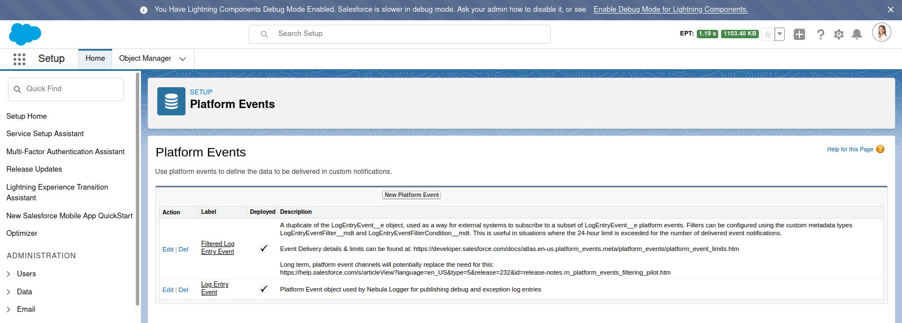
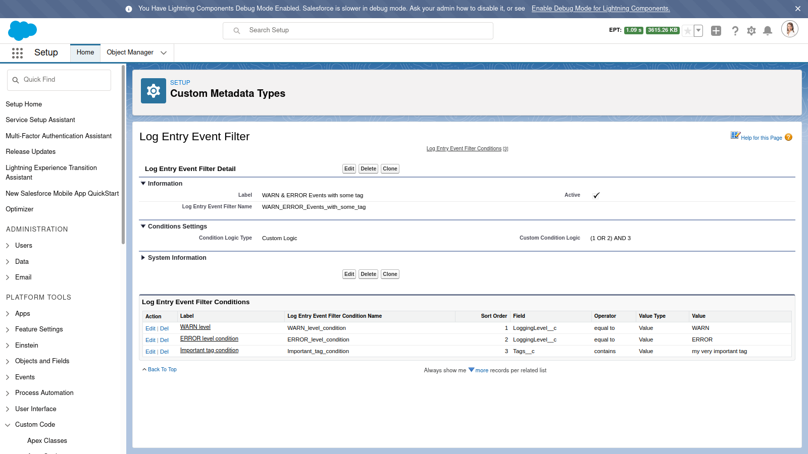

# Filtered Log Entry Events plugin for Nebula Logger

Currently, platform events have a 24-hour limit for the number of delivered event notifications across all CometD clients. When this limit is exceeded, no additional notifications are sent to external systems that have subscribed to platform events in your org. Based on the [Platform Event Allocations](https://developer.salesforce.com/docs/atlas.en-us.platform_events.meta/platform_events/platform_event_limits.htm) docs, the current limits are:

-   Developer Edition: 10,00 per 24 hours
-   Performance and Unlimited Editions: 25,000 per 24 hours
-   Enterprise Edition and Professional Edition (with API Add-On): 50,000 per 24 hours

Long term, [platform event channels (currently in pilot)](https://help.salesforce.com/s/articleView?language=en_US&type=5&release=232&id=release-notes.rn_platform_events_filtering_pilot.htm) will potentially solve this issue by providng a way to filter which platfom events are sent to subscribers. As a short-term solution, this plugin provides a second platform event, `FilteredLogEntryEvent__e`, that will only contain copies of `LogEntryEvent__e` platform events that meet criteria defined in your org, using custom metadata types. Instead of subscribing to `LogEntryEvent__e` directly, external systems can subscribe to `FilteredLogEntryEvent__e` instead.

-   Positive: This is useful in situations where the 24-hour limit is exceeded for the number of delivered event notifications
-   Negative: This increases the number of platform events published in your org, which counts towards the hourly limit for the number of event notifications published per hour.

---

## `FilteredLogEntryEvent__e` platform event

A duplicate of the `LogEntryEvent__e` platform event object, `FilteredLogEntryEvent__e` is used as a way for external systems to subscribe to a subset of `LogEntryEvent__e` platform events. Filters can be configured using the custom metadata types `LogEntryEventFilter__mdt` and `LogEntryEventFilterCondition__mdt`.

## `LogEntryEventFilter__mdt` custom metadata type

A filter rule to apply to `LogEntryEvent__e` platform events - any matching events will be duplicated & published as a `FilteredLogEntryEvent__e` platform events. Each filter consists of 1 or more conditions, stored in LogEntryEventFilterCondition\_\_mdt

## `LogEntryEventFilterCondition__mdt` custom metadata type

A field-level condition to check on `LogEntryEvent__e` platform events for a particular `LogEntryEventFilter__mdt` record. Conditions can be added for a specific value, a regular expression (regex), or by comparing 2 fields on `LogEntryEvent__e`.

---

## Example Filter & Conditions

As an example, the screenshot below shows how you can configure a filter to identity `LogEntryEvent__e` platform events with either an `ERROR` or `WARN` logging level, and the `LogEntryEvent__e` platform events have a the tag 'my very important tag'. The filter applies conditions using a custom condition logic of `(1 OR 2) AND 3`.

Any `LogEntryEvent__e` that match the filter's conditions are automatically republished as `FilteredLogEntryEvent__e` platform events.

