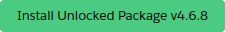
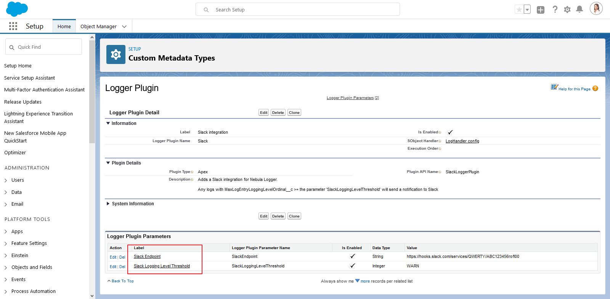

# Slack plugin for Nebula Logger

Adds a Slack integration for Nebula Logger. Any logs with log entries that meet a certain (configurable) logging level will automatically be posted to your Slack channel via an asynchronous `Queueable` job.

---

## What's Included

This plugin includes some add-on metadata for Logger to support the Slack integration

1. Apex class `SlackLoggerPlugin` and corresponding tests in `SlackLoggerPlugin_Tests`
2. Plugin configuration details stored in Logger's CMDT objects `LoggerSObjectHandlerPlugin__mdt` and `LoggerSObjectHandlerPluginParameter__mdt`
3. Custom fields `Log__c.SendSlackNotification__c` and `Log__c.SlackNotificationDate__c`
4. Field-level security (FLS) via a new permission sets `LoggerSlackPluginAdmin` to provide access to the custom Slack fields
5. Custom list views for the `Log__c` and `LoggerSObjectHandlerPluginParameter__mdt` objects
6. Remote site setting for Slack's API

---

## Installation Steps

In order to use the Slack plugin, there are some configuration changes needed in both Slack and Salesforce

### Slack setup

Within Slack, you'll need to setup incoming webhooks to allow the Logger Slack plugin to create messages. The high-level steps are:

1. Create a new app in your Slack workspace and enable incoming webhooks for your app.
2. Create a new incoming webhook for your app, and copy the webhook URL. This will be used in Salesforce (see below steps)

Check out [Slack's webhooks documentation](https://api.slack.com/messaging/webhooks) for more details on how to setup incoming webhooks.

### Salesforce setup

1. Ensure that you have the unlocked package version of Nebula Logger installed in your org.
2. Deploy the metadata for the Slack plugin for Logger. Currently, this has to be done by cloning/downloading the repo from GitHub and deploying yourself. An unlocked package will be released in the future to make this process much easier.
3. Go to Setup --> Custom Metadata Types --> Logger Plugin --> Slack (shown in screenshot below). There are 2 parameters to configure (shown in screenshot below)
    - Parameter 'Slack Endpoint' - Paste the Slack webhook URL into the `Value__c` field and save the Plugin Parameter record.
    - Parameter 'Slack Notification Logging Level' - Set the desired logging level value that should trigger a Slack notification to be sent the Logger Plugin Parameter 'Slack Notification Logging Level` . It controls which logging level (ERROR, WARN, INFO, DEBUG, FINE, FINER, or FINEST) will trigger the Slack notifications to be sent.

At this point, the Slack integration should now be setup & working - any new logs that meet the threshold logging level (step 6 above) will send a Slack notification.

