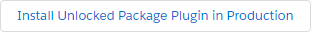
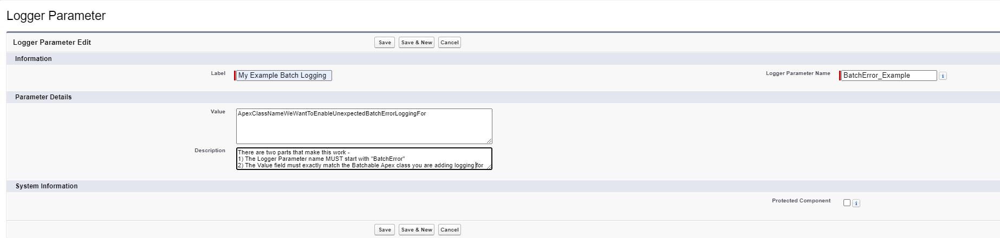

# Async Failure Additions plugin for Nebula Logger

> :information_source: This plugin requires `v4.15.3` or newer of Nebula Logger's core unlocked package

[](https://test.salesforce.com/packaging/installPackage.apexp?p0=04t5Y0000015ok7QAA)
[](https://login.salesforce.com/packaging/installPackage.apexp?p0=04t5Y0000015ok7QAA)

## What's Included

### Flow Error Event Logging

Salesforce includes a platform event, [FlowExecutionErrorEvent](https://developer.salesforce.com/docs/atlas.en-us.platform_events.meta/platform_events/sforce_api_objects_flowexecutionerrorevent.htm)that can only be subscribed to via Flow. Once subscribed, unhandled errors from Screen Flows can be automatically logged using Nebula Logger. In order to enable this functionality, navigate to the `Logger Parameter` Custom Metadata Type and flip the `Value` field on the `Is FlowExecutionErrorEvent Handled?` record from `false` to `true`.

### Unexpected Batch Error Logging

By default, this plugin adds support for logging unexpected Batch class failures in Apex. All a batch class needs to do is implement the marker `Database.RaisesPlatformEvents` interface _and_ create a `LoggerParameter__mdt` record where the `Value` field matches the name of the batch class you are looking to add logging for, and the DeveloperName (the "Name" field) starts with `BatchError`:

```java
// the class MUST implement Database.RaisesPlatformEvents for this to work correctly!
public class MyExampleBatchable implements Database.Batchable<SObject>, Database.RaisesPlatformEvents {
    // etc ...
}
```

And the CMDT record:



Once you've correctly configured those two things (the marker interface `Database.RaisesPlatformEvents` on the Apex batchable class, and the Logger Parameter CMDT record), your class will now log any uncaught exceptions that cause that batch class to fail unexpectedly.

---

If you want to customize additional behavior off of the trigger that subscribes to `BatchApexErrorEvent`, you can do so by creating a new Trigger SObject Handler CMDT record using the `TriggerSObjectHandler__mdt.SObjectTypeOverride__c` field (since `BatchApexErrorEvent` isn't one of the supported Entity Definition picklist results). The Logger SObject Handler Name should correspond to a valid instance of `LoggerSObjectHandler` - the instance of `LogBatchApexEventHandler` included in this plugin shows what an example logging implementation for unexpected failures would look like, if you want to go down that route.

### Queueable Error Logging

If you have Apex classes that implement `System.Queueable`, you can add error logging with some minimal code additions:

```java
public class MyExampleQueueable implements System.Queueable {
    public void execute (System.QueueableContext qc) {
        System.attachFinalizer(new LogFinalizer());
    }
}
```

If you'd like to do _additional_ processing, you can alternatively choose to _extend_ `LogFinalizer`:

```java
public class MyCustomFinalizer extends LogFinalizer {
    protected override void innerExecute(System.FinalizerContext fc) {
        // do whatever you'd like!
        // errors will be logged automatically in addition to what you choose to do here
        // no need to call Logger.saveLog() manually on this code path
    }
}
```
