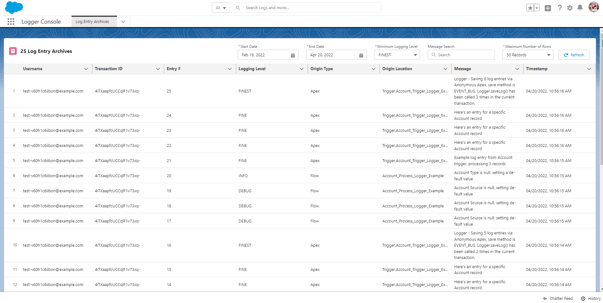

# Big Object Archiving plugin for Nebula Logger

> :information_source: This plugin requires `v4.15.3` or newer of Nebula Logger's core unlocked package

Adds a Big Object - `LogEntryArchive__b` - to Nebula Logger for archiving of logging data. The `LogEntryArchive__b` object can be used to:

- **To immediately publish logging data, instead of using platform events**. Out of the box, Nebula Logger leverages platform events (`LogEntryEvent__e`) as the mechanism for saving logging data, even if an error occurs. It then transforms the platform event data in `LogEntryEvent__e` and stores it in `Log__c` and `LogEntry__c` for reporting & managing of logs. If you want to skip the platform events altogether, and don't need to report on the data via Log**c or LogEntry**c, then you can leverage the Big Object Archiving plugin to immediately write to `LogEntryArchive__b`, giving you a way to store logging data on platform, without consuming your data storage limits (although it's worth noting that Big Objects have their own storage limits as well).
- **To later archive `Log__c` and `LogEntry__c` data**. If you want to leverage the benefits of having logging data in `Log__c` and `LogEntry__c`, but need to delete some records due to storage limits, the plugin also provides the ability to archive `Log__c` and `LogEntry__c` data into the big object `LogEntryArchive__b`. This is accomplished by setting a "Log Purge Action" to "Archive" on any `Log__c` records that you want to archive into the `LogEntryArchive__b` big object.
  - When the `LogBatchPurger` job runs, any `Log__c` (and related `LogEntry__c` records) with a "Log Purge Action" of "Archive" and a "Log Retention Date" <= TODAY will first be copied into the big object `LogEntryArchive__b`, before being deleted in `Log__c` and `LogEntry__c`.

---

## What's Included

This plugin includes some add-on metadata for Nebula Logger to support storing logging data within a big object

1. Big Object `LogEntryArchive__b`
2. Custom tab "Log Entry Archives" to display the included LWC `logEntryArchives`
3. Apex classes `LogEntryArchivePlugin`, `LogEntryArchiveBuilder` and corresponding test classes
4. Plugin configuration details stored in Logger's CMDT objects `LoggerPlugin__mdt` and `LoggerParameter__mdt`
5. Field-level security (FLS) & tab access via a new permission set `LogEntryArchiveAdmin` to provide access to the custom Slack fields

---

## Installation Steps

TODO
