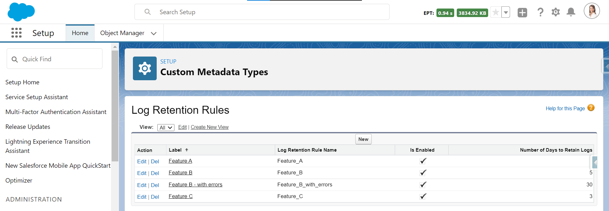
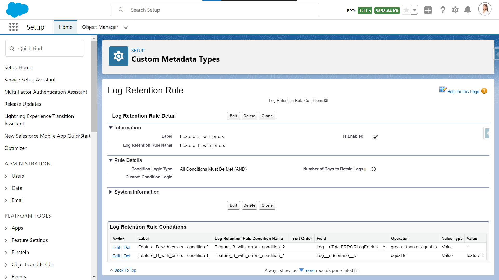

# Log Retention Rules plugin for Nebula Logger

> :information_source: This plugin requires `v4.7.1` or newer of Nebula Logger's unlocked package

Adds the ability to create & deploy advanced, configurable rules for setting the retention date of `Log__c` records, using custom metadata types `LogRetentionRule__mdt` and `LogRetentionRuleCondition__mdt`.

---

## What's Included

This plugin includes some add-on metadata for Nebula Logger to support the Slack integration

1. Plugin configuration details stored in Logger's CMDT objects `LoggerPlugin__mdt.LogRetentionRules`
2. New custom metadata types
   - `LogRetentionRule__mdt` - Used to configure rules that set the value of `Log__c`.`LogRetentionDate__c`. Each rules consists of 1 or more conditions, stored in `LogRetentionRuleCondition__mdt`.
   - `LogRetentionRuleCondition__mdt` - Used to configure field-level conditions for retention rules - each condition checks a `LogEntry__c` or `Log__c` field for a specific value, regular expression (regex), or field comparisons.
3. Apex class `LogRetentionRulesPlugin` (and corresponding tests in `LogRetentionRulesPlugin_Tests`). The plugin class reads the configured rules & conditions and automatically sets the field `Log__c.LogRetentionDate__c` when new `Log__c` records are inserted.

---

## Installation Steps

After installing the Nebula Logger's unlocked package, you can then install the Log Retention Rules plugin unlocked package in a sandbox.

This plugin is currently in beta and cannot be installed in production - however, if you want to use it in your production org, you can deploy the metadata to your org using your preferred deployment tool (changes sets, sfdx, the metadata API, etc.).

### Quick Start: Adding Log Retention Rules and Conditions

After installing the plugin, you can add rules using the custom metadata types `LogRetentionRule__mdt` and `LogRetentionRuleCondition__mdt`. Multiple rules can be configured in your orgs, as shown below:

In this example rule, for every inserted `LogEntry__c` record, 2 conditions are checked:

1. Does the entry's parent `Log__c` record have 1 or more error? (based on the roll-up summary field `Log__c.TotalERRORLogEntries__c`)
2. Does the entry's parent `Log__c` record have the scenario 'feature B'? (based on the text field `Log__c.Scenario__c`)

If any `LogEntry__c` record is inserted that meets these 2 conditions, then the parent `Log__c` record will have the field `LogRetentionDate__c` set to `System.today() + 30`.

