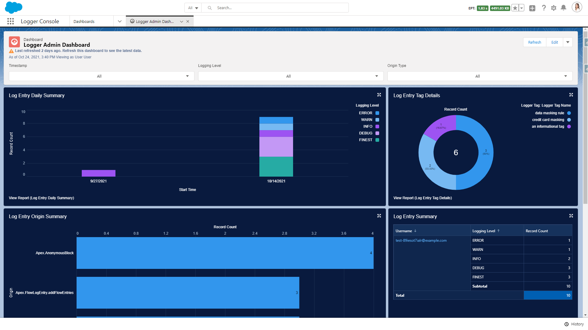

# Logger Admin Dashboard for Nebula Logger

> :information_source: This plugin requires `v4.6.12` or newer of Nebula Logger's unlocked package

To help monitor logs in your org, this plugin includes a new Logger Admin dynamic dashboard, as well as several new reports. The dashboard displays several report charts to quickly see summary info about your logs. It supports filtering on:

-   Timestamp: based on `LogEntry__c.Timestamp__c`
-   Logging Level: based on `LogEntry__c.LoggingLevel__c`
-   Origin Type: based on `LogEntry__c.OriginType__c`

