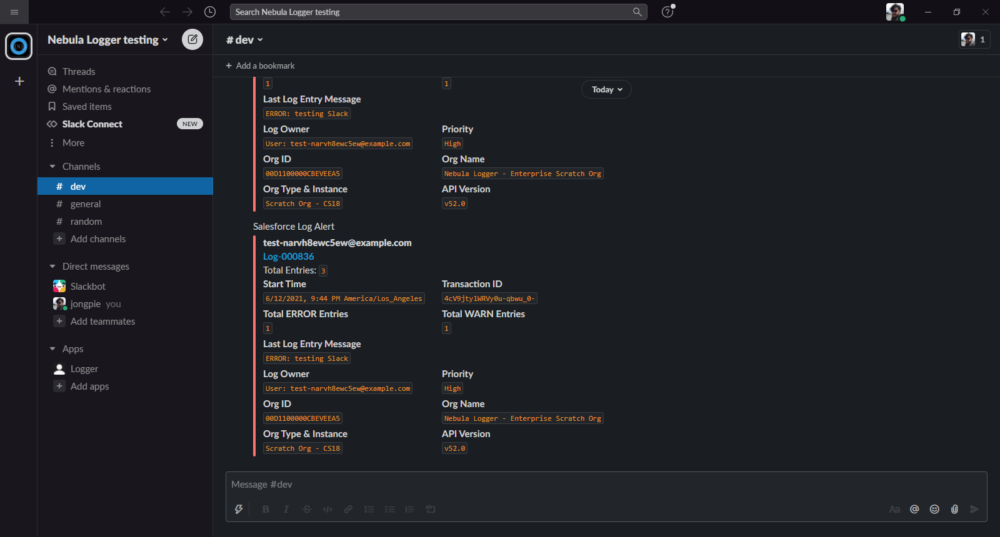

# Slack plugin for Nebula Logger

> :information_source: This plugin requires `v4.7.1` or newer of Nebula Logger's unlocked package

Adds a Slack integration for the unlocked package edition of Nebula Logger. Any logs with log entries that meet a certain (configurable) logging level will automatically be posted to your Slack channel via an asynchronous `Queueable` job.

---

## What's Included

This plugin includes some add-on metadata for Nebula Logger to support the Slack integration

1. Apex class `SlackLoggerPlugin` and corresponding tests in `SlackLoggerPlugin_Tests`
2. Plugin configuration details stored in Logger's CMDT objects `LoggerPlugin__mdt` and `LoggerParameter__mdt`
3. Custom fields `Log__c.SendSlackNotification__c` and `Log__c.SlackNotificationDate__c`
4. Field-level security (FLS) via a new permission set `LoggerSlackPluginAdmin` to provide access to the custom Slack fields
5. Two custom list views for the `Log__c` object to see any `Log__c` records that have, or should be, sent to Slack
6. Remote site setting for Slack's API

---

## Installation Steps

In order to use the Slack plugin, there are some configuration changes needed in both Slack and Salesforce

### Slack setup

Within Slack, you'll need to setup incoming webhooks to allow the Logger Slack plugin to create messages. The high-level steps are:

1. Create a new app in your Slack workspace (or use an existing app, if you prefer)
2. Create a new incoming webhook for your app, and copy the webhook URL. This will be used in Salesforce (see below steps)

Check out [Slack's webhooks documentation](https://api.slack.com/messaging/webhooks) for more details on how to setup incoming webhooks.

### Salesforce setup

1. Ensure that you have the unlocked package version of Nebula Logger installed in your org
2. Install the unlocked package for the Slack plugin
3. Go to Setup --> Custom Metadata Types --> Logger Parameters. There are 2 parameters to configure (shown in screenshot below)
   - Parameter 'Slack Endpoint' - You can configure this webhook in 1 of 2 ways:
     - Easier but less secure: Paste the Slack webhook URL into the `Value__c` field and save the Plugin Parameter record.
     - More secure: Create a new Named Credential ([see section below for step-by-step instructions](#setting-up-named-credentials)), using the webhook URL as the endpoint. Within the Parameter 'Slack Endpoint', enter `callout:<your named credential>` into the `Value__c` field and save the Plugin Parameter record
   - Parameter 'Slack Notification Logging Level' - Set the desired logging level value that should trigger a Slack notification to be sent the Logger Plugin Parameter 'Slack Notification Logging Level`. It controls which logging level (ERROR, WARN, INFO, DEBUG, FINE, FINER, or FINEST) will trigger the Slack notifications to be sent.

The Slack integration should now be setup & working - any new logs that meet the specified notification logging level (step 6 above) will send a Slack notification.

#### Setting up Named Credentials

_Note: these instructions are for setting up the improved Named Credentials, as legacy credentials are deprecated as of Winter '23. For more info, see [Salesforce's documentation](https://help.salesforce.com/s/articleView?id=sf.named_credentials_about.htm&type=5)._

1. **Create a new External Credential.** This will define how Salesforce should authenticate with the Slack webhook (which in this case is no authentication).
   - Go to the Named Credentials page in setup, click `New` under the External Credentials tab.
   - Enter a name (for example, `Nebula Slack Webhook (No Auth)`)
   - Select `No Authentication` for the Authentication Protocol.

2. **Create a Principle for the External Credential.** This will define the credentials that should be used when calling out to the Slack webhook (again, in this case, no credentials are needed, but we will still need to grant access to the principal).
   - In the Principals section of the External Credential you just created, click `New`.
   - Enter a parameter name (for example: `Default` or `Standard`, as there will only ever be one principal for this credential).

   

3. **Create a new Named Credential.** This is where the webhook URL will be stored.
   - Go back to the main Named Credentials page and click `New` in the Named Credentials tab.
   - Enter a name for the Named Credential (for example: `Nebula Slack Webhook`).
   - Paste the Slack webhook URL into the URL field.
   - In the External Credential dropdown, select the one you created in step 1.

4. **Grant the Platform Integration User access to the External Credential.** This will allow the Platform Integration user (the running user listening for Log Platform Events) to make callouts to the Slack webhook.
   - Create a new permission set or open an existing one
   - Go to the External Credential Principal Access section of the permissions set and grant access to the External Credential you created in step 1.
   - Assign the permission set to the Platform Integration User handles Log Platform events.
     - There are often multiple platform integration users. The easiest way to determine the correct one is to run this query: `SELECT CreatedBy.Username from Log__c LIMIT 1`, then assign the permission set to the user with the username returned in the query.
       
